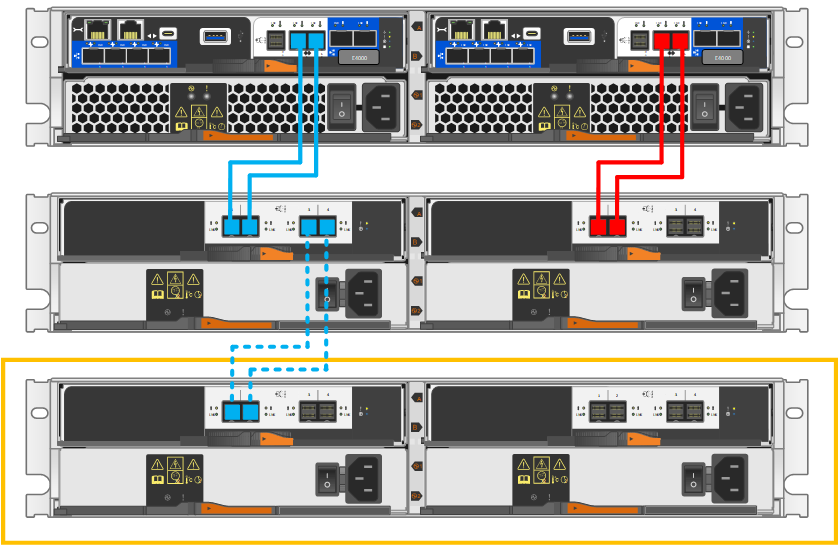

= Etapa 1: Prepare-se para adicionar o compartimento de unidades
:allow-uri-read: 

.Antes de começar
Devido à complexidade deste procedimento, recomenda-se o seguinte:

* Leia todos os passos antes de iniciar o procedimento.
* Certifique-se de que a adição de um compartimento de unidade é o procedimento que você precisa.

.Sobre esta tarefa
Este procedimento se aplica à adição rápida de um compartimento de unidades DE212C, DE224C ou DE460C a um compartimento de controladora E2800, E2800B, EF280, EF300, E5700B, EF570, E5700, EF600, EF300C, EF600C ou E4000.

Este procedimento se aplica aos compartimentos de unidades IOM12 e IOM12B.

NOTE: Os módulos IOM12B só são suportados no SANtricity os 11.70.2 em diante. Certifique-se de que o firmware do controlador foi atualizado antes de instalar ou atualizar para um IOM12B.

NOTE: Esse procedimento é para hot-swaps ou substituições de IOM de gaveta semelhantes. Isto significa que só pode substituir um módulo IOM12 por outro módulo IOM12 ou substituir um módulo IOM12B por outro módulo IOM12B. (Sua prateleira pode ter dois módulos IOM12 ou ter dois módulos IOM12B.)

Se você estiver fazendo o cabeamento de uma gaveta de controladora mais antiga para um DE212C, DE224C ou DE460, https://mysupport.netapp.com/ecm/ecm_download_file/ECMLP2859057["Adição de gavetas de unidade IOM a uma gaveta de controladora E27XX, E56XX ou EF560 existente"^] consulte .

NOTE: Para manter a integridade do sistema, você deve seguir o procedimento exatamente na ordem apresentada.

== Etapa 1: Prepare-se para adicionar o compartimento de unidades

Para se preparar para adicionar um compartimento de unidade em tempo real, você deve verificar se há eventos críticos e verificar o status das IOMs.

.Antes de começar
* A fonte de alimentação do seu sistema de storage deve ser capaz de acomodar os requisitos de energia do novo compartimento de unidades. Para obter a especificação de energia para o compartimento de unidades, consulte https://hwu.netapp.com/Controller/Index?platformTypeId=2357027["Hardware Universe"^] .
* O padrão de cabeamento do sistema de storage existente deve corresponder a um dos esquemas aplicáveis mostrados neste procedimento.

.Passos
. No Gerenciador do sistema SANtricity, selecione *suporte* > *Centro de suporte* > *Diagnóstico*.
. Selecione *coletar dados de suporte*.
+
A caixa de diálogo coletar dados de suporte é exibida.

. Clique em *Collect*.
+
O arquivo é salvo na pasta Downloads do navegador com o nome support-data.7z. Os dados não são enviados automaticamente para o suporte técnico.

. Selecione *Support* > *Event Log*.
+
A página Registro de eventos exibe os dados do evento.

. Selecione o cabeçalho da coluna *Priority* para classificar eventos críticos no topo da lista.
. Revise os eventos críticos do sistema para ver se ocorreram nas últimas duas a três semanas e verifique se quaisquer eventos críticos recentes foram resolvidos ou solucionados de outra forma.
+

NOTE: Se ocorrerem eventos críticos não resolvidos nas duas ou três semanas anteriores, interrompa o procedimento e contacte o suporte técnico. Continue o procedimento apenas quando o problema for resolvido.

. Se você tiver IOMs conetados ao seu hardware, execute as etapas a seguir. Caso contrário, vá para <<step2_install_drive_shelf,Etapa 2: Instale o compartimento de unidades e aplique energia.>>
+
.. Selecione *hardware*.
.. Selecione o ícone *IOMs (ESMs)*.
+
image::../media/sam1130_ss_hardware_iom_icon.gif[Ícone de IOMs (ESMs)]

+
A caixa de diálogo Configurações do componente do compartimento é exibida com a guia *IOMs (ESMs)* selecionada.

.. Certifique-se de que o status mostrado para cada IOM/ESM é _Optimal_.
.. Clique em *Mostrar mais configurações*.
.. Confirme se existem as seguintes condições:
+
*** O número de ESMs/IOMs detetados corresponde ao número de ESMs/IOMs instalados no sistema e ao de cada compartimento de unidades.
*** Ambos os ESMs/IOMs mostram que a comunicação está OK.
*** A taxa de dados é de 12GB GB/s para compartimentos de unidades DE212C, DE224C e DE460C ou 6 GB/s para outras bandejas de unidades.

== Etapa 2: Instale o compartimento de unidades e aplique energia

Instale um novo compartimento de unidade ou um compartimento de unidade instalado anteriormente, ligue a alimentação e verifique se há LEDs que exijam atenção.

.Passos
. Se você estiver instalando um compartimento de unidade que tenha sido instalado anteriormente em um sistema de storage, remova as unidades. As unidades devem ser instaladas uma de cada vez mais tarde neste procedimento.
+
Se o histórico de instalação do compartimento de unidades que você está instalando for desconhecido, você deve pressupor que ele foi instalado anteriormente em um sistema de armazenamento.

. Instale o compartimento de unidades no rack que contém os componentes do sistema de armazenamento.
+

NOTE: Consulte as instruções de instalação do seu modelo para obter o procedimento completo para instalação física e cabeamento de energia. As instruções de instalação para o seu modelo incluem notas e avisos que você deve levar em conta para instalar com segurança uma prateleira de unidade.

. Ligue o novo compartimento de unidades e confirme se nenhum LED âmbar de atenção está aceso no compartimento de unidades. Se possível, resolva quaisquer condições de avaria antes de continuar com este procedimento.

== Passo 3: Faça o cabo do seu sistema

Se você estiver fazendo o cabeamento de uma gaveta de controladora mais antiga para um DE212C, DE224C ou DE460, https://mysupport.netapp.com/ecm/ecm_download_file/ECMLP2859057["Adição de gavetas de unidade IOM a uma gaveta de controladora E27XX, E56XX ou EF560 existente"^] consulte .

[role="tabbed-block"]
====
.Conete o compartimento de unidades para E2800 ou E5700
--
Você conecta o compartimento de unidades ao controlador A, confirma o status IOM e, em seguida, conecta o compartimento de unidades à controladora B.

.Passos
. Conete o compartimento de unidades ao controlador A.
+
A figura a seguir mostra um exemplo de conexão entre um compartimento de unidade adicional e o controlador A. para localizar as portas no modelo, consulte o https://hwu.netapp.com/Controller/Index?platformTypeId=2357027["Hardware Universe"^].

+
image::../media/hot_e5700_0.png[Conete o compartimento de unidades ao controlador]

+
image::../media/hot_e5700_1.png[Conete o compartimento de unidades ao controlador]

. No Gerenciador do sistema SANtricity, clique em *hardware*.
+

NOTE: Neste ponto do procedimento, você tem apenas um caminho ativo para o compartimento da controladora.

. Role para baixo, conforme necessário, para ver todos os compartimentos de unidades no novo sistema de storage. Se o novo compartimento de unidades não for exibido, resolva o problema de conexão.
. Selecione o ícone *ESMs/IOMs* para o novo compartimento de unidades.
+
image::../media/sam1130_ss_hardware_iom_icon.gif[Ícone ESMs/IOMs]

+
A caixa de diálogo *Shelf Component Settings* é exibida.

. Selecione a guia *ESMs/IOMs* na caixa de diálogo *Configurações do componente de prateleira*.
. Selecione *Mostrar mais opções* e verifique o seguinte:
+
** IOM/Esm A está na lista.
** A taxa de dados atual é de 12 Gbps para um compartimento de unidades SAS-3.
** As comunicações do cartão estão OK.

. Desconete todos os cabos de expansão do controlador B.
. Conete o compartimento de unidades ao controlador B.
+
A figura a seguir mostra um exemplo de conexão entre um compartimento de unidade adicional e o controlador B. para localizar as portas no modelo, consulte o https://hwu.netapp.com/Controller/Index?platformTypeId=2357027["Hardware Universe"^].

+
image::../media/hot_e5700_2.png[Exemplo de conexão do compartimento de unidades]

. Se ainda não estiver selecionado, selecione a guia *ESMs/IOMs* na caixa de diálogo *Configurações do componente de prateleira* e, em seguida, selecione *Mostrar mais opções*. Verifique se as comunicações do cartão são *SIM*.
+

NOTE: O status ideal indica que o erro de perda de redundância associado ao novo compartimento de unidades foi resolvido e o sistema de armazenamento está estabilizado.

--
.Conete o compartimento de unidades para EF300 ou EF600
--
Você conecta o compartimento de unidades ao controlador A, confirma o status IOM e, em seguida, conecta o compartimento de unidades à controladora B.

.Antes de começar
* Atualizou o firmware para a versão mais recente. Para atualizar o firmware, siga as instruções no link:../upgrade-santricity/index.html["Atualizando o SANtricity os"].

.Passos
. Desconete os dois cabos do controlador do lado A das IOM12 portas uma e duas da última gaveta anterior na stack e, em seguida, conete-os à nova gaveta IOM12 portas uma e duas.
+
image::../media/de224c_sides.png[Desconete os cabos do controlador A e conete-os à nova gaveta]

. Conete os cabos às portas IOM12 três e quatro do lado A da nova gaveta às portas IOM12 do último compartimento anterior uma e duas.
+
A figura a seguir mostra um exemplo de conexão para um lado entre um compartimento de unidade adicional e o último compartimento anterior. Para localizar as portas no modelo, consulte https://hwu.netapp.com/Controller/Index?platformTypeId=2357027["Hardware Universe"^] .

+
image::../media/hot_ef_0.png[Exemplo de cabeamento do compartimento de unidade]

+
image::../media/hot_ef_1.png[Exemplo de cabeamento do compartimento de unidade]

. No Gerenciador do sistema SANtricity, clique em *hardware*.
+

NOTE: Neste ponto do procedimento, você tem apenas um caminho ativo para o compartimento da controladora.

. Role para baixo, conforme necessário, para ver todos os compartimentos de unidades no novo sistema de storage. Se o novo compartimento de unidades não for exibido, resolva o problema de conexão.
. Selecione o ícone *ESMs/IOMs* para o novo compartimento de unidades.
+
image::../media/sam1130_ss_hardware_iom_icon.gif[Ícone ESMs/IOMs]

+
A caixa de diálogo *Shelf Component Settings* é exibida.

. Selecione a guia *ESMs/IOMs* na caixa de diálogo *Configurações do componente de prateleira*.
. Selecione *Mostrar mais opções* e verifique o seguinte:
+
** IOM/Esm A está na lista.
** A taxa de dados atual é de 12 Gbps para um compartimento de unidades SAS-3.
** As comunicações do cartão estão OK.

. Desconete os dois cabos do controlador do lado B das IOM12 portas uma e duas da última gaveta anterior na stack e, em seguida, conete-os às novas portas da gaveta IOM12 uma e duas.
. Conete os cabos às portas IOM12 do lado B três e quatro da nova gaveta às portas IOM12 do último compartimento anterior uma e duas.
+
A figura a seguir mostra um exemplo de conexão para o lado B entre um compartimento de unidade adicional e o último compartimento anterior. Para localizar as portas no modelo, consulte https://hwu.netapp.com/Controller/Index?platformTypeId=2357027["Hardware Universe"^] .

+
image::../media/hot_ef_2.png[Exemplo de cabeamento do compartimento de unidade]

. Se ainda não estiver selecionado, selecione a guia *ESMs/IOMs* na caixa de diálogo *Configurações do componente de prateleira* e, em seguida, selecione *Mostrar mais opções*. Verifique se as comunicações do cartão são *SIM*.
+

NOTE: O status ideal indica que o erro de perda de redundância associado ao novo compartimento de unidades foi resolvido e o sistema de armazenamento está estabilizado.

--
.Conete o compartimento de unidades para E4000
--
Você conecta o compartimento de unidades ao controlador A, confirma o status IOM e, em seguida, conecta o compartimento de unidades à controladora B.

.Passos
. Conete o compartimento de unidades ao controlador A.
+

. No Gerenciador do sistema SANtricity, clique em *hardware*.
+

NOTE: Neste ponto do procedimento, você tem apenas um caminho ativo para o compartimento da controladora.

. Role para baixo, conforme necessário, para ver todos os compartimentos de unidades no novo sistema de storage. Se o novo compartimento de unidades não for exibido, resolva o problema de conexão.
. Selecione o ícone *ESMs/IOMs* para o novo compartimento de unidades.
+
image::../media/sam1130_ss_hardware_iom_icon.gif[Ícone de hardware IOM]

+
A caixa de diálogo *Shelf Component Settings* é exibida.

. Selecione a guia *ESMs/IOMs* na caixa de diálogo *Configurações do componente de prateleira*.
. Selecione *Mostrar mais opções* e verifique o seguinte:
+
** IOM/Esm A está na lista.
** A taxa de dados atual é de 12 Gbps para um compartimento de unidades SAS-3.
** As comunicações do cartão estão OK.

. Desconete todos os cabos de expansão do controlador B.
. Conete o compartimento de unidades ao controlador B.
+
image::../media/hot_e4000_cabling_2.png[Cabeamento do compartimento de unidades]

. Se ainda não estiver selecionado, selecione a guia *ESMs/IOMs* na caixa de diálogo *Configurações do componente de prateleira* e, em seguida, selecione *Mostrar mais opções*. Verifique se as comunicações do cartão são *SIM*.
+

NOTE: O status ideal indica que o erro de perda de redundância associado ao novo compartimento de unidades foi resolvido e o sistema de armazenamento está estabilizado.

--
====

== Passo 4: Complete hot add

Você conclui o hot add verificando se há erros e confirmando que o compartimento de unidade recém-adicionado usa o firmware mais recente.

.Passos
. No Gerenciador do sistema SANtricity, clique em *Início*.
. Se o link rotulado *Recover from problems* aparecer na parte superior central da página, clique no link e resolva quaisquer problemas indicados no Recovery Guru.
. No Gerenciador do sistema SANtricity, clique em *hardware* e role para baixo, conforme necessário, para ver o compartimento de unidades recém-adicionado.
. Para unidades que foram instaladas anteriormente em um sistema de storage diferente, adicione uma unidade de vez ao compartimento de unidades recém-instalado. Aguarde que cada unidade seja reconhecida antes de inserir a próxima unidade.
+
Quando uma unidade é reconhecida pelo sistema de armazenamento, a representação do slot da unidade na página *hardware* é exibida como um retângulo azul.

. Selecione *Support* > *Support Center* > *Support Resources* tab.
. Clique no link *Inventário de software e firmware* e verifique quais versões do firmware IOM/ESM e do firmware da unidade estão instaladas no novo compartimento de unidades.
+

NOTE: Talvez seja necessário rolar a página para localizar esse link.

. Se necessário, atualize o firmware da unidade.
+
O firmware IOM/ESM é atualizado automaticamente para a versão mais recente, a menos que você tenha desativado o recurso de atualização.

O procedimento de adição a quente está concluído. Pode retomar as operações normais.
