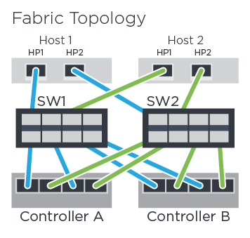

= Grave seu NVMe em configuração FC no e-Series - Linux
:allow-uri-read: 
:icons: font
:imagesdir: ../media/

[role="lead"]
Você pode gerar e imprimir um PDF desta página e, em seguida, usar a seguinte Planilha para gravar informações de configuração de armazenamento NVMe sobre Fibre Channel. Você precisa dessas informações para executar tarefas de provisionamento.

== Topologia de conexão direta

Em uma topologia de conexão direta, um ou mais hosts são conetados diretamente ao controlador.

image::../media/nvme_fc_direct_topology.png[Exemplo de topologia de conexão direta]

* Host 1 HBA porta 1 e controlador A porta de host 1
* Host 1 HBA porta 2 e controlador B porta de host 1
* Host 2 HBA porta 1 e controlador A porta de host 2
* Host 2 HBA porta 2 e controlador B porta de host 2
* Host 3 HBA porta 1 e controlador A porta de host 3
* Host 3 HBA porta 2 e controlador B porta de host 3
* Host 4 HBA porta 1 e controlador A porta de host 4
* Host 4 HBA porta 2 e controlador B porta de host 4

== Topologia de conexão do switch

Em uma topologia de malha, um ou mais switches são usados. Consulte https://mysupport.netapp.com/matrix["Ferramenta de Matriz de interoperabilidade do NetApp"^] a para obter uma lista de comutadores suportados.

== Identificadores de host

Localize e documente o iniciador NQN de cada host.

|===
| Conexões de porta de host | NQN do host 

 a| 
Host (iniciador) 1
 a| 

 a| 
Host (iniciador) 2
 a| 

|===

== NQN alvo

Documente o NQN de destino para o storage array.

|===
| Nome do array | NQN alvo 

 a| 
Controlador de array (destino)
 a| 

|===

== NQNs de destino

Documente os NQNs a serem usados pelas portas de matriz.

|===
| Conexões de porta do controlador de matriz (destino) | NQN 

 a| 
Controlador A, porta 1
 a| 

 a| 
Controlador B, porta 1
 a| 

 a| 
Controlador A, porta 2
 a| 

 a| 
Controlador B, porta 2
 a| 

|===

== Mapeando o nome do host

NOTE: O nome do host de mapeamento é criado durante o fluxo de trabalho.

|===

 a| 
Mapeando o nome do host
 a| 

 a| 
Tipo de SO de host
 a| 

|===