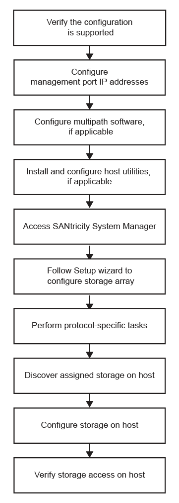

= Entenda o fluxo de trabalho da VMware no e-Series
:allow-uri-read: 
:icons: font
:imagesdir: ../media/

[role="lead"]
Esse fluxo de trabalho orienta você pelo "método expresso" para configurar seu storage array e o Gerenciador de sistema do SANtricity para disponibilizar o storage para um host VMware.

