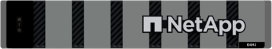

= Saiba mais sobre o hardware e-Series
:allow-uri-read: 
:icons: font
:imagesdir: ../media/

[role="lead"]
Os storage arrays e-Series estão disponíveis em várias configurações e modelos.

Um storage array inclui compartimentos, controladores, unidades, software e firmware. O array pode ser instalado em um rack ou gabinete, com hardware personalizável para um ou dois controladores, em um compartimento de 12, 24 ou 60 unidades. Você pode conectar o storage array a uma SAN de vários tipos de interface e a uma variedade de sistemas operacionais de host.

Os arrays e-Series estão disponíveis nos seguintes modelos:

* Série E2800 -- híbrido de nível básico
* Série EF280 -- all flash de nível de entrada
* Série EF300 -- all-flash de nível de entrada, All NVMe
* Série E4000 -- híbrido de nível básico
* Série E5700 -- híbrido midrange
* Série EF570 -- all flash midrange
* Série EF600 -- all-flash midrange, All NVMe
* Série EF300C -- all-flash de nível de entrada, All NVMe
* Série EF600C -- all-flash midrange, All NVMe

NOTE: Para o SANtricity os 11,80GA e superior, todas as portas USB são desativadas nos storages E2800, EF280, E5700, EF570, EF600/EF600C e EF300/EF300C.

[role="tabbed-block"]
====
.Modelos E2800D.
--
Tamanhos de rack::
+
--
* 2U12 (2 unidades de rack; 12 unidades)
* 2U24 (2 unidades de rack; 24 unidades)
+
image::../media/e2800_2u_front.gif[E2800 2U]

* 4U60 (4 unidades de rack; 60 unidades)
+
image::../media/e2860_front.gif["E2800 4U']

--
Unidades::
+
--
Suporta os seguintes tipos de unidade:

* NL-SAS de 3,5" (até 180 TB)
* SSD SAS de 2,5" (até 120 GB)
* HDD SAS de 2,5" (até 180 GB)

--
Interfaces::
+
--
Disponível com as seguintes interfaces:

* 12Gb SAS
* ISCSI de 10Gb GB ou 25GB GB
* Fibre Channel de 16GB GB ou 32GB GB

--

--
.Modelos EF280D.
--
Tamanhos de rack::
+
--
2U24 (2 unidades de rack; 24 unidades)

image:../media/ef570_front.gif["EF280 2U"]

--
Unidades::
+
--
Suporta até 96 unidades SSD de 2,5"

--
Interfaces::
+
--
Disponível com as seguintes interfaces:

* 12Gb SAS
* ISCSI de 10Gb GB ou 25GB GB
* Fibre Channel de 16GB GB ou 32GB GB

--

--
.Modelos EF300D.
--
Tamanhos de rack::
+
--
2U24 (2 unidades de rack; 24 unidades)

image:../media/ef570_front.gif["EF300 2U"]

--
Unidades::
+
--
* Unidades SSD NVMe: Até 24 unidades SSD NVMe no compartimento da controladora.
* Unidades NL-SAS com compartimentos de expansão: Qualquer combinação de gavetas DE212C e DE460C não excederá um total de 240 slots de unidade NL-SAS e 4 gavetas de expansão, a menos que sejam usadas apenas DE212C gavetas, então 8 DE212C gavetas serão permitidas. Por exemplo, 4 DE460C gavetas, 8 DE212C gavetas ou 2 DE460C gavetas e 2 DE212 gavetas.
* Unidades SSD SAS com compartimentos de expansão: Qualquer combinação de gavetas DE212C, DE224C e DE460C não excederá um total de 96 slots de unidade SSD SAS e 4 compartimentos de expansão, a menos que sejam usadas apenas DE212C gavetas, então 8 DE212C gavetas serão permitidas. Por exemplo, 1 DE460C gaveta mais 1 DE224C gaveta mais 1 DE212C gaveta, ou 4 DE224C gavetas ou 8 DE212C gavetas.
* Suporte para uma placa de expansão SAS opcional, permitindo conexões de gaveta de expansão SAS.
* Suporte para uma placa de interface de host por controlador.

NOTE: Para o SANtricity os 11,80GA e posterior, o EF300 é compatível com configurações de compartimento de expansão sem unidades na bandeja de base Ao usar essa configuração, verifique se as unidades estão preenchidas no compartimento de expansão e conetadas corretamente à bandeja de base antes de ligar o sistema.

--
Interfaces::
+
--
Disponível com as seguintes interfaces:

* ISCSI de 25GB GB
* NVMe/Fibre Channel de 32GB GB
* 32GB SCSI/Fibre Channel
* Iser/IB de 100GB GB
* SRP/IB de 100GB GB
* NVMe/IB de 100GB GB
* NVMe/RoCE de 100GB GbE

--

--
.Modelos EF300CD.
--
Tamanhos de rack::
+
--
2U24 (2 unidades de rack; 24 unidades)

image:../media/ef570_front.gif["EF300 2U"]

--
Unidades::
+
--
* Suporte para unidades SSD NVMe de capacidade de 30TB TB ou 60TB TB.
+
** Compatível para uso do Dynamic Disk Pool somente sem suporte a RAID legado.

* Unidades SSD NVMe: Até 24 unidades SSD NVMe no compartimento da controladora.
+
** Sem suporte para configurações do compartimento de expansão.

* Suporte para uma placa de interface de host por controlador.
* Um único pool de discos é criado automaticamente se não houver unidades não atribuídas suficientes durante a inicialização do sistema.

--
Interfaces::
+
--
Disponível com as seguintes interfaces:

* ISCSI de 25GB GB
* NVMe/Fibre Channel de 32GB GB
* 32GB SCSI/Fibre Channel
* Iser/IB de 100GB GB
* SRP/IB de 100GB GB
* NVMe/IB de 100GB GB
* NVMe/RoCE de 100GB GbE

--

--
.Modelos E5700D.
--
Tamanhos de rack::
+
--
* 2U24 (2 unidades de rack; 24 unidades)
+
image::../media/e2800_2u_front.gif[E5700 2U]

* 4U60 (4 unidades de rack; 60 unidades)
+
image::../media/e2860_front.gif[E5700 4U]

--
Unidades::
+
--
Suporta até 480 dos seguintes tipos de unidade:

* Unidades NL-SAS de 3,5"
* Unidades SSD SAS de 2,5"
* Unidades HDD SAS de 2,5"

--
Interfaces::
+
--
Disponível com as seguintes interfaces:

* 12Gb SAS
* ISCSI de 10Gb GB ou 25GB GB
* Fibre Channel de 16GB GB ou 32GB GB
* NVMe/Fibre Channel de 32GB GB
* Iser/IB de 100GB GB
* SRP/IB de 100GB GB
* NVMe/IB de 100GB GB
* NVMe/RoCE de 100GB GbE

--

--
.Modelos EF570D.
--
Tamanhos de rack::
+
--
2U24 (2 unidades de rack; 24 unidades)

image:../media/ef570_front.gif["EF570 2U"]

--
Unidades::
+
--
Suporta até 120 unidades SSD de 2,5"

--
Interfaces::
+
--
Disponível com as seguintes interfaces:

* 12Gb SAS
* ISCSI de 10Gb GB ou 25GB GB
* Fibre Channel de 16GB GB ou 32GB GB
* NVMe/Fibre Channel de 32GB GB
* Iser/IB de 100GB GB
* SRP/IB de 100GB GB
* NVMe/IB de 100GB GB
* NVMe/RoCE de 100GB GbE

--

--
.Modelos EF600D.
--
Tamanhos de rack::
+
--
2U24 (2 unidades de rack; 24 unidades)

image:../media/ef570_front.gif["EF600 2U"]

--
Unidades::
+
--
* Unidades SSD NVMe: Até 24 unidades SSD NVMe no compartimento da controladora.
* Unidades NL-SAS com compartimentos de expansão: Qualquer combinação de gavetas DE212C e DE460C não excederá um total de 420 slots de unidade NL-SAS e 7 gavetas de expansão, a menos que sejam usadas apenas DE212C gavetas, então 8 DE212C gavetas serão permitidas. Por exemplo, 7 DE460C gavetas, 8 DE212C gavetas ou 5 DE460C gavetas e 2 DE212 gavetas.
* Unidades SSD SAS com compartimentos de expansão: Qualquer combinação de gavetas DE212C, DE224C e DE460C não excederá um total de 96 slots de unidade SSD SAS e 7 compartimentos de expansão, a menos que sejam usadas apenas DE212C gavetas, então 8 DE212C gavetas serão permitidas. Por exemplo, 1 DE460C gaveta mais 1 DE224C gaveta mais 1 DE212C gaveta, ou 4 DE224C gavetas ou 8 DE212C gavetas.
* Suporte para duas placas de interface de host por controlador.
+
** Como alternativa, é compatível com uma placa de interface de host IB de 200GB GB por controladora.

* Suporte para uma placa de expansão SAS opcional, permitindo conexões de gaveta de expansão SAS.
+
** A expansão SAS só é suportada em configurações com uma placa de interface de host por controladora.

NOTE: Para o SANtricity os 11,80GA e posterior, o EF600 é compatível com configurações de compartimento de expansão sem unidades na bandeja de base Ao usar essa configuração, verifique se as unidades estão preenchidas no compartimento de expansão e conetadas corretamente à bandeja de base antes de ligar o sistema.

--
Interfaces::
+
--
Disponível com as seguintes interfaces:

* ISCSI de 25GB GB
* NVMe/Fibre Channel de 32GB GB
* 32GB SCSI/Fibre Channel
* Iser/IB de 100GB GB
* SRP/IB de 100GB GB
* NVMe/IB de 100GB GB
* NVMe/RoCE de 100GB GbE
* Iser/IB de 200GB GB
* NVMe/IB de 200GB GB
* NVMe/RoCE de 200GB GbE

--

--
.Modelos EF600CD.
--
Tamanhos de rack::
+
--
2U24 (2 unidades de rack; 24 unidades)

image:../media/ef570_front.gif["EF600 2U"]

--
Unidades::
+
--
* Suporte para unidades SSD NVMe de capacidade de 30TB TB ou 60TB TB.
+
** Compatível para uso do Dynamic Disk Pool somente sem suporte a RAID legado.

* Unidades SSD NVMe: Até 24 unidades SSD NVMe no compartimento da controladora.
* Suporte para duas placas de interface de host por controlador.
+
** Como alternativa, é compatível com uma placa de interface de host IB de 200GB GB por controladora.
** Sem suporte para configurações do compartimento de expansão.

* Um único pool de discos é criado automaticamente se não houver unidades não atribuídas suficientes durante a inicialização do sistema.

--
Interfaces::
+
--
Disponível com as seguintes interfaces:

* ISCSI de 25GB GB
* NVMe/Fibre Channel de 32GB GB
* 32GB SCSI/Fibre Channel
* Iser/IB de 100GB GB
* SRP/IB de 100GB GB
* NVMe/IB de 100GB GB
* NVMe/RoCE de 100GB GbE
* Iser/IB de 200GB GB
* NVMe/IB de 200GB GB
* NVMe/RoCE de 200GB GbE

--

--
.Modelos E4000D.
--
Tamanhos de rack::
+
--
* 2U12 (2 unidades de rack; 12 unidades)
+

* 4U60 (4 unidades de rack; 60 unidades)
+
image::../media/e4000_4u_front.png[E4000 4U]

--
Unidades::
+
--
Suporta os seguintes tipos de unidade:

* NL-SAS de 3,5" (até 300 TB)
* SSD SAS de 2,5" (até 120 GB)

--
Interfaces::
+
--
Disponível com as seguintes interfaces:

* 12Gb SAS
* ISCSI de 1 GB ou 10GBASE T
* ISCSI de 1GB GB, 10Gb GB ou 25GB GB
* FC de 8GB GB, 16GB GB ou 32GB GB
* 12gb SAS

--

--
====