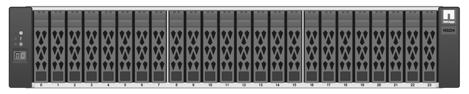

= Tipos de gaveta e-Series
:allow-uri-read: 
:icons: font
:imagesdir: ../media/

[role="lead"]
Os sistemas e-Series estão disponíveis em diversos tamanhos de prateleira.

|===
| Tipo de prateleira | Ilustração 

 a| 
*DE212C:*

* 2u12 (2 unidades de rack; 12 unidades)
* HDDs de 3,5" e/ou SSDs de 2,5" (com adaptador)
* Somente controladores E4000 e E2800

 a| 
image:../media/e2812_front.gif["DE212C"]

 a| 
*DE224C:*

* 2u24 (2 unidades de rack; 24 unidades)
* Unidades HDD de 2,5" e/ou SSD de 2,5"
* Controladores E2800, EF280, E5700 e EF570

 a| 
image:../media/e2824_front.gif["DE224C"]

 a| 
*DE460C:*

* 4u60 (4 unidades de rack; 60 unidades)
* Unidades de 3,5" e 2,5" (NL-SAS, SAS e SSD)
* Controladores E4000, E2800 e E5700

 a| 
image:../media/de460c.gif["DE460C"]

 a| 
*NE224:*

* 2u24 (2 unidades de rack; 24 unidades)
* Unidades SSD NVMe de 2,5"
* Controladores EF300 e EF600

 a| 

|===