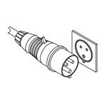
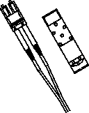

= Reunir as ferramentas e o equipamento necessários para o armário 3040 40U (e-Series)
:allow-uri-read: 
:icons: font
:imagesdir: ../media/

[role="lead"]
Antes de instalar o gabinete 3040 40U, certifique-se de que você tem as ferramentas e o equipamento necessários.

.Passo
. Reúna todos os itens listados na tabela a seguir.
+
|===
|  | Item | Incluído com o gabinete 

 a| 
image:../media/83009_02.gif["Chave de 3/4 pol. E chave Allen"]
 a| 
*Chave de 3/4 pol.* (fornecida na caixa de transporte) -- para levantar e baixar os pés de nivelamento sob o gabinete.

*Chave Allen de 1/4 pol.* -- para levantar e baixar o pé de estabilidade na parte frontal do gabinete.
 a| 
image:../media/77037_11.gif["Incluído com o gabinete"]

 a| 
*NEMA L6-30*

image:../media/73121_01_dwg_nema_l6_30_power_cord.gif["Cabo NEMA L6-30"]
 a| 
* Cabos de alimentação CA* -- para conetar o gabinete a fontes de alimentação externas (plugues de parede).

** Os conetores NEMA L6-30 são para uso nos EUA e no Canadá.
** Os conetores IEC-60309 são para uso em todo o mundo, exceto para EUA e Canadá.

NOTE: Cada PDU tem de ser ligada a uma fonte de alimentação independente.
 a| 
image:../media/77037_11.gif["Incluído com o gabinete"]

 a| 
**IEC-60309**

 a| 

 a| 
**Cabos SAS** (opcional) – dois cabos estão incluídos em cada bandeja de unidades, enquanto os cabos laterais do host devem ser adquiridos separadamente.

**Cabos de comunicação** (opcional) – para conetar a bandeja ao host.

Consulte o guia de instalação apropriado da bandeja de unidades e controlador para ver os itens adicionais necessários.
 a| 

 a| 
image:../media/77038_06.gif["Cabos SAS e de comunicação"]
 a| 
**Bobinas de cabo montáveis** – instaladas ao longo de ambos os lados das tomadas de distribuição de energia vertical para acomodar o excesso de comprimento do cabo e encaminhamento de cabos. Dois carretéis de cabo estão incluídos em cada bandeja de unidades e controlador Os carretéis de cabos também são fornecidos com bandejas de unidades autônomas.
 a| 
image:../media/77037_11.gif["Bobinas de cabos montáveis"]

 a| 
 a| 
**Shears** – para cortar as bandas de metal na caixa de transporte.
 a| 

 a| 
 a| 
**Empilhadeira** (opcional) – para remover o gabinete da palete de transporte.
 a| 

 a| 
 a| 
**Kits de painel frontal** (opcional) – para cobrir os compartimentos vazios na parte frontal do gabinete.
 a| 

 a| 
 a| 
**Sacos antiestáticos** (opcional) – para proteger os componentes que são removidos durante o procedimento de instalação do gabinete.
 a| 

|===

