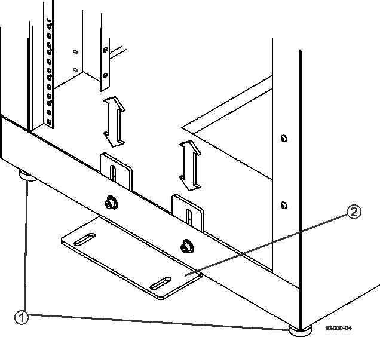

= Instalação completa do gabinete
:allow-uri-read: 
:icons: font
:imagesdir: ../media/

[role="lead"]
Depois de mover o gabinete, abaixe os pés de nivelamento e o pé de estabilidade, reinstale os componentes que você removeu, instale outros componentes necessários e conete o gabinete à alimentação.

== Passo 1: Baixe os pés niveladores e o pé de estabilidade

Você estabiliza o gabinete ajustando seus pés. Os pés niveladores suportam o gabinete fora dos rodízios. O pé de estabilidade impede que o gabinete caia depois que ele é colocado em sua localização permanente.

.Passos
. Baixe os pés de nivelamento para apoiar o gabinete fora dos rodízios.
+
Os pés de nivelamento estão localizados perto de cada canto inferior do gabinete.

. Certifique-se de que o gabinete está o mais nivelado possível.
+
A figura seguinte proporciona uma visão de grande plano do pé de estabilidade e dos pés niveladores.

+

+
|===

 a| 
1.
 a| 
Pés niveladores

 a| 
2.
 a| 
Pé de estabilidade

|===

== Etapa 2: Reinstale as bandejas

Depois de mover o gabinete, você pode reinstalar as bandejas em seus locais originais.

CAUTION: _Não_ instale as seguintes bandejas na parte superior do gabinete sobre a cabeça. Quando totalmente preenchido, cada uma dessas bandejas pesa mais de 100 kg (220 lb). Se instaladas na parte superior do gabinete, essas bandejas criam um gabinete pesado que pode ficar facilmente desequilibrado: Bandejas de unidades e controlador E2660, E2660, E2760, E5460, E5560 e E5660, bem como a bandeja de unidades de DE6600 TB

.Passos
. Reinstale todas as bandejas em suas localizações originais no gabinete.
+

CAUTION: *Risco de lesões corporais* -- uma bandeja vazia pesa aproximadamente 56,7 kg (125 lb). São necessárias três pessoas para mover uma bandeja vazia com segurança Se a bandeja estiver preenchida com componentes, é necessário um elevador mecanizado para mover a bandeja com segurança

. Reinstale todos os componentes em suas localizações originais nas bandejas.
+
Para evitar conflitos de endereço e perda de acesso aos dados, substitua todos os componentes na mesma bandeja e no mesmo local na bandeja

. Volte a instalar todos os cabos nas respetivas localizações originais nas bandejas.
. Encaminhe os cabos de interface para o gabinete.
. Encaminhe os cabos de alimentação principais do gabinete para as duas fontes de alimentação externas. _Não_ Conete os cabos de energia neste momento.

== Passo 3: Instale carretéis de cabo e ataduras

Depois de reinstalar as bandejas, instale os carretéis de cabo e os atamentos. Os carretéis de cabo e os atamentos acomodam o excesso de comprimento do cabo e o encaminhamento de cabos para os controladores e as bandejas.

.Passo
. Instale os carretéis de cabo e os atamentos de amarração ao longo de ambos os lados das tomadas de distribuição de energia verticais.
+
image::../media/83003_01_dwg_3040_cable_spools.gif[Amarre o enrolamento e o carretel do cabo]

+
|===

 a| 
1.
 a| 
Localização do atamento com atamento

 a| 
2.
 a| 
Bobina de cabo

|===

== Etapa 4: Instale bandejas adicionais

Se necessário, você pode instalar bandejas adicionais. Deve cobrir posições não utilizadas para bandejas para garantir o fluxo de ar correto.

.Passos
. Se tiver bandejas adicionais que devam ser instaladas, instale o hardware de montagem dessas bandejas.
. Se a parte frontal do gabinete não estiver completamente preenchida com bandejas, use kits do painel frontal para cobrir os espaços vazios acima ou abaixo das bandejas instaladas.
+
Cobrir os espaços vazios é necessário para que o fluxo de ar correto através do gabinete seja mantido.

. Ligue as bandejas.

== Passo 5: Instale trilhos de montagem adicionais

Se você estiver instalando bandejas de unidades e controlador ou bandejas de unidades fornecidas separadamente (ainda não instaladas no gabinete), talvez seja necessário instalar trilhos de montagem adicionais no gabinete.

.Passos
. Determine a localização dos trilhos de montagem.
+
** *Acima de uma bandeja existente* -- posicione os trilhos de montagem imediatamente acima da bandeja superior no gabinete.
** *Abaixo de uma bandeja existente* -- Posicione os trilhos de montagem com espaço suficiente para segurar a bandeja que está sendo instalada:
+
*** 8,9 cm (3,5 pol.) para bandejas de unidades e controlador 2U ou bandejas de unidades
*** 17,8 cm (7 pol.) para bandejas de unidades e controlador 4U ou bandejas de unidades

. Use os marcadores de medição nos suportes verticais dianteiro direito e dianteiro esquerdo para fixar os trilhos de montagem na mesma posição em cada lado do gabinete.
+
image::../media/92042_06.gif[Montagem da calha]

+
|===

 a| 
1.
 a| 
Calha ajustável dianteira

 a| 
2.
 a| 
Calha ajustável traseira

 a| 
3.
 a| 
Placa de ajuste e parafusos

 a| 
4.
 a| 
Montagem do trilho M5 x 10mm parafusos

 a| 
5.
 a| 
Porcas de freio

 a| 
6.
 a| 
Suporte de fixação traseiro

 a| 
7.
 a| 
Suporte vertical

|===
+

NOTE: As porcas de fixação e o suporte de fixação traseiro não são utilizados quando as calhas estão instaladas num armário 3040.

. Coloque a calha ajustável traseira no suporte vertical.
. Na calha ajustável traseira, alinhe os orifícios da calha ajustável à frente dos orifícios no suporte vertical.
. Fixe dois parafusos M5 x 10mm.
+
.. Fixe os parafusos através da calha de suporte vertical e da calha ajustável traseira.
.. Aperte os parafusos.

. Coloque a calha ajustável dianteira no suporte vertical.
. No trilho ajustável dianteiro, alinhe os orifícios ajustáveis do trilho na frente dos orifícios no suporte vertical.
. Fixe dois parafusos M5 x 10mm.
+
.. Fixe um parafuso através do trilho de suporte vertical e do orifício inferior do trilho ajustável dianteiro.
.. Fixe um parafuso através do trilho de suporte vertical e do meio dos três orifícios superiores no trilho ajustável dianteiro.
.. Aperte os parafusos.

+

NOTE: Os dois orifícios restantes são utilizados para montar a bandeja

. Repita os passos 3 a 8 para fixar o segundo trilho no outro lado do gabinete.
. Instale cada bandeja usando as instruções de instalação da bandeja aplicáveis.
. Escolha uma das seguintes opções:
+
** Se todas as posições das bandejas estiverem cheias, ligue as bandejas.
** Se nem todas as posições das bandejas estiverem cheias, use kits do painel frontal para cobrir os espaços vazios acima ou abaixo das bandejas instaladas.

== Passo 6: Conete o gabinete ao poder

Para concluir a instalação do gabinete, ligue os componentes do gabinete.

.Sobre esta tarefa
Enquanto as bandejas executam o procedimento de inicialização, os LEDs na parte frontal e traseira das bandejas piscam. Dependendo da sua configuração, pode demorar vários minutos para concluir o procedimento de ativação.

.Passos
. Desligue a alimentação de todos os componentes do gabinete.
. Rode todos os 12 disjuntores para a sua posição de desligado (para baixo).
. Ligue cada um dos seis conetores NEMA L6-30 (EUA e Canadá) ou os seis conetores IEC 60309 (em todo o mundo, exceto nos EUA e Canadá) a uma tomada elétrica disponível.
+

NOTE: Você deve conetar cada PDU a uma fonte de alimentação independente fora do gabinete.

. Rode todos os 12 disjuntores para a respetiva posição de ligado (para cima).
+
image::../media/83002_05_dwg_3040_cabinet_pdus.gif[Disjuntores e tomadas elétricas]

+
|===

 a| 
1.
 a| 
Disjuntores

 a| 
2.
 a| 
Tomadas elétricas

 a| 
3.
 a| 
Caixas de entrada de energia

|===
. Ligue a alimentação de todas as bandejas de unidades no gabinete.
+

NOTE: Aguarde 60 segundos após ligar as bandejas de unidades antes de ligar a alimentação das bandejas de unidades e controlador.

. Aguarde 60 segundos após ligar as bandejas de unidades e, em seguida, ligue a alimentação de todas as bandejas de unidades e controlador no gabinete.

.Resultado
A instalação do gabinete está concluída. Pode retomar as operações normais.
