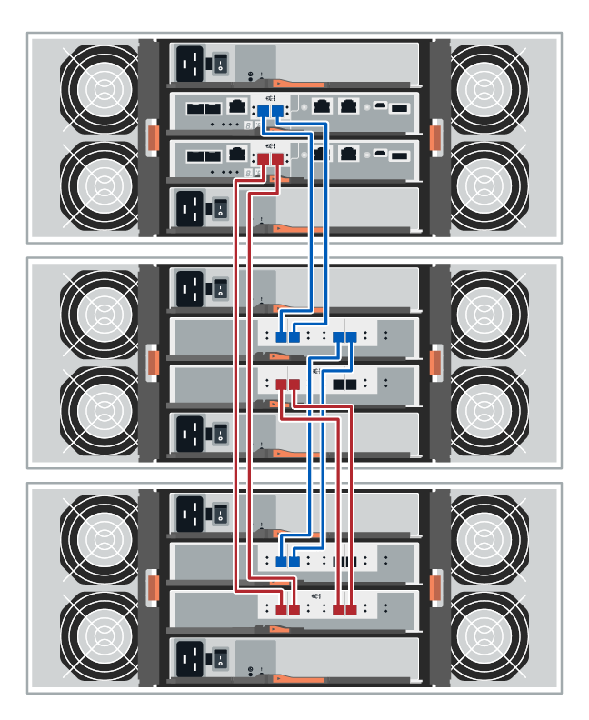
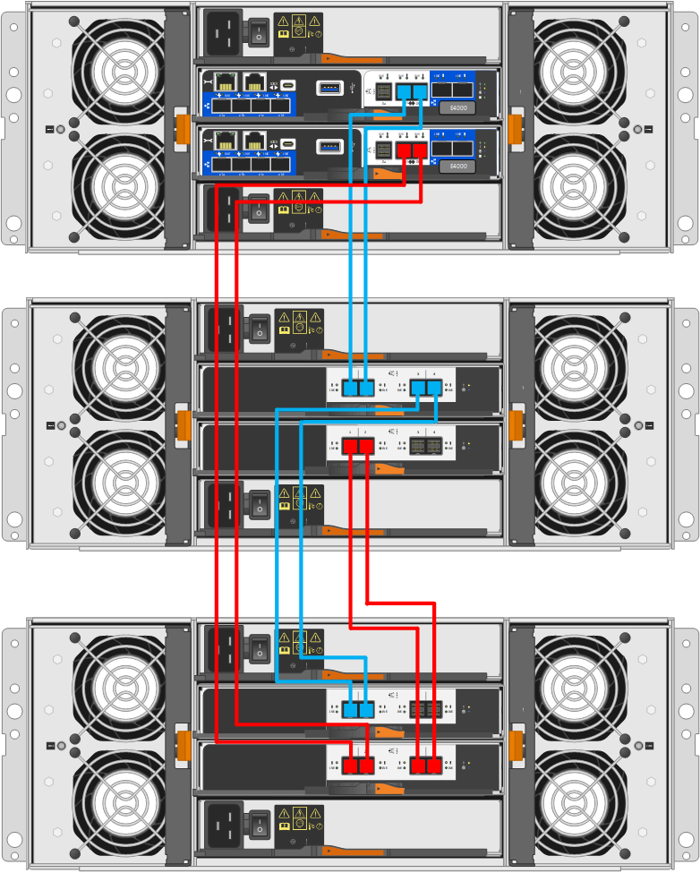

= Cabeamento do compartimento de unidades
:allow-uri-read: 
:icons: font
:imagesdir: ../media/

[role="lead"]
É necessário conectar cada controladora na gaveta de controladora a um módulo de e/S (IOM) em uma gaveta de unidades.

Este procedimento se aplica aos compartimentos de unidades IOM12 e IOM12B.

NOTE: Os módulos IOM12B só são suportados no SANtricity os 11.70.2 em diante. Certifique-se de que o firmware do controlador foi atualizado antes de instalar ou atualizar para um IOM12B.

NOTE: Esse procedimento é para hot-swaps ou substituições de IOM de gaveta semelhantes. Isto significa que só pode substituir um módulo IOM12 por outro módulo IOM12 ou substituir um módulo IOM12B por outro módulo IOM12B. (Sua prateleira pode ter dois módulos IOM12 ou ter dois módulos IOM12B.)

Se você estiver fazendo o cabeamento de uma gaveta de controladora mais antiga para um DE212C, DE224C ou DE460, https://mysupport.netapp.com/ecm/ecm_download_file/ECMLP2859057["Adição de gavetas de unidade IOM a uma gaveta de controladora E27XX, E56XX ou EF560 existente"^] consulte .

== Cabeamento E2800 e E5700

As informações a seguir se aplicam ao cabeamento de um compartimento de controladora E2800, E2800B, EF280, E5700, EF5700B ou EF570 em um compartimento de unidades de DE212C, DE224C ou DE460.

[role="tabbed-block"]
====
.compartimento de 12 unidades ou 24 unidades
--
Você pode vincular o compartimento de controladora a uma ou mais gavetas de 12 ou 24 unidades.

A imagem a seguir mostra uma representação do compartimento de controladora e dos compartimentos de unidades. Para localizar as portas no modelo, https://hwu.netapp.com/Controller/Index?platformTypeId=2357027["Hardware Universe"^] consulte .

image::../media/12_24_cabling.png[Um compartimento de controladora e compartimentos de 12 ou 24 unidades]

--
.compartimento de 60 unidades
--
Você pode vincular o compartimento de controladora a uma ou mais gavetas de 60 unidades.

A imagem a seguir mostra uma representação do compartimento de controladora e dos compartimentos de unidades. Para localizar as portas no modelo, https://hwu.netapp.com/Controller/Index?platformTypeId=2357027["Hardware Universe"^] consulte .

--
====

== Cabeamento EF300 e EF600

As informações a seguir se aplicam ao cabeamento de um compartimento de controladora EF300, EF600, EF300C ou EF600CU em um compartimento de unidades de DE212C, DE224C ou DE460 U.

.Antes de começar
Antes de fazer o cabeamento de um EF300 ou EF600, verifique se o firmware está atualizado para a versão mais recente. Para atualizar o firmware, siga as instruções em link:../upgrade-santricity/index.html["Atualizando o SANtricity os"^].

[role="tabbed-block"]
====
.compartimento de 12 unidades ou 24 unidades
--
Você pode vincular o compartimento de controladora a uma ou mais gavetas de 12 ou 24 unidades.

A imagem a seguir mostra uma representação do compartimento de controladora e dos compartimentos de unidades. Para localizar as portas no modelo, https://hwu.netapp.com/Controller/Index?platformTypeId=2357027["Hardware Universe"^] consulte .

image::../media/ef_to_de224c_four_shelves.png[Um compartimento de controladora e compartimentos de 12 ou 24 unidades]

--
.compartimento de 60 unidades
--
Você pode vincular o compartimento de controladora a uma ou mais gavetas de 60 unidades.

A imagem a seguir mostra uma representação do compartimento de controladora e dos compartimentos de unidades. Para localizar as portas no modelo, https://hwu.netapp.com/Controller/Index?platformTypeId=2357027["Hardware Universe"^] consulte .

image::../media/ef_to_de460c.png[Um compartimento de controladora e compartimentos de 60 unidades]

--
====

== Cabeamento E4000

As informações a seguir se aplicam ao cabeamento de um compartimento de controladora E4000U a um compartimento de unidades de DE212CU, DE224CU ou DE460U.

[role="tabbed-block"]
====
.compartimento de 12 unidades
--
Você pode vincular o compartimento de controladora a uma ou mais gavetas de 12 unidades.

image::../media/e4012_cabling.png[Um compartimento de controladora e um compartimento de 12 unidades]

--
.compartimento de 60 unidades
--
Você pode vincular o compartimento de controladora a uma ou mais gavetas de 60 unidades.

--
====