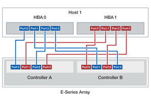
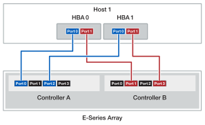

= Cabeamento para conectar um host a controladoras ou swticches (e-Series)
:allow-uri-read: 
:icons: font
:imagesdir: ../media/

[role="lead"]
Você pode vincular um host diretamente a um controlador (topologia de conexão direta) ou usar switches (topologia de switch) para conectar um host a um controlador.

== Cabeamento para topologia de conexão direta

Uma topologia com conexão direta conecta os adaptadores de host diretamente aos controladores do sistema de storage.

Para ajudar a garantir o máximo desempenho, use todas as portas de adaptador de host disponíveis.

.Um host com dois HBAs
A figura a seguir mostra um exemplo de um host com dois HBA instalados.

.Um host com dois HBAs (cabeamento alternativo)
A figura a seguir mostra um exemplo de um host com dois HBA instalados.

.Dois hosts com dois HBAs por host
A figura a seguir mostra um exemplo de dois hosts cada um com dois HBAs instalados.

image::../media/2hosts_4hbas_ieops-2146.svg[Dois hosts/quatro HBAs e dois cabeamento de controladoras]

== Cabeamento para uma topologia de switch

A topologia do switch usa switches para conectar hosts aos controladores no sistema de storage. O switch deve suportar o tipo de conexão usado entre o host e o controlador.

A figura a seguir mostra um exemplo de conexão. Para switches que fornecem funcionalidade de provisionamento, você deve isolar cada iniciador e par de destino.

.Dois hosts e dois switches
image::../media/topology_host_fabric_generic.png[Cabeamento de dois hosts e dois switches]

*(1)* _Conete cada adaptador de host diretamente ao switch._

*(2)* _Conete cada switch diretamente às portas do host nos controladores. Para ajudar a garantir o máximo desempenho, use todas as portas de adaptador de host disponíveis._
