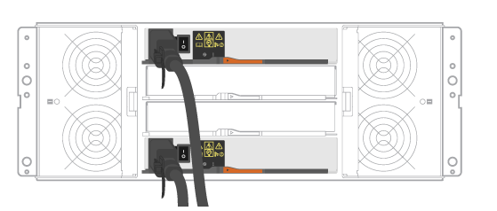

= Ligue os cabos
:allow-uri-read: 
:icons: font
:imagesdir: ../media/

[role="lead"]
Saiba como conectar os cabos de alimentação e ligar as gavetas de unidade.

.Antes de começar
* Instale o hardware.
* Tome precauções antiestáticas.

Este procedimento se aplica aos compartimentos de unidades IOM12 e IOM12B.

NOTE: Os módulos IOM12B só são suportados no SANtricity os 11.70.2 em diante. Certifique-se de que o firmware do controlador foi atualizado antes de instalar ou atualizar para um IOM12B.

NOTE: Esse procedimento é para hot-swaps ou substituições de IOM de gaveta semelhantes. Isto significa que só pode substituir um módulo IOM12 por outro módulo IOM12 ou substituir um módulo IOM12B por outro módulo IOM12B. (Sua prateleira pode ter dois módulos IOM12 ou ter dois módulos IOM12B.)

.Passos
. Faça o cabeamento das prateleiras.
+
Faça o cabo do sistema de acordo com a sua configuração. Se você precisar de mais opções de cabeamento do que os exemplos mostrados, link:../install-hw-cabling/index.html["Cabeamento"]consulte .

+
Para os exemplos mostrados, você precisa dos seguintes cabos:

+
|===

 a| 
image:../media/sas_cable.png["Cabo SAS"]
 a| 
*Cabos SAS*

|===
+
.Exemplo A: Compartimento de controladora E5700U com três compartimentos de disco DE212C/DE224U em uma configuração SAS padrão.

+
.. Controlador de cabo A a IOM a da primeira gaveta de unidades.
.. A OIM de cabo A da primeira gaveta de unidade para IOM A da segunda gaveta de unidade.
.. A OIM de cabo A da segunda gaveta de unidade para Iom A da terceira gaveta de unidade.
.. Controlador de cabo B a IOM B do terceiro compartimento de unidades.
.. Cabo IOM B da segunda gaveta de unidade para IOM B da terceira gaveta de unidades.
.. Cabo IOM B da primeira gaveta de unidade para IOM B da segunda gaveta de unidade.

+
.Exemplo B: Um compartimento de controladora E5700U com um compartimento de disco DE212C/DE224U em uma configuração SAS padrão.
image:../media/example_b_57_28.png["Controladora E5700 em uma configuração SAS"]

+
.. Controlador de cabo A a IOM A..
.. Controlador de cabo B a IOM B.

. Alimente as gavetas de unidades.
+
Você precisa dos seguintes cabos:

+
|===

 a| 
image:../media/power_cable_inst-hw-e2800-e5700.png["Cabos de alimentação"]
 a| 
*Cabos de alimentação*

|===
+

CAUTION: Confirme se os interrutores de alimentação do compartimento de unidades estão desligados.

+
.. Conete os dois cabos de alimentação de cada compartimento a diferentes unidades de distribuição de energia (PDUs) no gabinete ou no rack.
.. Se você tiver compartimentos de unidades, ligue os dois switches de energia primeiro. Aguarde 2 minutos antes de ligar a energia ao compartimento do controlador.
.. Ligue os dois interruptores de energia no compartimento do controlador.
.. Verifique os LEDs e o visor de sete segmentos em cada controlador.
+
Durante a inicialização, o visor de sete segmentos mostra a sequência de repetição do SO, SD, blank para indicar que o controlador está executando o processamento de início do dia. Depois que o controlador tiver inicializado, o ID do compartimento é exibido.

+
|===

 a| 
*Exemplo: As conexões de alimentação estão na parte traseira da prateleira.* image:../media/trafford_power.png["Ligações do compartimento de alimentação"]

|===

