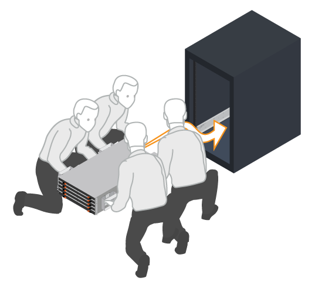

= Instale o material de fixação - E2860, E5760 e DE460
:allow-uri-read: 
:icons: font
:imagesdir: ../media/

[role="lead"]
Saiba como instalar um sistema de armazenamento E2860, E5760 ou DE460 em um rack de dois pilares ou em um gabinete de sistema NetApp.

.Antes de começar
* Registre seu hardware em http://mysupport.netapp.com/["Suporte à NetApp"^].
* Prepare uma área de trabalho plana e livre de estática.
* Obtenha uma pulseira antiestática e tome precauções antiestáticas.

Leia todas as instruções antes de prosseguir com os passos abaixo.

.Passos
. Desembale o conteúdo do hardware e, em seguida, faça o inventário do hardware contido contra o deslizamento da embalagem.
. Instale os trilhos.
+
Se as instruções foram incluídas com o hardware de montagem em rack, consulte-as para saber como instalar os trilhos. Para obter instruções adicionais de montagem em rack, link:../rackmount-hardware.html["Hardware de montagem em rack"]consulte .

+

NOTE: Para armários de orifício quadrado, primeiro você deve instalar as porcas de gaiola fornecidas para fixar a parte frontal e traseira da prateleira com parafusos.

+
|===
|  

 a| 
image:../media/install_rails_inst-hw-e2800-e5700.png["Instale os trilhos"]

|===
. Instale a prateleira.
+

CAUTION: Uma prateleira vazia pesa aproximadamente 132 lb (60 kg). Um elevador mecanizado ou quatro pessoas usando alças de elevação são necessárias para mover com segurança uma prateleira vazia.

+
.. Se levantar a prateleira manualmente, fixe as quatro pegas de elevação. Empurre cada alça para cima até que ela se encaixe no lugar.
.. Apoiando a prateleira de baixo, deslize-a para dentro do gabinete. Se as pegas de elevação forem utilizadas, retire-as um conjunto de cada vez, à medida que a prateleira desliza para dentro do armário. Para remover as pegas, puxe para trás o trinco de desbloqueio, empurre-o para baixo e, em seguida, puxe-o para fora da prateleira.
+

. Fixe a prateleira.
+
.. Insira os parafusos no primeiro e no terceiro orifícios da parte superior da prateleira de ambos os lados para prendê-la à parte frontal do gabinete.
.. Coloque dois suportes traseiros em cada lado da secção traseira superior da prateleira. Insira os parafusos no primeiro e terceiro orifícios de cada suporte para fixar a parte traseira do gabinete.
+
image:../media/trafford_secure.png["Fixe os suportes na parte traseira da prateleira"]

. Instale as unidades.
+
.. Enrole a extremidade da correia da pulseira ESD à volta do pulso e fixe a extremidade do clipe a um solo metálico para evitar descargas estáticas.
.. Começando na ranhura dianteira esquerda da gaveta superior, instale cada unidade posicionando-a cuidadosamente na ranhura da unidade e baixando a pega da unidade levantada até encaixar no devido lugar.
+
*** Se você estiver instalando menos de 60 unidades, tiver unidades de estado sólido (SSDs) ou suas unidades tiverem capacidades diferentes:
+
**** Manter um mínimo de 20 unidades por gaveta. Instale as unidades nos quatro slots frontais em cada gaveta primeiro, para um fluxo de ar adequado para resfriamento.
**** Distribua todas as unidades restantes pelas gavetas. Se possível, instale um número igual de cada tipo de unidade em cada gaveta para permitir a criação de grupos de volume ou pools de discos protegidos contra perda de gaveta.
**** Distribua todos os SSDs uniformemente entre as gavetas.

.. Deslize cuidadosamente a gaveta para dentro, empurrando o centro e fechando cuidadosamente ambos os trincos.
+
*** Não force a gaveta no lugar.
*** Use a ferramenta conetor, desconete o conetor do cabo de cobra e reconete-o, certifique-se de ouvir um clique para determinar que a reconexão está feita corretamente.
*** A desconexão e a reconexão só devem ser necessárias durante a configuração inicial ou se a bandeja for enviada para um local diferente.

.. Fixe a moldura frontal.

|===

 a| 
image:../media/trafford_overview.png["Instale a placa frontal"]

 a| 

CAUTION: Risco de danos no equipamento -- pare de empurrar a gaveta se sentir preso. Use as alavancas de liberação na parte frontal da gaveta para deslizar a gaveta para fora. Em seguida, reinsira cuidadosamente a gaveta na ranhura.

|===