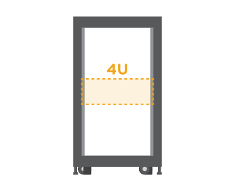

= Prepare-se para a instalação
:allow-uri-read: 
:icons: font
:imagesdir: ../media/

[role="lead"]
Saiba como se preparar para instalar o sistema de armazenamento da série E2860, E5760 ou DE460.

.Passos
. Crie uma conta e Registre seu hardware em http://mysupport.netapp.com/["Suporte à NetApp"^].
. Certifique-se de que os itens a seguir estão na caixa que você recebeu.
+
|===

 a| 
image:../media/trafford_overview.png["Gaveta com unidades instaladas e painel frontal"]
 a| 
Prateleira, moldura e ferragens de montagem em rack

 a| 
image:../media/handles_counted.png["Pegas da prateleira"]
 a| 
Alças de prateleira x4

|===
+
A tabela a seguir identifica os tipos de cabos que você pode receber. Se receber um cabo não listado na tabela, consulte https://hwu.netapp.com/["Hardware Universe"^] para localizar o cabo e identificar a respetiva utilização.

+
|===
| Tipo de conetor | Tipo de cabo | Utilização 

 a| 
image:../media/cable_ethernet_inst-hw-e2800-e5700.png["Cabos Ethernet"]
 a| 
Cabos Ethernet

(se encomendado)
 a| 
Conexão de gerenciamento

 a| 
image:../media/cable_io_inst-hw-e2800-e5700.png["Cabos de e/S."]
 a| 
Cabos de e/S.

(se encomendado)
 a| 
Cabeamento dos hosts de dados

 a| 
image:../media/cable_power_inst-hw-e2800-e5700.png["Cabos de alimentação"]
 a| 
Cabos de alimentação

x2 por prateleira

(se encomendado)
 a| 
Ligar o sistema de armazenamento

 a| 
image:../media/sas_cable.png["Cabos SAS"]
 a| 
Cabos SAS (incluídos somente com as gavetas de unidade)
 a| 
Cabeamento das gavetas

|===
. Certifique-se de fornecer os seguintes itens.
+
|===

 a| 
image:../media/screwdriver_inst-hw-e2800-e5700.png["Chave de fendas Phillips nº 2"]
 a| 
Chave de fendas Phillips nº 2

 a| 
image:../media/flashlight_inst-hw-e2800-e5700.png["Lanterna"]
 a| 
Lanterna

 a| 
image:../media/wrist_strap_inst-hw-e2800-e5700.png["Correia ESD"]
 a| 
Correia ESD

 a| 

 a| 
4U espaço em rack: Um rack padrão de 19 pol. (48,30 cm) para caber 4U prateleiras das seguintes dimensões.

*Profundidade*: 38,25 pol. (97,16 cm)

* Largura*: 17,66 pol. (44,86 cm)

*Altura*: 6,87 pol. (17,46 cm)

* Peso máximo*: 250 lb (113 kg)

 a| 
image:../media/management_station_inst-hw-e2800-e5700_g60b3.png["Estação de gerenciamento com navegador compatível para software de gerenciamento"]
 a| 
Um navegador compatível para o software de gerenciamento:

** Google Chrome (versão 89 e posterior)
** Microsoft Edge (versão 90 e posterior)
** Mozilla Firefox (versão 80 e posterior)
** Safari (versão 14 e posterior)

|===

