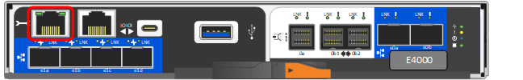

= Configuração completa do sistema de armazenamento (E4060)
:allow-uri-read: 
:icons: font
:imagesdir: ../media/

[role="lead"]
Saiba como fazer o cabeamento dos controladores à sua rede e concluir a configuração e configuração do sistema de armazenamento.

== Passo 1: Faça o cabeamento dos hosts de dados

Faça o cabeamento do sistema de acordo com a topologia da rede.

NOTE: As portas de host no lado esquerdo inferior (e1a, e1b, E1C e e1d) e no lado direito superior (e0a e e0b) da controladora podem ser usadas para cabeamento de host de dados.

[role="tabbed-block"]
====
.Opção 1: Topologia de conexão direta
--
O exemplo a seguir mostra o cabeamento dos hosts de dados usando uma topologia de conexão direta.

. Conete cada porta HBA do host às portas do host nos controladores (e1a, e1b, E1C, e1d ou e0a e e0b).

NOTE: Para obter exemplos adicionais de diagramas de cabeamento, https://docs.netapp.com/us-en/e-series/install-hw-cabling/host-cable-task.html#cabling-for-a-direct-attached-topology["Cabeamento de host"^]consulte .

--
.Opção 2: Topologia de malha
--
O exemplo a seguir mostra o cabeamento dos hosts de dados usando uma topologia de malha.

image:../media/drw_e4060_fabric_topology_ieops-2049.svg["E4060 topologia de tecido, largura de 1000pxmm"]

. Conete cada adaptador de host diretamente ao switch.
. Conete cada switch diretamente às portas do host nos controladores (e1a, e1b, E1C, e1d ou e0a e e0b).

--
====

== Passo 2: Conete e configure a conexão de gerenciamento

Você pode configurar as portas de gerenciamento do controlador usando um servidor DHCP ou um endereço IP estático.

[role="tabbed-block"]
====
.Opção 1: Servidor DHCP
--
Saiba como configurar as portas de gerenciamento com um servidor DHCP.

.Antes de começar
* Configure o servidor DHCP para associar um endereço IP, uma máscara de sub-rede e um endereço de gateway como uma concessão permanente para cada controlador.
* Obtenha os endereços IP atribuídos para se conetar ao sistema de armazenamento a partir do administrador da rede.

.Passos
. Conete um cabo Ethernet à porta de gerenciamento de cada controlador e conete a outra extremidade à rede.
+
As figuras a seguir mostram exemplos da localização da porta de gerenciamento do controlador:

+

. Abra um navegador e conete-se ao sistema de armazenamento usando um dos endereços IP do controlador fornecidos pelo administrador da rede.

--
.Opção 2: Endereço IP estático
--
Saiba como configurar manualmente as portas de gerenciamento inserindo o endereço IP e a máscara de sub-rede.

.Antes de começar
* Obtenha o endereço IP dos controladores, a máscara de sub-rede, o endereço de gateway e as informações do servidor DNS e NTP do administrador da rede.
* Certifique-se de que o computador portátil que está a utilizar não está a receber a configuração de rede a partir de um servidor DHCP.

.Passos
. Usando um cabo Ethernet, conete a porta de gerenciamento do controlador A à porta Ethernet de um laptop.
+

. Abra um navegador e use o endereço IP padrão (169.254.128.101) para estabelecer uma conexão com o controlador. O controlador envia de volta um certificado autoassinado. O navegador informa que a conexão não é segura.
. Siga as instruções do navegador para continuar e iniciar o Gerenciador de sistema do SANtricity. Se não conseguir estabelecer uma ligação, verifique se não está a receber a configuração de rede a partir de um servidor DHCP.
. Defina a palavra-passe do sistema de armazenamento para iniciar sessão.
. Use as configurações de rede fornecidas pelo administrador de rede no assistente *Configurar configurações de rede* para configurar as configurações de rede do controlador A e selecione *concluir*.
+

NOTE: Como você redefine o endereço IP, o System Manager perde a conexão com o controlador.

. Desconete o cabo ethernet do sistema de storage e conete a porta de gerenciamento do controlador A à rede.
. Abra um navegador em um computador conetado à rede e insira o endereço IP recém-configurado do controlador A.
+

NOTE: Se perder a ligação ao controlador A, pode ligar um cabo ethernet ao controlador B para restabelecer a ligação ao controlador A através do controlador B (169.254.128.102).

. Inicie sessão utilizando a palavra-passe que definiu anteriormente.
+
O assistente Configurar definições de rede será apresentado.

. Use as configurações de rede fornecidas pelo administrador de rede no assistente *Configurar configurações de rede* para configurar as configurações de rede do controlador B e selecione *concluir*.
. Ligue o controlador B à rede.
. Valide as configurações de rede do controlador B inserindo o endereço IP recém-configurado do controlador B em um navegador.
+

NOTE: Se perder a ligação ao controlador B, pode utilizar a ligação previamente validada ao controlador A para restabelecer a ligação ao controlador B através do controlador A.

--
====

== Passo 3: Configurar e gerenciar seu sistema de armazenamento

Depois de instalar o hardware, use o software SANtricity para configurar e gerenciar o sistema de storage.

.Antes de começar
* Configure suas portas de gerenciamento.
* Verifique e registe a sua palavra-passe e endereços IP.

.Passos
. Use o software SANtricity para configurar e gerenciar seus storage arrays.
. Na configuração de rede mais simples, conete seu controlador a um navegador da Web e use o Gerenciador de sistema SANtricity para gerenciar um único storage array da série E4000. Para acessar o System Manager, use os mesmos endereços IP usados para configurar suas portas de gerenciamento.

