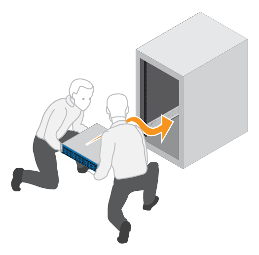

= Instale o hardware
:allow-uri-read: 
:icons: font
:imagesdir: ../media/

[role="lead"]
Você pode instalar um sistema de armazenamento EF300 ou EF600 em um rack de dois postes ou em um gabinete do sistema NetApp.

.Antes de começar
Certifique-se de fazer o seguinte:

* Registre seu hardware em http://mysupport.netapp.com/["Suporte à NetApp"^].
* Prepare uma área de trabalho plana e livre de estática.
* Tome precauções antiestáticas.

.Passos
. Desembale o hardware.
+
.. Desembale o conteúdo e faça o inventário do hardware contido contra a folha de embalagem.
.. Antes de prosseguir, leia todas as instruções.

. Instale os trilhos.
+

NOTE: Para evitar que o equipamento caia, instale o hardware da parte inferior do rack ou gabinete até a parte superior.

+
|===

 a| 
Se as instruções foram incluídas com o hardware de montagem em rack, consulte-as para saber como instalar os trilhos. Para obter instruções adicionais de montagem em rack, link:../rackmount-hardware.html["Hardware de montagem em rack"]consulte .

 a| 
image:../media/install_rails_inst-hw-ef600.png["Instale os trilhos"]

|===
. Instale a prateleira.
+
|===

 a| 
.. Se você estiver instalando várias prateleiras, comece a instalar a partir da parte inferior para a parte superior do gabinete. Posicione a parte de trás da prateleira sobre os trilhos.
+

CAUTION: Ao instalar a prateleira, use um elevador de equipe com duas pessoas.

.. Apoiando a prateleira de baixo, deslize-a para dentro do gabinete.

 a| 

|===
. Fixe a prateleira.
+
|===

 a| 
Para obter mais informações, link:../rackmount-hardware.html["Hardware de montagem em rack"]consulte .

 a| 
image:../media/secure_shelf_inst-hw-ef600.png["Fixe a prateleira"]

|===
. Instale a placa frontal.
+
|===

 a| 
.. Alinhe a placa frontal com a prateleira e encaixe-a no lugar.

 a| 
image:../media/install_faceplate_2_0_inst-hw-ef600.png["Instale a placa frontal"]

|===

