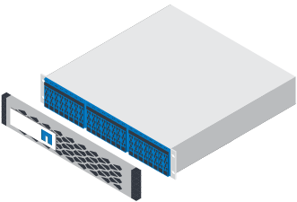

= Prepare-se para a instalação
:allow-uri-read: 
:icons: font
:imagesdir: ../media/

[role="lead"]
Saiba como se preparar para a instalação do seu sistema de armazenamento da série EF300 ou EF600.

.Antes de começar
Se você estiver fazendo o cabeamento do EF300 para expansão SAS, consulte as seguintes informações:

* link:../maintenance-ef600/sas-add-supertask-task.html["Adicione placas de expansão SAS"^] Para instalação da placa de expansão SAS.
* link:../install-hw-cabling/index.html["Visão geral do cabeamento"] Para cabeamento de expansão SAS.

.Passos
. Crie uma conta e Registre seu hardware em http://mysupport.netapp.com/["Suporte à NetApp"^].
. Certifique-se de que os itens a seguir estão na caixa que você recebeu.
+
|===

 a| 

 a| 
Gaveta com unidades instaladas (tampa frontal e tampa frontal empacotadas separadamente)

 a| 
image:../media/superrails_inst-hw-ef600.png["Hardware de montagem em rack"]
 a| 
Hardware de montagem em rack

|===
+
A tabela a seguir identifica os tipos de cabos que você pode receber. Se receber um cabo não listado na tabela, consulte https://hwu.netapp.com/["Hardware Universe"] para localizar o cabo e identificar a respetiva utilização.

+
|===
| Tipo de conetor | Tipo de cabo | Utilização 

 a| 
image:../media/cable_ethernet_inst-hw-ef600.png["Cabo ethernet RJ-45"]
 a| 
Cabos Ethernet RJ-45 (se solicitados)
 a| 
Conexão de gerenciamento

 a| 
image:../media/cable_io_inst-hw-ef600.png["Cabo de e/S."]
 a| 
Cabos de e/S (se solicitados)
 a| 
Cabeamento dos hosts de dados

 a| 
image:../media/cable_power_inst-hw-ef600.png["Cabos de alimentação"]
 a| 
Cabos de alimentação (se tiverem sido encomendados)
 a| 
Ligar o sistema de armazenamento

|===
. Certifique-se de fornecer os seguintes itens.
+
|===

 a| 
image:../media/screwdriver_inst-hw-ef600.png["Chave de fendas Phillips nº 2"]
 a| 
Chave de fendas Phillips nº 2

 a| 
image:../media/flashlight_inst-hw-ef600.png["Lanterna"]
 a| 
Lanterna

 a| 
image:../media/wrist_strap_inst-hw-ef600.png["Correia ESD"]
 a| 
Correia ESD

 a| 
image:../media/2u_rackspace_inst-hw-ef600.png["Rack de 2U U"]
 a| 
2U espaço em rack: Um rack padrão de 19 pol. (48,30 cm) para caber 2U prateleiras das seguintes dimensões.

*Profundidade*: 19,0 pol. (48,3 cm)

* Largura*: 17,6 pol. (44,7 cm)

*Altura*: 3,34 pol. (8,48 cm)

* Prateleira*: 24 unidades

* Peso máximo*: 60,5 lb (27,4 kg)

NOTE: O uso de gabinetes de terceiros pode fazer com que os cabos de alimentação restrinjam o acesso ao controlador.

 a| 
image:../media/management_station_inst-hw-ef600_g60b3.png["Estação de gerenciamento com navegador compatível para software de gerenciamento"]
 a| 
Um navegador compatível para o software de gerenciamento:

** Google Chrome (versão 89 e posterior)
** Microsoft Edge (90 e posterior)
** Mozilla Firefox (versão 80 e posterior)
** Safari (versão 14 e posterior)

|===

