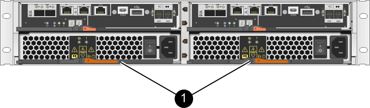

= Requisitos para substituir o recipiente - E2800
:allow-uri-read: 
:icons: font
:imagesdir: ../media/

[role="lead"]
Antes de substituir um recipiente em uma matriz E2800, revise os tipos e requisitos do recipiente.

Os tipos de receptáculos incluem fontes de alimentação, coletores de alimentação e coletores de ventilador.

== Fonte de alimentação

NOTE: O procedimento de substituição da fonte de alimentação é aplicável para substituições IOM. Para substituir a sua IOM, execute o procedimento de substituição da fonte de alimentação.

Cada compartimento de unidade ou compartimento de controladora de 12 ou 24 unidades inclui duas fontes de alimentação com ventiladores integrados. Estes são referidos como _power-fan canisters_ no Gerenciador de sistemas do SANtricity. Se um recipiente do ventilador falhar, você deve substituí-lo o mais rápido possível para garantir que o compartimento tenha uma fonte de alimentação redundante e resfriamento adequado.

=== Tipos de prateleiras para uma fonte de alimentação

Você pode substituir uma fonte de alimentação nas seguintes prateleiras:

* Compartimento do controlador de E2812 TB
* Compartimento do controlador de E2824 TB
* Array Flash EF280
* Compartimento de unidade de DE212C TB
* Compartimento de unidade de DE224C TB

A figura a seguir mostra um exemplo de compartimento de controladora E2812, compartimento de controladora E2824 e array Flash EF280 com duas fontes de alimentação (coletores de ventilador de energia). Os compartimentos de unidades DE212C e DE224C são idênticos, mas incluem módulos de e/S (IOMs) em vez de coletores de controladora.

*(1)* _compartimento do controlador com duas fontes de alimentação (coletores do ventilador de energia) abaixo dos coletores do controlador_

O procedimento para substituir uma fonte de alimentação não descreve como substituir um recipiente do ventilador de energia com falha em uma bandeja de unidades DE1600 ou DE5600, que pode estar conetado aos compartimentos de controladores E5700 ou E2800. Para obter instruções sobre esses modelos de bandeja de unidades, link:https://library.netapp.com/ecm/ecm_download_file/ECMP1140874["Recolocar um recipiente do ventilador de alimentação no tabuleiro de unidades DE1600 ou no tabuleiro de unidades DE5600"^]consulte a .

=== Requisitos para substituir uma fonte de alimentação

Se você pretende substituir uma fonte de alimentação, tenha em mente os seguintes requisitos.

* Você precisa ter uma fonte de alimentação de substituição (recipiente do ventilador de energia) compatível com o modelo do compartimento de controladora ou do compartimento de unidades.
* Você tem uma pulseira antiestática ou tomou outras precauções antiestáticas.
* Você pode substituir uma fonte de alimentação (recipiente do ventilador de energia) enquanto seu storage array estiver ligado e executando operações de e/S do host, desde que as seguintes condições sejam verdadeiras:
+
** A segunda fonte de alimentação (recipiente da ventoinha de alimentação) na prateleira tem um estado ideal.
** O campo *OK para remover* na área Detalhes do Guru de recuperação no Gerenciador de sistema do SANtricity exibe *Sim*, indicando que é seguro remover esse componente.
+

NOTE: Se a segunda fonte de alimentação (recipiente da ventoinha de alimentação) na prateleira não tiver o estado ideal ou se o Recovery Guru indicar que não está OK para remover o recipiente da ventoinha de alimentação, contacte o suporte técnico.

== Depósito de alimentação

Cada compartimento de controladora ou compartimento de unidade de 60 unidades inclui dois coletores de energia para redundância de energia.

=== Tipos de prateleira para um recipiente de alimentação

Você pode substituir um recipiente de energia nas seguintes prateleiras:

* E2860 gavetas de controladora
* Compartimento de unidade de DE460C TB

O procedimento para substituir um recipiente de alimentação não descreve como substituir um recipiente de alimentação com falha em uma bandeja de unidades DE6600, que pode estar conetada ao compartimento do controlador.

A figura a seguir mostra a parte traseira de um compartimento de unidades de DE460C TB com os dois coletores de energia:

image::../media/28_dwg_de460c_rear_no_callouts_maint-e2800.gif[DE460C com latas de energia]

A figura a seguir mostra um recipiente de alimentação:

image::../media/28_dwg_e2860_de460c_psu_maint-e2800.gif[Latas de energia]

=== Requisitos para a substituição de um recipiente de alimentação

Se você pretende substituir um recipiente de energia, tenha em mente os seguintes requisitos.

* Você tem um recipiente de energia de substituição compatível com o modelo do compartimento de controladora ou do compartimento de unidade.
* Você tem um recipiente de alimentação instalado e em execução.
* Você tem uma pulseira antiestática ou tomou outras precauções antiestáticas.
* Você pode substituir um recipiente de energia enquanto seu storage array estiver ligado e executando operações de e/S de host, contanto que as seguintes condições sejam verdadeiras:
+
** O outro recipiente de alimentação na prateleira tem o estado ideal.
+

NOTE: Enquanto executa o procedimento, o outro recipiente de alimentação fornece alimentação a ambas as ventoinhas para garantir que o equipamento não sobreaquece.

** O campo *OK para remover* na área Detalhes do Guru de recuperação no Gerenciador de sistema do SANtricity exibe *Sim*, indicando que é seguro remover esse componente.
+

NOTE: Se o segundo recipiente de alimentação na prateleira não tiver o estado ideal ou se o Recovery Guru indicar que não está correto remover o recipiente de alimentação, contacte o suporte técnico.

== Recipiente da ventoinha

Cada compartimento de controladora de 60 unidades ou compartimento de unidade inclui dois coletores de ventilador.

=== Tipos de prateleira para um recipiente do ventilador

Você pode substituir um recipiente de ventilador nas seguintes prateleiras:

* E2860 gavetas de controladora
* Compartimento de unidade de DE460C TB

O procedimento para substituir um recipiente do ventilador não descreve como substituir um recipiente do ventilador com falha em uma bandeja de unidades DE6600, que pode estar conetado ao compartimento do controlador.

A figura seguinte mostra um recipiente da ventoinha:

image::../media/28_dwg_e2860_de460c_single_fan_canister_no_callouts_maint-e2800.gif[Recipiente da ventoinha]

A figura a seguir mostra a parte traseira de uma prateleira DE460C com dois coletores de ventilador:

image::../media/28_dwg_de460c_rear_no_callouts_maint-e2800.gif[DE460c com dois coletores de ventilador]

CAUTION: *Possíveis danos ao equipamento* -- se substituir um recipiente do ventilador com a alimentação ligada, deve concluir o procedimento de substituição no prazo de 30 minutos para evitar a possibilidade de sobreaquecimento do equipamento.

=== Requisitos para a substituição de um recipiente do ventilador

Se você pretende substituir um recipiente de ventilador, tenha em mente os seguintes requisitos.

* Você tem um recipiente do ventilador (FAN) de substituição compatível com o modelo do compartimento de controladora ou do compartimento de unidade.
* Você tem um recipiente de ventilador que está instalado e funcionando.
* Você tem uma pulseira antiestática ou tomou outras precauções antiestáticas.
* Se executar este procedimento com a alimentação ligada, deve concluí-lo no prazo de 30 minutos para evitar a possibilidade de sobreaquecimento do equipamento.
* Você pode substituir um recipiente de ventilador enquanto seu storage array estiver ligado e executando operações de e/S do host, contanto que as seguintes condições sejam verdadeiras:
+
** O segundo recipiente da ventoinha na prateleira tem um estado ideal.
** O campo *OK para remover* na área Detalhes do Guru de recuperação no Gerenciador de sistema do SANtricity exibe *Sim*, indicando que é seguro remover esse componente.
+

NOTE: Se o segundo recipiente do ventilador na prateleira não tiver o status ideal ou se o Recovery Guru indicar que não está OK para remover o recipiente do ventilador, entre em Contato com o suporte técnico.

