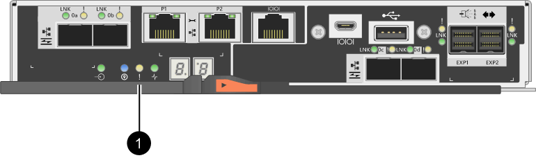

= Alterar o protocolo do host - E2800
:allow-uri-read: 
:experimental: 
:icons: font
:imagesdir: ../media/

[role="lead"]
Se você tiver um storage array de E2800 GbE com portas de host SFP (óticas), poderá alterar o protocolo de porta de host de Fibre Channel (FC) para iSCSI ou de iSCSI para FC.

Você pode alterar o protocolo usado pelas portas do host incorporadas ao controlador (_baseboard host ports_), o protocolo usado pelas portas do host na placa de interface do host (_HIC Ports_) ou o protocolo de todas as portas do host.

== Passo 1: Determine se você tem SFPs de protocolo duplo

Use o Gerenciador de sistema SANtricity para determinar que tipo de transcetores SFP você tem. Como esses SFPs podem ser usados com protocolos FC e iSCSI, eles são chamados de SFPs _dual-Protocol_ ou _Unified_.

.Passos
. No Gerenciador do sistema SANtricity, selecione *suporte*.
. Selecione o mosaico *Centro de suporte*.
. Na guia recursos de suporte, localize e selecione o link *Storage Array Profile*.
. Digite *SFP* na caixa de texto e clique em *Find*.
. Para cada SFP listado no Perfil da matriz de armazenamento, localize a entrada para *taxa(s) de dados suportada(s)*.
+
image::../media/sam1130_ss_e2800_unified_spf_maint-e2800.gif[Taxa de dados suportada]

. Consulte a tabela para determinar se você pode reutilizar os SFPs, da seguinte forma:
+
|===
| Taxa(s) de dados suportada(s) | Tipo de SFP | Protocolo suportado 

 a| 
16 Gbps, 10 Gbps, 4 Gbps
 a| 
Com protocolo duplo
 a| 
** *FC:* 16 Gbps, 4 Gbps
** **ISCSI: **10 Gbps

 a| 
25 Gbps, 10 Gbps
 a| 
25 Gbps. 10 Gbps,
 a| 
Apenas iSCSI

 a| 
32 Gbps, 16 Gbps, 8 Gbps, 4 Gbps
 a| 
32 Gbps, 16 Gbps
 a| 
Apenas FC

|===
+
** Se tiver SFPs de protocolo duplo, pode continuar a utilizá-los depois de converter o protocolo.
+

NOTE: Os SFPs de protocolo duplo não suportam iSCSI de 1 GB. Se você estiver convertendo portas de host para iSCSI, esteja ciente de que os SFPs de protocolo duplo suportam apenas um link de 10 GB para a porta conetada.

** Se você tiver SFPs de 16 Gbps e estiver convertendo portas de host para iSCSI, remova os SFPs e substitua-os por SFPs de protocolo duplo ou 10 Gbps após a conversão do protocolo. Conforme necessário, você também pode usar cobre iSCSI de 10 Gbps usando um cabo especial Twin-Ax com SFPs.
+

NOTE: SFPs FC de 8Gbps GB NÃO são compatíveis com as controladoras E28xx ou E57xx. APENAS SFPs FC de 16Gbps e 32 Gbps são suportados.

** Se você tiver SFPs de 10 Gbps e estiver convertendo portas de host para FC, remova os SFPs dessas portas e substitua-os por SFPs de protocolo duplo ou 16 Gbps após a conversão do protocolo.

== Passo 2: Obtenha o pacote de recursos

Para obter o pacote de recursos, é necessário o número de série do compartimento do controlador, um Código de ativação de recursos e o Identificador de ativação de recursos para o storage array.

.Passos
. Localize o número de série.
+
.. No Gerenciador do sistema do SANtricity, selecione menu:suporte[Centro de suporte].
.. Com a guia *Support Resources* selecionada, role até a seção *View top storage array Properties*.
.. Localize o *número de série do chassi* e copie esse valor para um arquivo de texto.
+
image::../media/sam1130_ss_e2800_storage_array_profile_sn_smid_copy_maint-e2800.gif[Número de série do chassis]

. Localize o *ID do submodelo do pacote de recursos*.
+
.. Na guia recursos de suporte, localize e selecione o link *Storage Array Profile*.
.. Digite *ID do submodelo do pacote de recursos* na caixa de texto e clique em *Localizar*.
+

NOTE: "Submodelo" também pode ser escrito como "submodelo".

.. Localize a ID do submodelo do pacote de recursos para a configuração inicial.
+
image::../media/storage_array_profile2_maint-e2800.gif[ID do submodelo do pacote Featue]

. Usando o ID do submodelo do pacote de recursos, localize o ID do submodelo do controlador correspondente para a configuração inicial e encontre o código de ativação do recurso para a configuração final desejada na tabela abaixo. Em seguida, copie o código de ativação do recurso para um arquivo de texto.
+
|===
3+| A iniciar a configuração 3+| A terminar a configuração .2+| Código de ativação do recurso 

| ID do submodelo do controlador | Portas da placa de base | Portas HIC | ID do submodelo do controlador | Portas da placa de base | Portas HIC 

 a| 
318
 a| 
FC
 a| 
FC
 a| 
319
 a| 
FC
 a| 
ISCSI
 a| 
ZGW-4L2-Z36IJ

 a| 
320
 a| 
ISCSI
 a| 
FC
 a| 
4GZ-NL2-Z4NRP

 a| 
321
 a| 
ISCSI
 a| 
ISCSI
 a| 
TG2-7L2-Z5485

 a| 
_Nenhum HIC ou não um HIC ótico_
 a| 
321
 a| 
ISCSI
 a| 
TG2-7L2-Z5485

 a| 
319
 a| 
FC
 a| 
ISCSI
 a| 
318
 a| 
FC
 a| 
FC
 a| 
1G5-QL2-Z7LFC

 a| 
320
 a| 
ISCSI
 a| 
FC
 a| 
FG7-AL2-Z82RW

 a| 
321
 a| 
ISCSI
 a| 
ISCSI
 a| 
5G7-0K2-Z0G8X

 a| 
320
 a| 
ISCSI
 a| 
FC
 a| 
318
 a| 
FC
 a| 
FC
 a| 
4GP-HL2-ZYRKP

 a| 
319
 a| 
FC
 a| 
ISCSI
 a| 
PGU-KL2-Z1P7I

 a| 
321
 a| 
ISCSI
 a| 
ISCSI
 a| 
BGA-8K2-ZQWM5

 a| 
321
 a| 
ISCSI
 a| 
ISCSI
 a| 
318
 a| 
FC
 a| 
FC
 a| 
SGH-UK2-ZUCJG

 a| 
319
 a| 
FC
 a| 
ISCSI
 a| 
1GK-EK2-ZVSW1

 a| 
320
 a| 
ISCSI
 a| 
FC
 a| 
AGM-XL2-ZWA8A

|===
+
|===
3+| A iniciar a configuração 3+| A terminar a configuração .2+| Código de ativação do recurso 

| ID do submodelo do controlador | Portas da placa de base | Portas HIC | ID do submodelo do controlador | Portas da placa de base | Portas HIC 

 a| 
338
 a| 
FC
 a| 
FC
 a| 
339
 a| 
FC
 a| 
ISCSI
 a| 
PGC-RK2-ZREUT

 a| 
340
 a| 
ISCSI
 a| 
FC
 a| 
MGF-BK2-ZSU3Z

 a| 
341
 a| 
ISCSI
 a| 
ISCSI
 a| 
NGR-1L2-ZZ8QC

 a| 
_Nenhum HIC ou não um HIC ótico_
 a| 
341
 a| 
ISCSI
 a| 
NGR-1L2-ZZ8QC

 a| 
339
 a| 
FC
 a| 
ISCSI
 a| 
338
 a| 
FC
 a| 
FC
 a| 
DGT-7M2-ZKBMD

 a| 
340
 a| 
ISCSI
 a| 
FC
 a| 
GGA-TL2-Z9J50

 a| 
341
 a| 
ISCSI
 a| 
ISCSI
 a| 
WGC-DL2-ZBZIB

 a| 
340
 a| 
ISCSI
 a| 
FC
 a| 
338
 a| 
FC
 a| 
FC
 a| 
4GM-KM2-ZGWS1

 a| 
339
 a| 
FC
 a| 
ISCSI
 a| 
PG0-4M2-ZHDZ6

 a| 
341
 a| 
ISCSI
 a| 
ISCSI
 a| 
XGR-NM2-ZJUGR

 a| 
341
 a| 
ISCSI
 a| 
ISCSI
 a| 
338
 a| 
FC
 a| 
FC
 a| 
3GE-WL2-ZCHNY

 a| 
339
 a| 
FC
 a| 
ISCSI
 a| 
FGH-HL2-ZDY3R

 a| 
340
 a| 
ISCSI
 a| 
FC
 a| 
VGJ-1L2-ZFFEW

|===
+

NOTE: Se a ID do submodelo do controlador não estiver listada, http://mysupport.netapp.com["Suporte à NetApp"^] contacte .

. No System Manager, localize o identificador de ativação da funcionalidade.
+
.. Aceda ao menu:Definições[sistema].
.. Role para baixo até *Complementos*.
.. Em *Change Feature Pack*, localize o *Feature Enable Identifier*.
.. Copie e cole esse número de 32 dígitos em um arquivo de texto.
+
image::../media/sam1130_ss_e2800_change_feature_pack_feature_enable_identifier_copy_maint-e2800.gif['Identificador de ativação da funcionalidade"]

. Aceda a http://partnerspfk.netapp.com["Ativação de licença do NetApp: Ativação do recurso Premium do storage array"^]e introduza as informações necessárias para obter o pacote de funcionalidades.
+
** Número de série do chassis
** Código de ativação do recurso
** Identificador de ativação de funcionalidade
+

NOTE: O site de ativação de recursos Premium inclui um link para ""instruções de ativação de recursos Premium"". Não tente usar essas instruções para este procedimento.

. Escolha se deseja receber o arquivo-chave do pacote de recursos em um e-mail ou baixá-lo diretamente do site.

== Etapa 3: Parar a e/S do host

Você deve parar todas as operações de e/S do host antes de converter o protocolo das portas do host. Não é possível acessar dados no storage array até concluir a conversão com êxito.

.Passos
. Certifique-se de que nenhuma operação de e/S esteja ocorrendo entre o storage array e todos os hosts conectados. Por exemplo, você pode executar estas etapas:
+
** Parar todos os processos que envolvem os LUNs mapeados do armazenamento para os hosts.
** Garantir que nenhuma aplicação esteja gravando dados em LUNs mapeados do storage para os hosts.
** Desmonte todos os sistemas de arquivos associados a volumes no array.
+

NOTE: As etapas exatas para interromper as operações de e/S do host dependem do sistema operacional do host e da configuração, que estão além do escopo dessas instruções. Se você não tiver certeza de como interromper as operações de e/S do host em seu ambiente, considere encerrar o host.

+

CAUTION: *Possível perda de dados* -- se você continuar este procedimento enquanto as operações de e/S estão ocorrendo, o aplicativo host pode perder o acesso aos dados porque o armazenamento não está acessível.

. Se o storage array participar de uma relação de espelhamento, interrompa todas as operações de e/S de host no storage array secundário.
. Aguarde até que quaisquer dados na memória cache sejam gravados nas unidades.
+
O LED verde Cache ative na parte de trás de cada controlador fica aceso quando os dados em cache precisam ser gravados nas unidades. Tem de esperar que este LED se desligue.

+
|===
| Legenda | Tipo de portas de host 

 a| 
*(1)*
 a| 
LED de cache ativo

|===
. Na página inicial do Gerenciador do sistema do SANtricity, selecione *Exibir operações em andamento*.
. Aguarde que todas as operações sejam concluídas antes de continuar com o próximo passo.

== Passo 4: Altere o pacote de recursos

Altere o pacote de recursos para converter o protocolo de host das portas de host da placa base, as portas IB HIC ou ambos os tipos de portas.

.Passos
. No Gerenciador do sistema SANtricity, selecione menu:Configurações[sistema].
. Em *Add-ons*, selecione *Change Feature Pack*.
+
image::../media/sam1130_ss_system_change_feature_pack_maint-e2800.gif[Alterar o pacote de funcionalidades]

. Clique em *Procurar* e, em seguida, selecione o pacote de funcionalidades que pretende aplicar.
. Digite `CHANGE` o campo.
. Clique em *alterar*.
+
A migração do pacote de recursos começa. Ambos os controladores reiniciam automaticamente duas vezes para permitir que o novo pacote de recursos entre em vigor. O storage array retorna a um estado responsivo após a reinicialização ser concluída.

. Confirme se as portas do host têm o protocolo que você espera.
+
.. No Gerenciador do sistema SANtricity, selecione *hardware*.
.. Clique em *Mostrar parte posterior da prateleira*.
.. Selecione o gráfico para o controlador A ou controlador B.
.. Selecione *View settings* no menu de contexto.
.. Selecione a guia *interfaces de host*.
.. Clique em *Mostrar mais configurações*.
.. Revise os detalhes mostrados para as portas de base e as portas HIC (rotulada como "lote 1") e confirme se cada tipo de porta tem o protocolo que você espera.

.O que se segue?
Vá para link:hpp-complete-protocol-conversion-task.html["Conversão completa do protocolo de host"].
