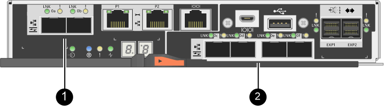

= Requisitos para alterar o protocolo da porta do host - E2800
:allow-uri-read: 
:icons: font
:imagesdir: ../media/

[role="lead"]
Antes de converter o protocolo host para um array E2800, revise os requisitos.

== Portas de host que você pode alterar

NOTE: Apenas as HICs iSCSI de 16GB GB/10Gb GB e as portas de base óticas em um controlador E2800 podem ser convertidas.

A figura a seguir mostra a parte traseira de um controlador E2800 que tem duas portas de host de placa base SFP (óticas) *(1)* e quatro portas HIC SFP (óticas) *(2)*.

NOTE: Um HIC de duas portas também está disponível.

O controlador E2800 ou controladores no seu storage array podem ter diferentes tipos de portas de host de placa base e diferentes tipos de portas HIC. A tabela mostra quais portas de host podem ser alteradas com um pacote de recursos.

|===
| Se você tiver essas portas de host de base... | E você tem essas portas HIC... | Você pode mudar... 

 a| 
Duas portas SFP (óticas)
 a| 
Nenhum
 a| 
Apenas as portas de host da placa base

 a| 
Duas portas SFP (óticas)
 a| 
Quatro portas SFP (óticas)
 a| 
Todas as portas

 a| 
Duas portas SFP (óticas)
 a| 
Duas portas SFP (óticas)
 a| 
Todas as portas

 a| 
Duas portas SFP (óticas)
 a| 
Duas ou quatro portas SAS
 a| 
Apenas as portas de host da placa base

 a| 
Duas portas SFP (óticas)
 a| 
Duas portas RJ-45 (base-T)
 a| 
Apenas as portas de host da placa base

 a| 
Duas portas RJ-45 (base-T)
 a| 
Nenhum
 a| 
Nenhuma das portas

 a| 
Duas portas RJ-45 (base-T)
 a| 
Duas portas RJ-45 (base-T)
 a| 
Nenhuma das portas

|===
As portas do host da placa base e as portas HIC podem usar o mesmo protocolo de host ou protocolos de host diferentes.

== Requisitos para alterar o protocolo de host

* Tem de programar uma janela de manutenção de tempo de inatividade para este procedimento.
* Você deve parar as operações de e/S do host quando executar a conversão e não poderá acessar dados no storage array até que você tenha concluído a conversão com êxito.
* Você deve usar o gerenciamento fora da banda. (Você não pode usar o gerenciamento na banda para concluir este procedimento.)
* Você obteve o hardware necessário para a conversão. O seu representante de vendas da NetApp pode ajudá-lo a determinar o hardware de que necessita e ajudá-lo a encomendar as peças corretas.
* Se você estiver tentando alterar as portas de host de placa base de seu storage array e ele atualmente usa transcetores SFP de protocolo duplo (também chamados _unificados_) que você comprou da NetApp, você não precisa alterar seus transcetores SFP.
* Certifique-se de que os transcetores SFP de protocolo duplo suportam FC (a 4 Gbps, 16 Gbps) e iSCSI (a 10 Gbps), mas não suportam iSCSI de 1 Gbps. link:../maintenance-e2800/hpp-change-host-protocol-task.html["Passo 1: Determine se você tem SFPs de protocolo duplo"]Consulte para determinar que tipo de transcetores SFP estão instalados.

== Considerações para alterar o protocolo do host

As considerações para alterar o protocolo do host dependem dos protocolos de início e término das portas do host da placa base e das portas HIC.

Se você usar um recurso de espelhamento ou o recurso Data Assurance (DA), você deve entender o que acontece com esses recursos quando você alterar o protocolo de porta do host, conforme descrito abaixo.

NOTE: As considerações a seguir se aplicam somente se você estiver convertendo um storage array que já esteja em uso. Essas considerações não se aplicam se você estiver convertendo um novo storage array que ainda não tenha hosts e volumes definidos.

=== Conversão de FC para iSCSI

* Se a sua configuração contiver hosts de inicialização SAN conetados às portas de placa base FC, verifique a https://mysupport.netapp.com/NOW/products/interoperability["Matriz de interoperabilidade do NetApp"^] ferramenta para garantir que a configuração seja compatível com iSCSI. Se não estiver, não poderá converter o protocolo de anfitrião para iSCSI.
* A funcionalidade DA não é suportada para iSCSI.
+
** Se você estiver usando O DA e quiser converter portas de host FC para iSCSI, desative O DA em todos os volumes.
** Se você não desativar O DA antes de converter para iSCSI, o storage ficará fora de conformidade após a conversão.

* O recurso de espelhamento síncrono não é suportado para iSCSI.
+
** Se você estiver usando relacionamentos de espelhamento síncrono e quiser converter portas de host FC para iSCSI, desative o espelhamento síncrono.
** Consulte a ajuda on-line do Gerenciador de sistemas do SANtricity para remover todos os pares espelhados síncronos, que remove as relações de espelhamento no storage array local e no storage array remoto. Além disso, siga as instruções na ajuda on-line para desativar o espelhamento síncrono.
+

CAUTION: Se não desativar as relações de espelhamento síncrono antes de converter para iSCSI, o sistema perderá o acesso aos dados e poderá ocorrer perda de dados.

* O espelhamento assíncrono requer o storage array local e o storage array remoto para usar o mesmo protocolo.
+
** Se você estiver usando espelhamento assíncrono e quiser converter todas as portas de host de FC para iSCSI, desative o espelhamento assíncrono antes de aplicar o pacote de recursos.
** Consulte a ajuda on-line do Gerenciador de sistemas do SANtricity para excluir todos os grupos de consistência de espelhos e remover todos os pares espelhados dos storages locais e remotos. Além disso, siga as instruções na ajuda on-line para desativar o espelhamento assíncrono.

=== Conversão de iSCSI para FC

* O espelhamento assíncrono requer o storage array local e o storage array remoto para usar o mesmo protocolo. Se estiver atualmente a utilizar o espelhamento assíncrono com as portas de base, tem de desativar o espelhamento assíncrono antes de alterar o protocolo.
* Consulte a ajuda on-line do Gerenciador de sistemas do SANtricity para excluir todos os grupos de consistência de espelhos e remover todos os pares espelhados dos storages locais e remotos. Além disso, siga as instruções na ajuda on-line para desativar o espelhamento assíncrono.

=== Conversão de FC para FC/iSCSI

Considerações sobre o espelhamento:

* O espelhamento síncrono não é suportado para iSCSI.
* Se um storage array usado para espelhamento atualmente tiver apenas portas FC e quiser converter algumas delas para iSCSI, determine quais portas serão usadas para o espelhamento.
* Não é necessário converter as portas do storage array local e do storage array remoto para o mesmo protocolo, desde que ambos os storage arrays tenham pelo menos uma porta FC ativa após a conversão.
* Se você planeja converter as portas que estão sendo usadas para relacionamentos espelhados, desative quaisquer relações espelhadas síncronas ou assíncronas antes de aplicar o pacote de recursos.
* Se você planeja converter as portas que estão _não_ sendo usadas para espelhamento, as operações de espelhamento assíncrono não serão afetadas.
* Antes de aplicar o pacote de recursos, você deve confirmar que todos os grupos de consistência de espelho estão sincronizados. Depois de aplicar o pacote de recursos, você deve testar a comunicação entre o storage de armazenamento local e o storage de armazenamento remoto.

Considerações sobre garantia de dados:

* A funcionalidade Data Assurance (DA) não é suportada para iSCSI.
+
Para garantir que o acesso aos dados permaneça ininterrupto, talvez seja necessário remapear ou remover volumes DA dos clusters de host antes de aplicar o pacote de recursos.

+

NOTE: O recurso de garantia de dados para iSCSI é suportado nas versões 11,40 e mais recentes do SANtricity.

+
|===
| Se você tem... | Você deve... 

 a| 
Volumes DA no cluster predefinido
 a| 
Remapear todos os volumes DA no cluster predefinido.

** Se você não quiser compartilhar volumes DA entre hosts, siga estas etapas:
+
... Crie uma partição de host para cada conjunto de portas de host FC (a menos que isso já tenha sido feito).
... Remapear os volumes DA para as portas de host apropriadas.

** Se você quiser compartilhar volumes DA entre hosts, siga estas etapas:
+
... Crie uma partição de host para cada conjunto de portas de host FC (a menos que isso já tenha sido feito).
... Crie um cluster de host que inclua as portas de host apropriadas.
... Remapear os volumes DA para o novo cluster de host.
+

NOTE: Essa abordagem elimina o acesso de volume a quaisquer volumes que permaneçam no cluster padrão.

 a| 
Volumes DA em um cluster de host que contém hosts somente FC e você deseja adicionar hosts somente iSCSI
 a| 
Remova quaisquer volumes DA pertencentes ao cluster, usando uma destas opções.

NOTE: Os volumes DA não podem ser partilhados neste cenário.

** Se você não quiser compartilhar volumes DA entre hosts, remapear todos os volumes DA para hosts FC individuais dentro do cluster.
** Separe os hosts somente iSCSI em seu próprio cluster de host e mantenha o cluster de host FC como está (com volumes DA compartilhados).
** Adicione um HBA FC aos hosts apenas iSCSI para permitir o compartilhamento de volumes DA e não DA.

 a| 
Volumes DA em um cluster de host que contém hosts somente FC ou volumes DA mapeados para uma partição de host FC individual
 a| 
Nenhuma ação é necessária antes de aplicar o pacote de recursos. Os volumes DA permanecerão mapeados para seu respetivo host FC.

 a| 
Nenhuma partição definida
 a| 
Nenhuma ação é necessária antes de aplicar o pacote de recursos porque nenhum volume está mapeado no momento. Depois de converter o protocolo host, siga o procedimento adequado para criar partições de host e, se desejado, clusters de host.

|===

=== Conversão de iSCSI para FC/iSCSI

* Se você pretende converter uma porta que está sendo usada para espelhamento, você deve mover as relações de espelhamento para uma porta que permanecerá iSCSI após a conversão.
+
Caso contrário, o link de comunicação pode estar inativo após a conversão devido a uma incompatibilidade de protocolo entre a nova porta FC no storage local e a porta iSCSI existente no storage remoto.

* Se você planeja converter as portas que não estão sendo usadas para espelhamento, as operações de espelhamento assíncrono não serão afetadas.
+
Antes de aplicar o pacote de recursos, você deve confirmar que todos os grupos de consistência de espelho estão sincronizados. Depois de aplicar o pacote de recursos, você deve testar a comunicação entre o storage de armazenamento local e o storage de armazenamento remoto.

=== Conversão de FC/iSCSI para FC

* Ao converter todas as portas de host para FC, lembre-se de que o espelhamento assíncrono com FC deve ocorrer na porta FC de maior número.
* Se você planeja converter as portas que estão sendo usadas para relacionamentos espelhados, desative essas relações antes de aplicar o pacote de recursos.
+

CAUTION: *Possível perda de dados* -- se você não excluir as relações de espelhamento assíncrono que ocorreram sobre iSCSI antes de converter as portas para FC, os controladores podem bloquear e você pode perder dados.

* Se o storage array atualmente tiver portas de placa base iSCSI e portas FC HIC, as operações de espelhamento assíncrono não serão afetadas.
+
Antes e depois da conversão, o espelhamento ocorrerá na porta FC de maior número, que permanecerá a porta HIC identificada como *2* na figura. Antes de aplicar o pacote de recursos, você deve confirmar que todos os grupos de consistência de espelho estão sincronizados. Depois de aplicar o pacote de recursos, você deve testar a comunicação entre o storage de armazenamento local e o storage de armazenamento remoto.

* Se o storage array tiver atualmente portas FC de placa base e portas iSCSI HIC, você deverá excluir quaisquer relações de espelhamento que ocorram pelo FC antes de aplicar o pacote de recursos.
+
Quando você aplica o pacote de recursos, o suporte de espelhamento passará da porta de host da placa base mais numerada (identificada como *1* na figura) para a porta HIC mais numerada (identificada como *2* na figura).

+
image::../media/28_dwg_e2800_fc_iscsi_to_fc.gif[Portas em um controlador E2800"]

+
|===
3+| Antes da conversão 3+| Após a conversão .2+| Passos necessários 

| Portas da placa de base | Portas HIC | Porta usada para espelhamento | Portas da placa de base | Portas HIC | Porta usada para espelhamento 

 a| 
ISCSI
 a| 
FC
 a| 
*(2)*
 a| 
FC
 a| 
FC
 a| 
*(2)*
 a| 
Sincronize grupos de consistência de espelhos antes e teste as comunicações depois

 a| 
FC
 a| 
ISCSI
 a| 
*(1)*
 a| 
FC
 a| 
FC
 a| 
*(2)*
 a| 
Exclua relacionamentos de espelhamento antes e restabeleça o espelhamento depois

|===

=== Conversão de FC/iSCSI para iSCSI

* O espelhamento síncrono não é suportado para iSCSI.
* Se você planeja converter as portas que estão sendo usadas para relacionamentos espelhados, desative as relações de espelhamento antes de aplicar o pacote de recursos.
+

CAUTION: *Possível perda de dados* -- se você não excluir as relações de espelhamento que ocorreram pelo FC antes de converter as portas para iSCSI, os controladores podem bloquear e você pode perder dados.

* Se você não planeja converter as portas que estão sendo usadas para espelhamento, as operações de espelhamento não serão afetadas.
* Antes de aplicar o pacote de recursos, você deve confirmar que todos os grupos de consistência de espelho estão sincronizados.
* Depois de aplicar o pacote de recursos, você deve testar a comunicação entre o storage de armazenamento local e o storage de armazenamento remoto.

=== Mesmas operações de espelhamento e protocolo de host

As operações de espelhamento não são afetadas se as portas do host que estão sendo usadas para espelhamento manterem o mesmo protocolo depois de aplicar o pacote de recursos. Mesmo assim, antes de aplicar o pacote de recursos, você deve confirmar que todos os grupos de consistência de espelho estão sincronizados.

Depois de aplicar o pacote de recursos, você deve testar a comunicação entre o storage de armazenamento local e o storage de armazenamento remoto. Consulte a ajuda on-line do Gerenciador de sistemas do SANtricity se você tiver dúvidas sobre como fazer isso.
