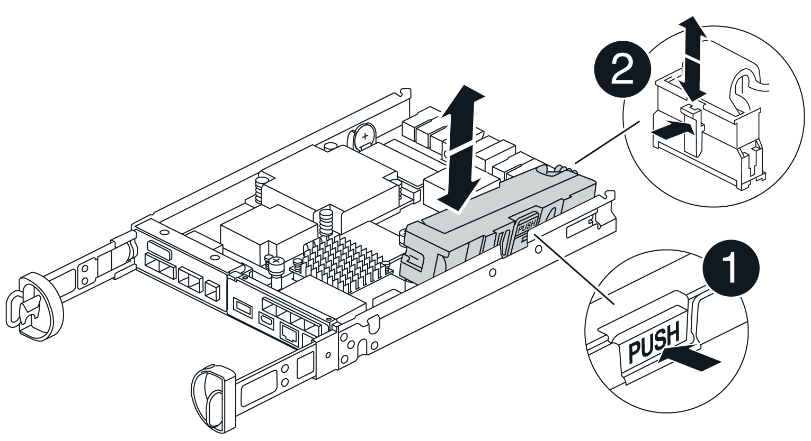

= Substitua o controlador - E4000
:allow-uri-read: 
:icons: font
:imagesdir: ../media/

[role="lead"]
Você pode substituir um recipiente do controlador com falha.

.Antes de começar
Certifique-se de que tem o seguinte:

* Um recipiente do controlador de substituição com o mesmo número de peça que o recipiente do controlador que está a substituir.
* Uma pulseira antiestática, ou você tomou outras precauções antiestáticas.
* Etiquetas para identificar cada cabo que está ligado ao recipiente do controlador.
* Chave de fendas Phillips nº 1.
* Uma estação de gerenciamento com um navegador que pode acessar o Gerenciador de sistema do SANtricity para o controlador. (Para abrir a interface do System Manager, aponte o navegador para o nome de domínio ou endereço IP do controlador.)

== Passo 1: Prepare-se para substituir o controlador

Prepare-se para substituir um recipiente de controlador salvando a chave de segurança da unidade, fazendo backup da configuração e coletando dados de suporte. Em seguida, você pode parar as operações de e/S do host e colocar o controlador off-line ou desligá-lo.

[role="tabbed-block"]
====
.Desligue o compartimento do controlador (simplex)
--
.Passos
. Se possível, anote qual versão do software SANtricity os está atualmente instalada no controlador. Abra o Gerenciador de sistema do SANtricity e selecione *suporte
. Se o recurso Segurança da unidade estiver ativado, verifique se existe uma chave salva e se você sabe a frase-passe necessária para instalá-la.
+

CAUTION: *Possível perda de acesso a dados* – se todas as unidades do storage estiverem habilitadas para segurança, o novo controlador não poderá acessar o storage até que você desbloqueie as unidades protegidas usando a janela Gerenciamento Empresarial no SANtricity Storage Manager.

+
Para salvar a chave (pode não ser possível, dependendo do estado do controlador):

+
.. No Gerenciador do sistema SANtricity, selecione *Configurações do sistema*.
.. Em *Gerenciamento de chaves de segurança da unidade*, selecione *Backup Key*.
.. Nos campos *Definir uma frase-passe/voltar a introduzir frase-passe*, introduza e confirme uma frase-passe para esta cópia de segurança.
.. Clique em *Backup*.
.. Grave suas informações chave em um local seguro e clique em *Fechar*.

. Faça backup do banco de dados de configuração do storage usando o Gerenciador de sistema do SANtricity.
+
Se ocorrer um problema ao remover um controlador, pode utilizar o ficheiro guardado para restaurar a configuração. O sistema salvará o estado atual do banco de dados de configuração RAID, que inclui todos os dados para grupos de volume e pools de discos na controladora.

+
** Do System Manager:
+
... *Selecione suporte
... Selecione *Collect Configuration Data*.
... Clique em *Collect*.
+
O arquivo é salvo na pasta Downloads do seu navegador com o nome *configurationData-<arrayName>-<dateTime>.7z*.

** Como alternativa, você pode fazer backup do banco de dados de configuração usando o seguinte comando CLI:
+
`save storageArray dbmDatabase sourceLocation=onboard contentType=all file="filename";`

. Colete dados de suporte para sua matriz de armazenamento usando o Gerenciador de sistema do SANtricity.
+
Se ocorrer um problema ao remover um controlador, você pode usar o arquivo salvo para solucionar o problema. O sistema salvará os dados de inventário, status e desempenho sobre seu storage array em um único arquivo.

+
.. *Selecione suporte
.. Selecione *coletar dados de suporte*.
.. Clique em *Collect*.
+
O arquivo é salvo na pasta Downloads do seu navegador com o nome *support-data.7z*.

. Certifique-se de que nenhuma operação de e/S esteja ocorrendo entre o storage array e todos os hosts conectados. Por exemplo, você pode executar estas etapas:
+
** Parar todos os processos que envolvem os LUNs mapeados do armazenamento para os hosts.
** Garantir que nenhuma aplicação esteja gravando dados em LUNs mapeados do storage para os hosts.
** Desmonte todos os sistemas de arquivos associados a volumes no array.
+

NOTE: As etapas exatas para interromper as operações de e/S do host dependem do sistema operacional do host e da configuração, que estão além do escopo dessas instruções. Se você não tiver certeza de como interromper as operações de e/S do host em seu ambiente, considere encerrar o host.

+

CAUTION: *Possível perda de dados* – se você continuar este procedimento enquanto as operações de e/S estão ocorrendo, você pode perder dados.

. Aguarde até que quaisquer dados na memória cache sejam gravados nas unidades.
+
O LED verde Cache ative na parte de trás do controlador fica aceso quando os dados em cache precisam ser gravados nas unidades. Tem de esperar que este LED se desligue.

. Na página inicial do Gerenciador do sistema do SANtricity, selecione *Exibir operações em andamento*.
. Confirme se todas as operações foram concluídas antes de continuar com a próxima etapa.
. Desligue ambos os interruptores de energia no compartimento do controlador.
. Aguarde que todos os LEDs na prateleira do controlador se desliguem.
. Selecione *Reverifique* no Recovery Guru e confirme se o campo *OK para remover* na área Detalhes exibe *Sim*, indicando que é seguro remover este componente. Os dados na matriz de armazenamento não estarão acessíveis até que você substitua o recipiente do controlador.

--
.Colocar o controlador offline (duplex)
--
.Passos
. Desembale o novo recipiente do controlador e coloque-o numa superfície plana e livre de estática.
+
Guarde os materiais de embalagem a utilizar ao enviar o recipiente do controlador avariado.

. Localize o endereço MAC e as etiquetas de número de peça FRU na parte traseira do recipiente do controlador.
. No Gerenciador do sistema do SANtricity, localize o número de peça de substituição do recipiente do controlador que você está substituindo.
+
Quando um controlador tem uma falha e precisa ser substituído, o número de peça de substituição é exibido na área Detalhes do Recovery Guru. Se você precisar encontrar esse número manualmente, siga estas etapas:

+
.. Selecione *hardware*.
.. Localize o compartimento do controlador, que está marcado com o ícone do controlador.
.. Clique no ícone do controlador.
.. Selecione o controlador e clique em *seguinte*.
.. No separador *base*, anote o *número de peça de substituição* para o controlador.

. Confirme se o número de peça de substituição para o controlador com falha é o mesmo que o número de peça FRU para o controlador de substituição.
+

CAUTION: *Possível perda de acesso aos dados* – se os dois números de peça não forem os mesmos, não tente este procedimento. A presença de controladores incompatíveis fará com que o novo controlador fique bloqueado quando você o colocar on-line.

. Faça backup do banco de dados de configuração do storage usando o Gerenciador de sistema do SANtricity.
+
Se ocorrer um problema ao remover um controlador, pode utilizar o ficheiro guardado para restaurar a configuração. O sistema salvará o estado atual do banco de dados de configuração RAID, que inclui todos os dados para grupos de volume e pools de discos na controladora.

+
** Do System Manager:
+
... Selecione *suporte
... Selecione *Collect Configuration Data*.
... Clique em *Collect*.
+
O arquivo é salvo na pasta Downloads do seu navegador com o nome *configurationData-<arrayName>-<dateTime>.7z*.

** Como alternativa, você pode fazer backup do banco de dados de configuração usando o seguinte comando CLI:
+
[listing]
----
save storageArray dbmDatabase sourceLocation=onboard contentType=all file="filename";
----

. Colete dados de suporte para sua matriz de armazenamento usando o Gerenciador de sistema do SANtricity.
+
Se ocorrer um problema ao remover um controlador, você pode usar o arquivo salvo para solucionar o problema. O sistema salvará os dados de inventário, status e desempenho sobre seu storage array em um único arquivo.

+
.. *Selecione suporte
.. Selecione *coletar dados de suporte*.
.. Clique em *Collect*.
+
O arquivo é salvo na pasta Downloads do seu navegador com o nome *support-data.7z*.

. Se o controlador ainda não estiver offline, coloque-o offline agora usando o Gerenciador de sistema do SANtricity.
+
** A partir do SANtricity System Manager:
+
... Selecione *hardware*.
... Se o gráfico mostrar as unidades, selecione *Mostrar parte traseira da prateleira* para mostrar os controladores.
... Selecione o controlador que pretende colocar offline.
... No menu de contexto, selecione *colocar offline* e confirme que deseja executar a operação.
+

NOTE: Se você estiver acessando o Gerenciador de sistema do SANtricity usando o controlador que você está tentando ficar offline, uma mensagem Gerenciador de sistema do SANtricity indisponível será exibida. Selecione conetar a uma conexão de rede alternativa para acessar automaticamente o Gerenciador de sistema do SANtricity usando o outro controlador.

** Como alternativa, você pode colocar os controladores offline usando os seguintes comandos CLI:
+
*Para o controlador A*: `set controller [a] availability=offline`

+
*Para o controlador B*: `set controller [b] availability=offline`

. Aguarde até que o Gerenciador de sistema do SANtricity atualize o status do controlador para offline.
+

CAUTION: Não inicie quaisquer outras operações até que o estado tenha sido atualizado.

. Selecione *Reverifique* no Recovery Guru e confirme se o campo *OK para remover* na área Detalhes exibe *Sim*, indicando que é seguro remover este componente.

--
====

== Passo 2: Remover controlador com falha

Substitua o recipiente com falha por um novo.

.Passos
. Remova um recipiente do controlador.
+
.. Coloque uma pulseira antiestática ou tome outras precauções antiestáticas.
.. Identifique cada cabo que esteja conetado ao recipiente do controlador.
.. Desligue todos os cabos do recipiente do controlador.
+

CAUTION: Para evitar um desempenho degradado, não torça, dobre, aperte ou pise nos cabos.

.. Se necessário, remova os transcetores SFPs.
.. Confirme se o LED Cache ative na parte de trás do controlador está desligado.
+
O LED verde Cache ative na parte de trás do controlador fica aceso quando os dados em cache precisam ser gravados nas unidades. Tem de esperar que este LED se desligue antes de remover o recipiente do controlador.

.. Aperte o trinco na pega do excêntrico até que este se solte, abra totalmente a pega do excêntrico para libertar o recipiente do controlador do plano médio e, em seguida, utilizando duas mãos, puxe o recipiente do controlador para fora do chassis.
.. Vire o recipiente do controlador e coloque-o numa superfície plana e estável.
.. Abra a tampa pressionando os botões azuis nas laterais do recipiente do controlador para soltar a tampa e, em seguida, gire a tampa para cima e para fora do recipiente do controlador.

== Passo 3: Retire a bateria

Retire a bateria do controlador desativado e instale-a no controlador de substituição.

.Passos
. Retire a bateria do recipiente do controlador:
+
.. Prima o botão azul na parte lateral do recipiente do controlador.
.. Deslize a bateria para cima até que ela solte os suportes de fixação e, em seguida, levante a bateria para fora do recipiente do controlador.
.. Desligue a ficha da bateria apertando o clipe na face da ficha da bateria para soltar a ficha da tomada e, em seguida, desligue o cabo da bateria da tomada.
+

+
|===

 a| 
image::../media/legend_icon_01.png[Um ícone]
| Patilha de libertação da bateria 

 a| 
image::../media/legend_icon_02.png[Dois ícones]
| Conetor de alimentação da bateria 
|===

. Mova a bateria para o recipiente do controlador de substituição e instale-a:
+
.. Alinhar a bateria com os suportes de fixação na parede lateral de chapa metálica.
.. Deslize a bateria para baixo até que o trinco da bateria encaixe e encaixe na abertura na parede lateral.
+

NOTE: Não ligue ainda a bateria. Você o conetará assim que o restante dos componentes for movido para o recipiente do controlador de substituição.

== Passo 4: Remova o HIC

Retire a moldura HIC e a placa PCIe HIC do módulo do controlador afetado.

.Passos
. Retire a moldura do HIC deslizando-a diretamente para fora do módulo do controlador.
+
image::../media/drw_E4000_replace_HIC_source_IEOPS-864.png[Remova o HIC do módulo do controlador.]

. Desaperte os parafusos de orelhas no HIC.
+

NOTE: Você pode soltar os parafusos com os dedos ou uma chave de fenda.

. Levante o HIC e coloque-o de lado numa superfície antiestática.

== Passo 5: Mova os DIMMs

Remova os DIMMs do recipiente do controlador danificado e instale-os no recipiente do controlador de substituição.

.Passos
. Localize os DIMMs no recipiente do controlador.
+

NOTE: Observe a localização do DIMM nos soquetes para que você possa inserir o DIMM no mesmo local no recipiente do controlador de substituição e na orientação adequada. Remova os DIMMs do recipiente do controlador danificado:

+
.. Ejete o DIMM do slot empurrando lentamente as duas abas do ejetor do DIMM em ambos os lados do DIMM.
+
O DIMM girará um pouco para cima.

.. Gire o DIMM o máximo possível e deslize o DIMM para fora do soquete.
+

NOTE: Segure cuidadosamente o DIMM pelas bordas para evitar a pressão nos componentes da placa de circuito DIMM.

+
image::../media/drw_E4000_replace_dimms_IEOPS-865.png[Remova DIMMS.]

+
|===

 a| 
image::../media/legend_icon_01.png[Um ícone]
| Patilhas do ejetor DIMM 

 a| 
image::../media/legend_icon_02.png[Dois ícones]
| DIMMS 
|===

. Verifique se a bateria não está conetada ao recipiente do controlador de substituição.
. Instale os DIMMs no controlador de substituição no mesmo local em que estavam no controlador prejudicado:
+
.. Empurre com cuidado, mas firmemente, na borda superior do DIMM até que as abas do ejetor se encaixem no lugar sobre os entalhes nas extremidades do DIMM.
+
O DIMM encaixa firmemente no slot, mas deve entrar facilmente. Caso contrário, realinhar o DIMM com o slot e reinseri-lo.

+

NOTE: Inspecione visualmente o DIMM para verificar se ele está alinhado uniformemente e totalmente inserido no slot.

. Repita estas etapas para o outro DIMM.

== Passo 6: Instale o HIC

Instale o HIC no recipiente do controlador de substituição.

.Passos
. Alinhe o soquete na tomada HIC de substituição com o soquete na placa-mãe e, em seguida, encaixe suavemente a placa diretamente no soquete.
. Aperte os três parafusos de aperto manual no HIC.
. Volte a instalar a placa frontal do HIC.

== Passo 7: Instale a bateria

Instale a bateria no recipiente do controlador de substituição.

.Passos
. Volte a ligar a ficha da bateria à tomada no recipiente do controlador.
+
Certifique-se de que a ficha se fixa à tomada da bateria na placa-mãe.

. Alinhar a bateria com os suportes de fixação na parede lateral de chapa metálica.
. Deslize a bateria para baixo até que o trinco da bateria encaixe e encaixe na abertura na parede lateral.
. Volte a instalar a tampa do recipiente do controlador e bloqueie-a no lugar.

== Passo 8: Substituição completa do controlador

Restabelecer a conexão com o compartimento do controlador, coletar dados de suporte e retomar as operações.

[role="tabbed-block"]
====
.Compartimento do controlador de alimentação (simplex)
--
.Passos
. Instale o controlador de substituição na prateleira.
+
.. Se você ainda não está aterrado, aterre-se adequadamente.
.. Vire o controlador ao contrário, de modo a que a tampa amovível fique virada para baixo.
.. Com a pega do came na posição aberta, deslize o controlador até à prateleira.
.. Volte a colocar os cabos.
+

NOTE: Se você removeu os conversores de Mídia (QSFPs ou SFPs), lembre-se de reinstalá-los se você estiver usando cabos de fibra ótica.

.. Prenda os cabos ao dispositivo de gerenciamento de cabos com o gancho e a alça de loop.
.. Ligue o compartimento do controlador.
.. Aguarde até que o controlador E4000 seja reiniciado.
.. Determine como você atribuirá um endereço IP ao controlador de substituição.
+

NOTE: As etapas para atribuir um endereço IP ao controlador de substituição dependem se você conetou a porta de gerenciamento a uma rede com um servidor DHCP e se todas as unidades estão protegidas.

+
Se a porta de gerenciamento 1 estiver conetada a uma rede com um servidor DHCP, o novo controlador obterá seu endereço IP do servidor DHCP. Este valor pode ser diferente do endereço IP do controlador original.

. Se a matriz de armazenamento tiver unidades seguras, importe a chave de segurança da unidade; caso contrário, vá para a próxima etapa. Siga o procedimento apropriado abaixo para um storage de armazenamento com todas as unidades seguras ou uma combinação de unidades seguras e não seguras.
+

NOTE: _Unidades não seguras_ são unidades não atribuídas, unidades hot spare globais ou unidades que fazem parte de um grupo de volumes ou de um pool que não é protegido pelo recurso de segurança da unidade. As unidades seguras são unidades atribuídas que fazem parte de um grupo de volumes ou de um pool de discos seguro usando o Drive Security.

+
** * Apenas unidades seguras (sem unidades não seguras)*:
+
... Acesse a interface de linha de comando (CLI) do storage array.
... Carregue a NVSRAM simplex apropriada no controlador.
+
Por exemplo: `download storageArray NVSRAM file=\"N4000-881834-SG4.dlp\" forceDownload=TRUE;`

... Confirme se a controladora é *ideal* após carregar NVSRAM simplex.
... Se estiver usando o gerenciamento de chaves de segurança externas https://docs.netapp.com/us-en/e-series/upgrade-controllers/upgrade-unlock-drives-task.html#external-key-management["configure o gerenciamento de chaves externas no controlador"], .
... Se estiver usando o gerenciamento de chaves de segurança internas, digite o seguinte comando para importar a chave de segurança:
+
[listing]
----
import storageArray securityKey file="C:/file.slk"
passPhrase="passPhrase";
----
+
local:

+
**** `C:/file.slk` representa a localização do diretório e o nome da chave de segurança da unidade
**** `passPhrase` É a frase-passe necessária para desbloquear o arquivo depois que a chave de segurança foi importada, o controlador reinicializa e o novo controlador adota as configurações salvas para a matriz de armazenamento.

... Vá para o próximo passo para confirmar que o novo controlador é o ideal.

** * Combinação de unidades seguras e inseguras*:
+
... Colete o pacote de suporte e abra o perfil da matriz de armazenamento.
... Encontre e grave todas as localizações das unidades não seguras, que são encontradas no pacote de suporte.
... Desligue o sistema.
... Remova as unidades não seguras.
... Substitua o controlador.
... Ligue o sistema.
... No Gerenciador do sistema SANtricity, selecione *Configurações do sistema*.
... Na seção Gerenciamento de chaves de segurança, selecione *criar/alterar chave* para criar uma nova chave de segurança.
... Selecione *Unlock Secure Drives* para importar a chave de segurança que você salvou.
... Execute o `set allDrives nativeState` comando CLI.
... O controlador reiniciará automaticamente.
... Aguarde que o controlador inicialize e que o visor de sete segmentos mostre o número da bandeja ou um L5 piscando.
... Desligue o sistema.
... Reinstale as unidades não seguras.
... Reponha o controlador utilizando o Gestor do sistema SANtricity.
... Ligue o sistema e aguarde que o visor de sete segmentos mostre o número da bandeja.
... Vá para o próximo passo para confirmar que o novo controlador é o ideal.

. No Gerenciador de sistemas do SANtricity, confirme se o novo controlador é o ideal.
+
.. Selecione *hardware*.
.. Para o compartimento do controlador, selecione *Mostrar parte posterior da prateleira*.
.. Selecione o recipiente do controlador que você substituiu.
.. Selecione *Ver definições*.
.. Confirme se o *Status* do controlador é o ideal.
.. Se o status não for ideal, realce o controlador e selecione *Place Online*.

. Colete dados de suporte para sua matriz de armazenamento usando o Gerenciador de sistema do SANtricity.
+
.. Selecione *suporte Centro de suporte *Diagnóstico*.
.. Selecione *coletar dados de suporte*.
.. Clique em *Collect*.
+
O arquivo é salvo na pasta Downloads do seu navegador com o nome *support-data.7z*.

--
.Colocar o controlador online (duplex)
--
.Passos
. Instale o controlador de substituição na prateleira.
+
.. Se você ainda não está aterrado, aterre-se adequadamente.
.. Se ainda não o tiver feito, substitua a tampa no recipiente do controlador.
.. Vire o controlador ao contrário, de modo a que a tampa amovível fique virada para baixo.
.. Com a pega do came na posição aberta, deslize o controlador até à prateleira.
.. Volte a colocar os cabos.
+

NOTE: Se você removeu os conversores de Mídia (QSFPs ou SFPs), lembre-se de reinstalá-los se você estiver usando cabos de fibra ótica.

.. Prenda os cabos ao dispositivo de gerenciamento de cabos com o gancho e a alça de loop.
.. Se o controlador original usou DHCP para o endereço IP, localize o endereço MAC na etiqueta na parte de trás do controlador de substituição. Peça ao administrador da rede para associar o DNS/rede e o endereço IP do controlador removido com o endereço MAC do controlador de substituição.
+

NOTE: Se o controlador original não tiver utilizado DHCP para o endereço IP, o novo controlador adotará o endereço IP do controlador removido.

. Coloque o controlador online.
+
.. No System Manager, navegue até a página *hardware*.
.. Selecione *Mostrar parte posterior do controlador*.
.. Selecione o controlador substituído.
.. Selecione *Place on-line* na lista suspensa.

. À medida que o controlador arranca, verifique os LEDs do controlador.
+
** O LED âmbar de atenção no controlador liga-se e desliga-se, a menos que haja um erro.
** Os LEDs do Host Link podem estar ligados, piscando ou desligados, dependendo da interface do host.

. Quando o controlador estiver novamente online, confirme se o seu estado é ideal e verifique os LEDs de atenção do compartimento do controlador.
+
Se o estado não for o ideal ou se algum dos LEDs de atenção estiver aceso, confirme se todos os cabos estão corretamente encaixados e o recipiente do controlador está instalado corretamente. Se necessário, remova e reinstale o recipiente do controlador.

+

NOTE: Se não conseguir resolver o problema, contacte o suporte técnico.

. Se necessário, redistribua todos os volumes de volta ao proprietário preferido usando o Gerenciador de sistemas do SANtricity.
+
.. Selecione *armazenamento de volumes*.
.. Selecione *mais

. Clique em *hardware* para garantir que a versão mais recente do software SANtricity os (firmware do controlador) esteja instalada.
+
Conforme necessário, instale a versão mais recente.

. Colete dados de suporte para sua matriz de armazenamento usando o Gerenciador de sistema do SANtricity.
+
.. Selecione *suporte
.. Selecione *coletar dados de suporte*.
.. Clique em *Collect*.
+
O arquivo é salvo na pasta Downloads do seu navegador com o nome *support-data.7z*.

--
====
.O que se segue?
A substituição do controlador está concluída. Pode retomar as operações normais.
