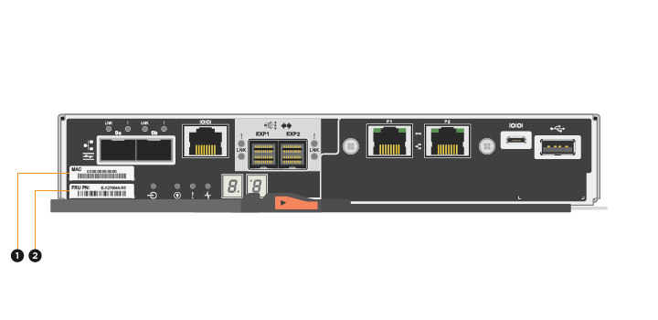

= Substitua o controlador na configuração duplex - E5700
:allow-uri-read: 
:experimental: 
:icons: font
:imagesdir: ../media/

[role="lead"]
Você pode substituir um recipiente de controlador em uma configuração duplex (duas controladoras), para as seguintes gavetas de controladora:

* Compartimento do controlador de E5724 TB
* Compartimento do controlador de E5760 TB

.Sobre esta tarefa
Cada recipiente do controlador contém uma placa controladora, uma bateria e uma placa de interface do host (HIC) opcional. Quando substituir um recipiente do controlador, tem de remover a bateria e o HIC, se estiverem instalados, do recipiente do controlador original e, em seguida, instalá-los no recipiente do controlador de substituição.

NOTE: Esta tarefa é apenas para matrizes de armazenamento com dois controladores (configuração duplex).

.Antes de começar
Certifique-se de que tem o seguinte:

* Um recipiente do controlador de substituição com o mesmo número de peça que o recipiente do controlador que está a substituir. (Consulte a etapa 1 para verificar o número de peça.)
* Uma pulseira antiestática, ou você tomou outras precauções antiestáticas.
* Chave de fendas Phillips nº 1.
* Etiquetas para identificar cada cabo que está ligado ao recipiente do controlador.
* Uma estação de gerenciamento com um navegador que pode acessar o Gerenciador de sistema do SANtricity para o controlador. (Para abrir a interface do System Manager, aponte o navegador para o nome de domínio ou endereço IP do controlador.)

== Passo 1: Prepare-se para substituir o controlador (duplex)

Prepare-se para substituir um recipiente do controlador, verificando se o recipiente do controlador de substituição tem o número de peça correto da FRU, fazendo backup da configuração e coletando dados de suporte. Se o controlador ainda estiver online, você deve colocá-lo off-line.

.Passos
. Desembale o novo recipiente do controlador e coloque-o numa superfície plana e livre de estática.
+
Guarde os materiais de embalagem a utilizar ao enviar o recipiente do controlador avariado.

+

NOTE: Os controladores de substituição vêm com 16GB GB de memória pré-instalado. Se o controlador necessitar da configuração 64GB, utilize o kit de atualização fornecido antes de instalar o controlador de substituição.

. Localize o endereço MAC e as etiquetas de número de peça FRU na parte traseira do recipiente do controlador.
+

+
*(1)* _Endereço MAC:_ o endereço MAC da porta de gerenciamento 1 ("'P1'"). Se você usou DHCP para obter o endereço IP do controlador original, você precisará desse endereço para se conetar ao novo controlador.

+
*(2)* _número de peça FRU:_ este número deve corresponder ao número de peça de substituição para o controlador atualmente instalado.

. No Gerenciador do sistema do SANtricity, localize o número de peça de substituição do recipiente do controlador que você está substituindo.
+
Quando um controlador tem uma falha e precisa ser substituído, o número de peça de substituição é exibido na área Detalhes do Recovery Guru. Se você precisar encontrar esse número manualmente, siga estas etapas:

+
.. Selecione *hardware*.
.. Localize o compartimento do controlador, que está marcado com o ícone do controlador image:../media/sam1130_ss_hardware_controller_icon_maint-e5700.gif["Ícone do controlador"].
.. Clique no ícone do controlador.
.. Selecione o controlador e clique em *seguinte*.
.. No separador *base*, anote o *número de peça de substituição* para o controlador.

. Confirme se o número de peça de substituição para o controlador com falha é o mesmo que o número de peça FRU para o controlador de substituição.
+

CAUTION: *Possível perda de acesso aos dados* -- se os dois números de peça não forem os mesmos, não tente este procedimento. Além disso, se o recipiente do controlador com falha incluir uma placa de interface do host (HIC), você deve instalar esse HIC no novo recipiente do controlador. A presença de controladores ou HICs incompatíveis faz com que o novo controlador fique bloqueado quando o coloca online.

. Faça backup do banco de dados de configuração do storage usando o Gerenciador de sistema do SANtricity.
+
Se ocorrer um problema ao remover um controlador, pode utilizar o ficheiro guardado para restaurar a configuração. O sistema salvará o estado atual do banco de dados de configuração RAID, que inclui todos os dados para grupos de volume e pools de discos na controladora.

+
** Do System Manager:
+
... Selecione menu:suporte[Centro de suporte > Diagnóstico].
... Selecione *Collect Configuration Data*.
... Clique em *Collect*.
+
O arquivo é salvo na pasta Downloads do seu navegador com o nome *configurationData-<arrayName>-<dateTime>.7z*.

** Como alternativa, você pode fazer backup do banco de dados de configuração usando o seguinte comando CLI:
+
`save storageArray dbmDatabase sourceLocation=onboard contentType=all file="filename";`

. Colete dados de suporte para sua matriz de armazenamento usando o Gerenciador de sistema do SANtricity.
+
Se ocorrer um problema ao remover um controlador, você pode usar o arquivo salvo para solucionar o problema. O sistema salvará os dados de inventário, status e desempenho sobre seu storage array em um único arquivo.

+
.. Selecione menu:suporte[Centro de suporte > Diagnóstico].
.. Selecione *coletar dados de suporte*.
.. Clique em *Collect*.
+
O arquivo é salvo na pasta Downloads do seu navegador com o nome *support-data.7z*.

. Se o controlador ainda não estiver offline, coloque-o offline agora usando o Gerenciador de sistema do SANtricity.
+
** A partir do SANtricity System Manager:
+
... Selecione *hardware*.
... Se o gráfico mostrar as unidades, selecione *Mostrar parte traseira da prateleira* para mostrar os controladores.
... Selecione o controlador que pretende colocar offline.
... No menu de contexto, selecione *colocar offline* e confirme que deseja executar a operação.
+

NOTE: Se você estiver acessando o Gerenciador de sistema do SANtricity usando o controlador que você está tentando ficar offline, uma mensagem Gerenciador de sistema do SANtricity indisponível será exibida. Selecione *conetar-se a uma conexão de rede alternativa* para acessar automaticamente o Gerenciador de sistema do SANtricity usando o outro controlador.

** Como alternativa, você pode colocar os controladores offline usando os seguintes comandos CLI:
+
*Para o controlador A:* `set controller [a] availability=offline`

+
*Para o controlador B:* `set controller [b] availability=offline`

. Aguarde até que o Gerenciador de sistema do SANtricity atualize o status do controlador para offline.
+

CAUTION: Não inicie quaisquer outras operações até que o estado tenha sido atualizado.

. Selecione *Reverifique* no Recovery Guru e confirme se o campo *OK para remover* na área Detalhes exibe *Sim*, indicando que é seguro remover este componente.

== Etapa 2: Remover o recipiente do controlador (duplex)

Remova um recipiente do controlador para substituir o recipiente com falha por um novo.

.Passos
. Coloque uma pulseira antiestática ou tome outras precauções antiestáticas.
. Identifique cada cabo que esteja conetado ao recipiente do controlador.
. Desligue todos os cabos do recipiente do controlador.
+

CAUTION: Para evitar um desempenho degradado, não torça, dobre, aperte ou pise nos cabos.

. Se o recipiente do controlador tiver um HIC que usa transcetores SFP, remova os SFPs.
+
Como você deve remover o HIC do recipiente do controlador com falha, você deve remover quaisquer SFPs das portas HIC. No entanto, você pode deixar quaisquer SFPs instalados nas portas de host da placa base. Ao reconetar os cabos, você pode mover esses SFPs para o novo recipiente do controlador.

. Confirme se o LED Cache ative na parte de trás do controlador está desligado.
. Aperte a trava na alça do came até que ela se solte e, em seguida, abra a alça do came para a direita para liberar o recipiente do controlador da prateleira.
+
A figura a seguir é um exemplo de um compartimento de controladora E5724:

+
image::../media/28_dwg_e2824_remove_controller_canister_maint-e5700.gif[Remova o recipiente do controlador]

+
*(1)* _Controller canister_

+
*(2)* _pega da câmara_

+
A figura a seguir é um exemplo de um compartimento de controladora E5760:

+
image::../media/28_dwg_e2860_add_controller_canister_maint-e5700.gif[Remova o recipiente do controlador]

+
*(1)* _Controller canister_

+
*(2)* _pega da câmara_

. Utilizando as duas mãos e a pega do came, deslize o recipiente do controlador para fora da prateleira.
+

CAUTION: Utilize sempre duas mãos para suportar o peso de um recipiente do controlador.

+
Se você estiver removendo o recipiente do controlador de uma prateleira do controlador E5724, uma aba se move para o lugar para bloquear o compartimento vazio, ajudando a manter o fluxo de ar e o resfriamento.

. Vire o recipiente do controlador ao contrário, de forma a que a tampa amovível fique virada para cima.
. Coloque o recipiente do controlador numa superfície plana e sem estática.

== Etapa 3: Remover a bateria (duplex)

Retire a bateria para que possa instalar o novo controlador.

.Passos
. Você remove a tampa do recipiente do controlador pressionando o botão e deslizando a tampa para fora.
. Confirme se o LED verde dentro do controlador (entre a bateria e os DIMMs) está desligado.
+
Se este LED verde estiver ligado, o controlador ainda está a utilizar a bateria. Deve aguardar que este LED se apague antes de remover quaisquer componentes.

+
image::../media/28_dwg_e2800_internal_cache_active_led_maint-e5700.gif[LED ativo de cache interno]

+
*(1)* _LED ativo Cache interno_

+
*(2)* _bateria_

. Localize a trava de liberação azul da bateria.
. Desengate a bateria empurrando a trava de liberação para baixo e afastando-a do recipiente do controlador.
+
image::../media/28_dwg_e2800_remove_battery_maint-e5700.gif[Retire a bateria]

+
*(1)* _trava de liberação da bateria_

+
*(2)* _bateria_

. Levante a bateria e deslize-a para fora do recipiente do controlador.

== Etapa 4: Remover a placa de interface do host (duplex)

Se o recipiente do controlador incluir uma placa de interface do host (HIC), remova o HIC do recipiente do controlador original para que você possa reutilizá-lo no novo recipiente do controlador.

.Passos
. Usando uma chave de fenda Phillips nº 1, remova os parafusos que prendem a placa frontal HIC ao recipiente do controlador.
+
Há quatro parafusos: Um na parte superior, um na parte lateral e dois na parte frontal.

+
image::../media/28_dwg_e2800_hic_faceplace_screws_maint-e5700.gif[Remova a placa frontal do controlador]

. Retire a placa frontal do HIC.
. Utilizando os dedos ou uma chave de fendas Phillips, desaperte os três parafusos de aperto manual que fixam o HIC à placa do controlador.
. Retire cuidadosamente o HIC da placa controladora levantando a placa para cima e deslizando-a para trás.
+

NOTE: Tenha cuidado para não arranhar ou bater os componentes na parte inferior do HIC ou na parte superior da placa controladora.

+
image::../media/28_dwg_e2800_hic_thumbscrews_maint-e5700.gif[Remover HIC da placa controladora"]

+
*(1)* _placa de interface de host (HIC)_

+
*(2)* _parafusos_

. Coloque o HIC sobre uma superfície livre de estática.

== Passo 5: Instale a bateria (duplex)

Instale a bateria no recipiente do controlador de substituição. Pode instalar a bateria que retirou do recipiente do controlador original ou instalar uma bateria nova que tenha encomendado.

.Passos
. Vire o recipiente do controlador de substituição ao contrário, de forma a que a tampa amovível fique virada para cima.
. Prima o botão da tampa para baixo e deslize a tampa para fora.
. Oriente o recipiente do controlador de forma a que a ranhura da bateria fique voltada para si.
. Introduza a bateria no recipiente do controlador a um ligeiro ângulo descendente.
+
Deve inserir a flange metálica na parte frontal da bateria na ranhura na parte inferior do recipiente do controlador e deslizar a parte superior da bateria por baixo do pequeno pino de alinhamento no lado esquerdo do recipiente.

. Desloque o trinco da bateria para cima para fixar a bateria.
+
Quando a trava se encaixa no lugar, a parte inferior da trava se encaixa em uma ranhura metálica no chassi.

+
image::../media/28_dwg_e2800_insert_battery_maint-e5700.gif[Reinstale a bateria]

+
*(1)* _trava de liberação da bateria_

+
*(2)* _bateria_

. Vire o recipiente do controlador para confirmar que a bateria está instalada corretamente.
+

CAUTION: *Possíveis danos ao hardware* -- a flange metálica na parte frontal da bateria deve ser completamente inserida na ranhura no recipiente do controlador (como mostrado na primeira figura). Se a bateria não estiver instalada corretamente (como mostrado na segunda figura), a flange metálica pode entrar em Contato com a placa controladora, causando danos ao controlador quando você aplicar energia.

+
** *Correto* -- a flange de metal da bateria está completamente inserida na ranhura do controlador:
+
image:../media/28_dwg_e2800_battery_flange_ok_maint-e5700.gif["Corrija a flange metálica"]

** *Incorreto* -- a flange metálica da bateria não está inserida na ranhura do controlador:
+
image:../media/28_dwg_e2800_battery_flange_not_ok_maint-e5700.gif["Flange metálica incorreta"]

== Passo 6: Instale a placa de interface do host (duplex)

Se tiver removido um HIC do recipiente do controlador original, tem de instalar esse HIC no novo recipiente do controlador.

.Passos
. Usando uma chave de fenda Phillips nº 1, remova os quatro parafusos que prendem a placa frontal vazia ao recipiente do controlador de substituição e remova a placa frontal.
. Alinhe os três parafusos de aperto manual no HIC com os orifícios correspondentes no controlador e alinhe o conetor na parte inferior do HIC com o conetor de interface HIC na placa do controlador.
+
Tenha cuidado para não arranhar ou bater os componentes na parte inferior do HIC ou na parte superior da placa controladora.

. Baixe cuidadosamente o HIC para o devido lugar e assente o conetor HIC pressionando suavemente o HIC.
+

CAUTION: * Possíveis danos ao equipamento * - tenha muito cuidado para não apertar o conetor de fita dourada para os LEDs do controlador entre o HIC e os parafusos de aperto manual.

+
image::../media/28_dwg_e2800_hic_thumbscrews_maint-e5700.gif['Reinstalar o HIC na placa do controlador"]

+
*(1)* _placa de interface de host (HIC)_

+
*(2)* _parafusos_

. Aperte manualmente os parafusos de aperto manual do HIC.
+
Não use uma chave de fenda, ou você pode apertar demais os parafusos.

. Usando uma chave de fenda Phillips nº 1, prenda a placa frontal HIC que você removeu do recipiente do controlador original ao novo recipiente do controlador com quatro parafusos.
+
image::../media/28_dwg_e2800_hic_faceplace_screws_maint-e5700.gif[Voltar a instalar a placa frontal"]

== Passo 7: Instale o novo recipiente do controlador (duplex)

Depois de instalar a bateria e a placa de interface do host (HIC), se uma foi instalada inicialmente, você pode instalar o novo recipiente do controlador na prateleira do controlador.

.Passos
. Volte a instalar a tampa no recipiente do controlador deslizando a tampa de trás para a frente até o botão clicar.
. Vire o recipiente do controlador ao contrário, de forma a que a tampa amovível fique virada para baixo.
. Com a alavanca do came na posição aberta, deslize o recipiente do controlador até a prateleira do controlador.
+
image::../media/28_dwg_e2824_remove_controller_canister_maint-e5700.gif[Instale o recipiente do controlador]

+
*(1)* _Controller canister_

+
*(2)* _pega da câmara_

+
image::../media/28_dwg_e2860_add_controller_canister_maint-e5700.gif[Instale o recipiente do controlador]

+
*(1)* _Controller canister_

+
*(2)* _pega da câmara_

. Mova a alavanca do came para a esquerda para bloquear o recipiente do controlador no lugar.
. Instale os SFPs do controlador original nas portas do host no novo controlador e reconete todos os cabos.
+
Se você estiver usando mais de um protocolo de host, certifique-se de instalar os SFPs nas portas de host corretas.

. Se o controlador original usou DHCP para o endereço IP, localize o endereço MAC na etiqueta na parte de trás do controlador de substituição. Peça ao administrador da rede para associar o DNS/rede e o endereço IP do controlador removido com o endereço MAC do controlador de substituição.
+

NOTE: Se o controlador original não tiver utilizado DHCP para o endereço IP, o novo controlador adotará o endereço IP do controlador removido.

== Passo 8: Substituição completa do controlador (duplex)

Coloque o controlador on-line, colete dados de suporte e retome as operações.

.Passos
. À medida que o controlador inicia, verifique os LEDs do controlador e o visor de sete segmentos.
+
Quando a comunicação com o outro controlador é restabelecida:

+
** O visor de sete segmentos mostra a sequência repetida *os*, *OL*, *_blank_* para indicar que o controlador está offline.
** O LED âmbar de atenção permanece aceso.
** Os LEDs do Host Link podem estar ligados, piscando ou desligados, dependendo da interface do host. image:../media/e5700_hic_3_callouts_maint-e5700.gif["E5700 LEDs do controlador\""]
+
*(1)* _Host Link LEDs_

+
*(2)* _LED de atenção (âmbar)_

+
*(3)* _display de sete segmentos_

. Verifique os códigos no visor de sete segmentos do controlador à medida que este regressa online. Se o visor apresentar uma das seguintes sequências de repetição, retire imediatamente o controlador.
+
** *OE*, *L0*, *_blank_* (controladores incompatíveis)
** *OE*, *L6*, *_blank_* (HIC não suportado)
+

CAUTION: *Possível perda de acesso a dados* -- se o controlador que você acabou de instalar mostrar um desses códigos, e o outro controlador for redefinido por qualquer motivo, o segundo controlador também pode bloquear.

. Quando a controladora estiver novamente on-line, verifique se uma incompatibilidade de NVSRAM é relatada no Recovery Guru.
+
.. Se uma incompatibilidade de NVSRAM for relatada, atualize a NVSRAM usando o seguinte comando SMcli:
+
[listing]
----
SMcli <controller A IP> <controller B IP> -u admin -p <password> -k -c "download storageArray NVSRAM file=\"C:\Users\testuser\Downloads\NVSRAM .dlp file>\" forceDownload=TRUE;"
----
+
O `-k` parâmetro é necessário se o array não for https seguro.

+

NOTE: Se o comando SMcli não puder ser concluído, contacte https://www.netapp.com/company/contact-us/support/["Suporte técnico da NetApp"^] ou inicie sessão no https://mysupport.netapp.com["Site de suporte da NetApp"^] para criar um caso.

. Confirme se o status do sistema é ideal e verifique os LEDs de atenção do compartimento do controlador.
+
Se o estado não for o ideal ou se algum dos LEDs de atenção estiver aceso, confirme se todos os cabos estão corretamente encaixados e o recipiente do controlador está instalado corretamente. Se necessário, remova e reinstale o recipiente do controlador.

+

NOTE: Se não conseguir resolver o problema, contacte o suporte técnico.

. Se necessário, redistribua todos os volumes de volta ao proprietário preferido usando o Gerenciador de sistemas do SANtricity.
+
.. Selecione menu:armazenamento[volumes].
.. Selecione menu:mais[redistribuir volumes].

. Clique em menu:hardware[Support > Upgrade Center] (hardware [suporte > Centro de atualização]) para garantir que as versões de firmware e NVSRAM do sistema estão nos níveis desejados.
+
Conforme necessário, instale a versão mais recente.

. Se necessário, colete dados de suporte para seu storage array usando o Gerenciador de sistema do SANtricity.
+
.. Selecione menu:suporte[Centro de suporte > Diagnóstico].
.. Selecione *coletar dados de suporte*.
.. Clique em *Collect*.
+
O arquivo é salvo na pasta Downloads do seu navegador com o nome *support-data.7z*.

.O que se segue?
A substituição do controlador está concluída. Pode retomar as operações normais.
