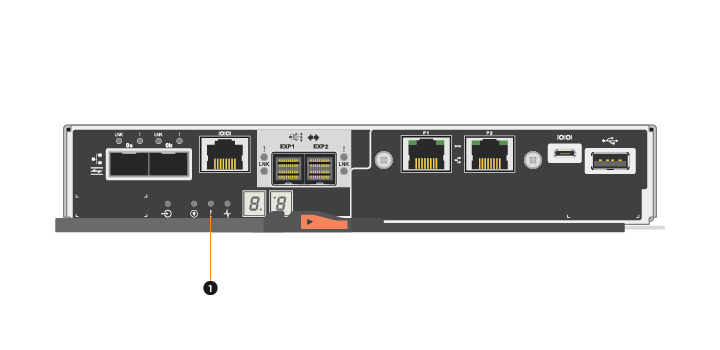

= Requisitos para substituição do controlador E5700
:allow-uri-read: 
:experimental: 
:icons: font
:imagesdir: ../media/

[role="lead"]
Antes de substituir um controlador E5700, reveja os requisitos e considerações.

Cada recipiente do controlador contém uma placa controladora, uma bateria e uma placa de interface do host (HIC) opcional.

== Descrição geral do procedimento

Quando substituir um recipiente do controlador com falha, tem de remover a bateria e o HIC, se estiverem instalados, do recipiente do controlador original e instalá-los no recipiente do controlador de substituição.

Você pode determinar se você tem um recipiente de controlador com falha de duas maneiras:

* O Guru de recuperação no Gerenciador de sistema do SANtricity direciona você para substituir o recipiente do controlador.
* O LED âmbar de atenção no recipiente do controlador está aceso, indicando que o controlador tem uma avaria.
+
[]
====

NOTE: O LED de atenção âmbar do controlador será desligado sempre que existirem as seguintes condições de substituição:

** Falha no caminho da unidade Alt
** A gaveta está aberta/em falta
** A ventoinha falhou/está em falta
** Fonte de alimentação em falta

====

*(1)* _atenção LED_

NOTE: A figura mostra um exemplo de receptor do controlador; as portas do host no seu receptor do controlador podem ser diferentes.

* Este procedimento se aplica aos compartimentos de unidades IOM12 e IOM12B.

NOTE: Os módulos IOM12B só são suportados no SANtricity os 11.70.2 em diante. Certifique-se de que o firmware do controlador foi atualizado antes de instalar ou atualizar para um IOM12B.

NOTE: Esse procedimento é para hot-swaps ou substituições de IOM de gaveta semelhantes. Isto significa que só pode substituir um módulo IOM12 por outro módulo IOM12 ou substituir um módulo IOM12B por outro módulo IOM12B. (Sua prateleira pode ter dois módulos IOM12 ou ter dois módulos IOM12B.)

== Requisitos para substituir um controlador com falha

Antes de substituir um controlador, tem de ter:

* Um recipiente do controlador de substituição com o mesmo número de peça que o recipiente do controlador que está a substituir.

NOTE: Os controladores de substituição vêm com 16GB GB de memória pré-instalado. Se o controlador necessitar da configuração 64GB, utilize o kit de atualização fornecido antes de instalar o controlador de substituição.

* Uma pulseira antiestática, ou você tomou outras precauções antiestáticas.
* Etiquetas para identificar cada cabo que está ligado ao recipiente do controlador.
* Uma chave de fendas Phillips nº 1.
* Uma estação de gerenciamento com um navegador que pode acessar o Gerenciador de sistema do SANtricity para o controlador. (Para abrir a interface do System Manager, aponte o navegador para o nome de domínio ou endereço IP do controlador.)
+
Opcionalmente, você pode usar a interface de linha de comando (CLI) para executar alguns dos procedimentos. Se você não tiver acesso à CLI, você poderá fazer um dos seguintes procedimentos:

+
** *Para Gerenciador de sistema SANtricity (versão 11,60 e superior)* -- Baixe o pacote CLI (arquivo zip) do Gerenciador de sistema. Aceda ao menu:Definições[sistema > Complementos > Interface de linha de comando]. Em seguida, você pode emitir comandos CLI de um prompt do sistema operacional, como o prompt do dos C:.
** *For SANtricity Storage Manager/Enterprise Management Window (EMW)* -- siga as instruções no guia expresso para baixar e instalar o software. Você pode executar comandos CLI do EMW selecionando menu:Ferramentas[Executar Script].

== Requisitos de configuração duplex

Para um compartimento de controladora com dois controladores (configuração duplex), você pode substituir um coletor de controladora enquanto seu storage array estiver ligado e executando operações de e/S de host, contanto que as seguintes condições sejam verdadeiras:

* O segundo recipiente do controlador na gaveta tem o status ideal.
* O campo *OK para remover* na área Detalhes do Guru de recuperação no Gerenciador de sistema do SANtricity exibe *Sim*, indicando que é seguro remover esse componente.

