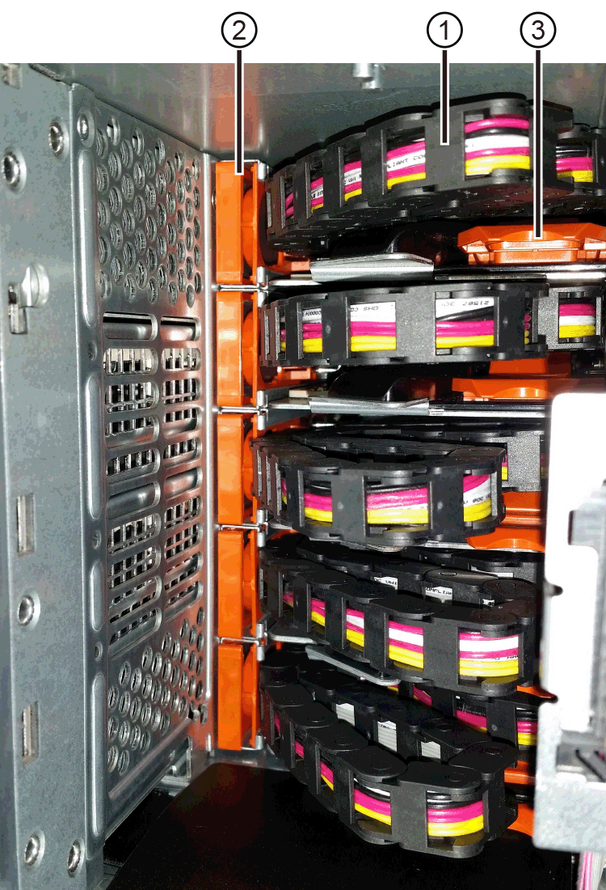

= Substitua a gaveta de unidades E5700 (60 unidades)
:allow-uri-read: 
:experimental: 
:icons: font
:imagesdir: ../media/

[role="lead"]
Você pode substituir uma gaveta de unidade em uma matriz E5700.

.Sobre esta tarefa
As etapas para substituir uma gaveta de unidade com falha em um compartimento de controladora E5760 ou em um compartimento de unidades DE460C dependem se os volumes na gaveta estão protegidos pela proteção contra perda de gaveta. Se todos os volumes na gaveta da unidade estiverem em pools de discos ou grupos de volumes que tenham proteção contra perda de gaveta, você poderá executar este procedimento on-line. Caso contrário, você deve parar toda a atividade de e/S do host e desligar a gaveta antes de substituir a gaveta da unidade.

.Antes de começar
* Revise os requisitos de manuseio de unidades link:drives-overview-supertask-concept.html["Requisitos para a substituição da unidade E5700"]na .
* Certifique-se de que o compartimento de unidades atenda a todas estas condições:
+
** A prateleira de acionamento não pode estar com temperatura excessiva.
** Ambos os ventiladores devem ser instalados e ter um status de ótimo.
** Todos os componentes do compartimento de unidades devem estar no lugar.
** Os volumes na gaveta da unidade não podem estar em estado degradado.

CAUTION: *Possível perda de acesso a dados* -- se um volume já estiver em estado degradado e você remover unidades da gaveta da unidade, o volume pode falhar.

* Certifique-se de que tem o seguinte:
+
** Uma unidade de substituição compatível com o NetApp para o compartimento de controladora ou compartimento de unidade.
** Uma pulseira antiestática, ou você tomou outras precauções antiestáticas.
** Uma lanterna.
** Um marcador permanente para anotar a localização exata de cada unidade enquanto remove a unidade da gaveta.
** Acesso à interface de linha de comando (CLI) do storage array. Se você não tiver acesso à CLI, você poderá fazer um dos seguintes procedimentos:
+
*** *Para Gerenciador de sistema SANtricity (versão 11,60 e superior)* -- Baixe o pacote CLI (arquivo zip) do Gerenciador de sistema. Aceda ao menu:Definições[sistema > Complementos > Interface de linha de comando]. Em seguida, você pode emitir comandos CLI de um prompt do sistema operacional, como o prompt do dos C:.
*** *For SANtricity Storage Manager/Enterprise Management Window (EMW)* -- siga as instruções no guia expresso para baixar e instalar o software. Você pode executar comandos CLI do EMW selecionando menu:Ferramentas[Executar Script].

== Passo 1: Prepare-se para substituir a gaveta da unidade (60 unidades)

Prepare-se para substituir uma gaveta de unidades determinando se você pode executar o procedimento de substituição enquanto o compartimento de unidades está on-line ou se precisa parar a atividade de e/S do host e desligar qualquer uma das gavetas ligadas. Se você estiver substituindo uma gaveta em uma prateleira com proteção contra perda de gaveta, não há necessidade de interromper a atividade de e/S do host e desligar qualquer uma das prateleiras.

.Passos
. Determine se o compartimento de unidades está ligado.
+
** Se a energia estiver desligada, você não precisará emitir o comando CLI. Vá para <<Passo 2: Remova as correntes dos cabos>>.
** Se a alimentação estiver ligada, avance para o passo seguinte.

. Digite o seguinte comando na linha de comando e pressione *Enter*:
+
[listing]
----
SMcli <ctlr_IP1\> -p "array_password" -c "set tray [trayID] drawer [drawerID]
serviceAllowedIndicator=on;"
----
+
local:

+
** `<ctlr_IP1>` é o identificador do controlador.
** `array_password` é a palavra-passe para a matriz de armazenamento. Você deve incluir o valor para array_password em aspas duplas ("").
** `[trayID]` é o identificador do compartimento de unidades que contém a gaveta de unidades que você deseja substituir. Os valores de ID do compartimento de unidades são de 0 a 99. Você deve incluir o valor `trayID` entre parênteses retos.
** `[drawerID]` é o identificador da gaveta da unidade que você deseja substituir. Os valores de ID da gaveta são 1 (gaveta superior) a 5 (gaveta inferior). Você deve incluir o valor `drawerID` entre parênteses retos. Esse comando garante que você possa remover a gaveta mais alta no compartimento de unidades 10:
+
[listing]
----
SMcli <ctlr_IP1\> -p "safety-1" -c "set tray [10] drawer [1]
serviceAllowedIndicator=forceOnWarning;"
----

. Determine se você precisa interromper a atividade de e/S do host, da seguinte forma:
+
** Se o comando for bem-sucedido, você não precisará interromper a atividade de e/S do host. Todas as unidades na gaveta estão em pools ou grupos de volume com proteção contra perda de gaveta. Vá para <<Passo 2: Remova as correntes dos cabos>>.
+

CAUTION: *Possível dano às unidades* -- espere 60 segundos após o comando ser concluído antes de abrir a gaveta da unidade. Esperar 60 segundos permite que as unidades girem para baixo, o que evita possíveis danos ao hardware.

** Se um aviso for exibido indicando que esse comando não pôde ser concluído, você deve parar a atividade de e/S do host antes de remover a gaveta. O aviso é exibido porque uma ou mais unidades na gaveta afetada estão em pools ou grupos de volume sem proteção contra perda de gaveta. Para evitar a perda de dados, siga as próximas etapas para interromper a atividade de e/S do host e desligar o compartimento de unidade e o compartimento de controladora.

. Certifique-se de que nenhuma operação de e/S esteja ocorrendo entre o storage array e todos os hosts conectados. Por exemplo, você pode executar estas etapas:
+
** Parar todos os processos que envolvem os LUNs mapeados do armazenamento para os hosts.
** Garantir que nenhuma aplicação esteja gravando dados em LUNs mapeados do storage para os hosts.
** Desmonte todos os sistemas de arquivos associados a volumes no array.
+

NOTE: As etapas exatas para interromper as operações de e/S do host dependem do sistema operacional do host e da configuração, que estão além do escopo dessas instruções. Se você não tiver certeza de como interromper as operações de e/S do host em seu ambiente, considere encerrar o host.

. Se o storage array participar de uma relação de espelhamento, interrompa todas as operações de e/S de host no storage array secundário.
+

CAUTION: *Possível perda de dados* -- se você continuar este procedimento enquanto as operações de e/S estão ocorrendo, o aplicativo host pode perder dados porque o storage array não estará acessível.

. Aguarde até que quaisquer dados na memória cache sejam gravados nas unidades.
+
O LED verde Cache ative na parte de trás de cada controlador fica aceso quando os dados em cache precisam ser gravados nas unidades. Tem de esperar que este LED se desligue.

+
image::../media/e5700_ib_hic_w_cache_led_callouts_maint-e5700.gif[LED de cache ativo no controlador E5700]

+
*(1)* _Cache ative LED_

. Na página inicial do Gerenciador do sistema do SANtricity, selecione *Exibir operações em andamento*.
. Aguarde que todas as operações sejam concluídas antes de continuar com o próximo passo.
. Desligue as prateleiras da seguinte forma:
+
** _Se você estiver substituindo uma gaveta em uma prateleira *com* proteção contra perda de gaveta_:
+
NÃO há necessidade de desligar nenhuma das prateleiras.

+
Você pode executar o procedimento Substituir enquanto a gaveta da unidade está on-line, porque o `Set Drawer Service Action Allowed Indicator` comando CLI foi concluído com êxito.

** _Se você estiver substituindo uma gaveta em uma prateleira *controller* *without* Drawer Loss Protection_:
+
... Desligue ambos os interruptores de energia no compartimento do controlador.
... Aguarde que todos os LEDs na prateleira do controlador fiquem escuros.

** _Se você estiver substituindo uma gaveta em um compartimento de unidade *Expansion* *without* Drawer Loss Protection_:
+
... Desligue ambos os interruptores de energia no compartimento do controlador.
... Aguarde que todos os LEDs na prateleira do controlador fiquem escuros.
... Desligue ambos os interruptores de energia no compartimento de unidades.
... Aguarde dois minutos para que a atividade de condução pare.

== Passo 2: Remova as correntes dos cabos

Remova ambas as correntes de cabo para que possa remover e substituir uma gaveta de unidade com falha. As correntes de cabo esquerda e direita permitem que as gavetas deslizem para dentro e para fora.

.Sobre esta tarefa
Cada gaveta de unidade tem correntes de cabo esquerda e direita. As extremidades metálicas nas correntes de cabos deslizam para os trilhos de guia verticais e horizontais correspondentes dentro do gabinete, da seguinte forma:

* Os trilhos de guia verticais esquerdo e direito conetam a corrente do cabo ao plano médio do gabinete.
* Os trilhos de guia horizontais esquerdo e direito conetam a corrente do cabo à gaveta individual.

CAUTION: *Possíveis danos ao hardware* -- se a bandeja da unidade estiver ligada, a corrente do cabo será energizada até que ambas as extremidades sejam desconetadas. Para evitar o curto-circuito do equipamento, não permita que o conetor da corrente do cabo desligado toque no chassis metálico se a outra extremidade da corrente do cabo ainda estiver ligada.

.Passos
. Verifique se a atividade de e/S do host foi interrompida e se o compartimento de unidades ou o compartimento de controladora está desligado ou emita o `Set Drawer Attention Indicator` comando CLI.
. A partir da parte traseira da prateleira de acionamento, retire o recipiente da ventoinha do lado direito:
+
.. Prima a patilha cor-de-laranja para soltar a pega do recipiente da ventoinha.
+
A figura mostra o manípulo para o recipiente da ventoinha estendido e libertado da patilha cor-de-laranja à esquerda.

+
image::../media/28_dwg_e2860_de460c_fan_canister_handle_with_callout_maint-e5700.gif[Bronzeado laranja para soltar a pega do recipiente do ventilador]

+
*(1)* _pega do recipiente do ventilador_

.. Usando a alça, puxe o recipiente do ventilador para fora da bandeja de unidades e coloque-o de lado.
.. Se a bandeja estiver ligada, certifique-se de que a ventoinha esquerda atinge a velocidade máxima.
+

CAUTION: *Possíveis danos ao equipamento devido ao sobreaquecimento* -- se a bandeja estiver ligada, não remova ambos os ventiladores ao mesmo tempo. Caso contrário, o equipamento pode sobreaquecer.

. Determine qual corrente de cabo desligar:
+
** Se a alimentação estiver ligada, o LED âmbar de atenção na parte frontal da gaveta indica a corrente do cabo que você precisa desconetar.
** Se a alimentação estiver desligada, você deve determinar manualmente qual das cinco correntes de cabo a serem desligadas. A figura mostra o lado direito da prateleira de acionamento com o recipiente do ventilador removido. Com o recipiente do ventilador removido, você pode ver as cinco correntes de cabo e os conetores verticais e horizontais para cada gaveta.
+
A corrente superior do cabo está fixada à gaveta de acionamento 1. A corrente do cabo inferior está fixada à gaveta da unidade 5. As legendas para a gaveta de unidades 1 são fornecidas.

+

+
*(1)* _corrente de cabo_

+
*(2)* _conetor vertical (conetado ao midplane)_

+
*(3)* _conetor horizontal (ligado à gaveta)_

. Para facilitar o acesso, use o dedo para mover a corrente do cabo do lado direito para a esquerda.
. Desligue qualquer uma das correntes de cabo direitas da respetiva calha-guia vertical correspondente.
+
.. Utilizando uma lanterna, localize o anel laranja na extremidade da corrente do cabo que está ligada ao trilho de guia vertical no compartimento.
+
image::../media/trafford_cable_rail_3_maint-e5700.gif[Anel laranja para calha vertical e corrente de cabo para a gaveta da unidade]

+
*(1)* _anel laranja no trilho de guia vertical_

+
*(2)* _corrente de cabo, parcialmente removida_

.. Para desbloquear a corrente do cabo, introduza o dedo no anel laranja e prima em direção ao centro do sistema.
.. Para desligar a corrente do cabo, puxe cuidadosamente o dedo na sua direção, aproximadamente 1 polegadas (2,5 cm). Deixe o conetor da corrente do cabo dentro da calha-guia vertical. (Se a bandeja de unidades estiver ligada, não permita que o conetor da corrente do cabo toque no chassi metálico.)

. Desligue a outra extremidade da corrente do cabo:
+
.. Usando uma lanterna, localize o anel laranja na extremidade da corrente do cabo que está conetada ao trilho de guia horizontal no gabinete.
+
A figura mostra o conetor horizontal do lado direito e a corrente do cabo desconetada e parcialmente puxada para fora do lado esquerdo.

+
image::../media/trafford_cable_rail_2_maint-e5700.gif[Anel laranja para calha horizontal e corrente de cabo para a gaveta da unidade]

+
*(1)* _anel laranja no trilho de guia horizontal_

+
*(2)* _corrente de cabo, parcialmente removida_

.. Para desengatar a corrente do cabo, introduza cuidadosamente o dedo no anel laranja e empurre-o para baixo.
+
A figura mostra o anel laranja no trilho de guia horizontal (ver item 1 na figura acima), uma vez que é empurrado para baixo para que o resto da corrente de cabo possa ser puxado para fora do compartimento.

.. Puxe o dedo na sua direção para desligar a corrente do cabo.

. Puxe cuidadosamente toda a corrente do cabo para fora da prateleira de acionamento.
. Substitua o recipiente da ventoinha direita:
+
.. Deslize o recipiente da ventoinha completamente para dentro da prateleira.
.. Desloque o manípulo do recipiente da ventoinha até este encaixar com a patilha cor-de-laranja.
.. Se a prateleira de acionamento estiver recebendo energia, confirme se o LED âmbar de atenção na parte traseira da ventoinha não está aceso e se o ar está saindo pela parte de trás da ventoinha.
+
O LED pode permanecer aceso durante um minuto depois de reinstalar a ventoinha enquanto ambas as ventoinhas se assentam na velocidade correta.

+
Se a alimentação estiver desligada, as ventoinhas não funcionam e o LED não está ligado.

. Na parte de trás da prateleira de acionamento, retire o recipiente do ventilador esquerdo.
. Se o compartimento de unidades estiver recebendo energia, verifique se o ventilador direito vai para sua velocidade máxima.
+

CAUTION: *Possíveis danos ao equipamento devido ao sobreaquecimento* -- se a prateleira estiver ligada, não remova ambos os ventiladores ao mesmo tempo. Caso contrário, o equipamento pode sobreaquecer.

. Desligue a corrente do cabo esquerdo da respetiva calha-guia vertical:
+
.. Utilizando uma lanterna, localize o anel laranja na extremidade da corrente do cabo fixada à calha guia vertical.
.. Para desbloquear a corrente do cabo, introduza o dedo no anel laranja.
.. Para desligar a corrente do cabo, puxe na sua direção aproximadamente 1 polegadas (2,5 cm). Deixe o conetor da corrente do cabo dentro da calha-guia vertical.
+

CAUTION: *Possíveis danos ao hardware* -- se a bandeja da unidade estiver ligada, a corrente do cabo será energizada até que ambas as extremidades sejam desconetadas. Para evitar o curto-circuito do equipamento, não permita que o conetor da corrente do cabo desligado toque no chassis metálico se a outra extremidade da corrente do cabo ainda estiver ligada.

. Desligue a corrente do cabo esquerdo do trilho de guia horizontal e puxe toda a corrente do cabo para fora da prateleira de acionamento.
+
Se estiver a executar este procedimento com a alimentação ligada, todos os LEDs desligam-se quando desligar o último conetor da corrente do cabo, incluindo o LED âmbar de atenção.

. Substitua o recipiente da ventoinha esquerda. Se o compartimento de unidades estiver recebendo energia, confirme se o LED âmbar na parte de trás do ventilador não está aceso e se o ar está saindo pela parte de trás do ventilador.
+
O LED pode permanecer aceso durante um minuto depois de reinstalar a ventoinha enquanto ambas as ventoinhas se assentam na velocidade correta.

== Etapa 3: Remover a gaveta de unidade com falha (60 unidades)

Remova uma gaveta de unidade com falha para substituí-la por uma nova.

CAUTION: *Possível perda de acesso a dados* -- os campos magnéticos podem destruir todos os dados na unidade e causar danos irreparáveis aos circuitos da unidade. Para evitar a perda de acesso aos dados e danos às unidades, mantenha sempre as unidades afastadas de dispositivos magnéticos.

.Passos
. Certifique-se de que:
+
** As correntes de cabo direita e esquerda são removidas da gaveta da unidade.
** Os coletores da ventoinha direita e esquerda são substituídos.

. Remova a moldura da parte frontal do compartimento de unidades.
. Desengate a gaveta da unidade puxando para fora em ambas as alavancas.
. Utilizando as alavancas estendidas, puxe cuidadosamente a gaveta da unidade para fora até parar. Não remova completamente a gaveta da unidade da prateleira da unidade.
. Se os volumes já tiverem sido criados e atribuídos, use um marcador permanente para anotar a localização exata de cada unidade. Por exemplo, usando o seguinte desenho como referência, escreva o número de slot apropriado na parte superior de cada unidade.
+
image::../media/dwg_trafford_drawer_with_hdds_callouts_maint-e5700.gif[Números da ranhura da unidade]

+

CAUTION: *Possível perda de acesso a dados* -- Certifique-se de gravar a localização exata de cada unidade antes de removê-la.

. Remova as unidades da gaveta da unidade:
+
.. Puxe cuidadosamente para trás o trinco de libertação cor-de-laranja que está visível na parte central dianteira de cada unidade.
.. Levante a alavanca de acionamento para a vertical.
.. Utilize a pega para levantar a unidade da gaveta da unidade.
+
image::../media/92_dwg_de6600_install_or_remove_drive_maint-e5700.gif[Use as alças do came para remover a unidade]

.. Coloque a unidade numa superfície plana e livre de estática e afastada de dispositivos magnéticos.

. Retire a gaveta da unidade:
+
.. Localize a alavanca de liberação de plástico em cada lado da gaveta da unidade.
+
image::../media/92_pht_de6600_drive_drawer_release_lever_maint-e5700.gif[Solte a alavanca para remover a gaveta]

+
*(1)* _alavanca de liberação da gaveta da unidade_

.. Desengate ambas as alavancas de libertação puxando os trincos na sua direção.
.. Enquanto segura ambas as alavancas de libertação, puxe a gaveta da unidade na sua direção.
.. Remova a gaveta da unidade da gaveta.

== Passo 4: Instale uma nova gaveta de unidade (60 unidades)

Instale uma nova gaveta de unidade para substituir a que falhou.

.Passos
. Determine um local para instalar cada unidade.
. A partir da parte frontal da prateleira da unidade, coloque uma lanterna na ranhura da gaveta vazia e localize a patilha de bloqueio para essa ranhura.
+
O conjunto de patilha de bloqueio é um recurso de segurança que impede que você seja capaz de abrir mais de uma gaveta de unidade de cada vez.

+
image::../media/92_pht_de6600_lock_out_tumbler_detail_maint-e5700.gif[Patilha de bloqueio e guia da gaveta]

+
*(1)* _patilha de bloqueio_

+
*(2)* _Guia da gaveta_

. Posicione a gaveta da unidade de substituição na frente da ranhura vazia e ligeiramente à direita do centro.
+
Posicionar ligeiramente a gaveta à direita do centro ajuda a garantir que a patilha de bloqueio e a guia da gaveta estão corretamente engatadas.

. Deslize a gaveta da unidade para dentro da ranhura e certifique-se de que a guia da gaveta desliza por baixo da patilha de bloqueio.
+

CAUTION: *Risco de danos no equipamento* -- ocorrem danos se a guia da gaveta não deslizar por baixo da patilha de bloqueio.

. Empurre cuidadosamente a gaveta da unidade até que o trinco encaixe completamente.
+
Experimentar um nível mais elevado de resistência é normal ao empurrar a gaveta fechada pela primeira vez.

+

CAUTION: *Risco de danos no equipamento* -- pare de empurrar a gaveta da unidade se sentir emperrada. Use as alavancas de liberação na parte frontal da gaveta para deslizar a gaveta para fora. Em seguida, reinsira a gaveta na ranhura, certifique-se de que a patilha está acima do trilho e os trilhos estão alinhados corretamente.

== Passo 5: Fixe as correntes dos cabos

Fixe as correntes de cabos para que possa reinstalar as unidades com segurança na gaveta da unidade.

Ao fixar uma corrente de cabo, inverta a ordem que utilizou ao desligar a corrente de cabo. É necessário inserir o conetor horizontal da corrente no trilho de guia horizontal do compartimento antes de inserir o conetor vertical da corrente no trilho de guia vertical do compartimento.

.Passos
. Certifique-se de que:
+
** Concluiu o passo para instalar a nova gaveta da unidade.
** Você tem duas correntes de cabo de substituição, marcadas como ESQUERDA e DIREITA (no conetor horizontal ao lado da gaveta da unidade).

. Na parte de trás da prateleira de acionamento, retire o recipiente do ventilador do lado direito e coloque-o de lado.
. Se a prateleira estiver ligada, certifique-se de que a ventoinha esquerda atinge a velocidade máxima.
+

CAUTION: *Possíveis danos ao equipamento devido ao sobreaquecimento* -- se a prateleira estiver ligada, não remova ambos os ventiladores ao mesmo tempo. Caso contrário, o equipamento pode sobreaquecer.

. Fixe a corrente de cabo direita:
+
.. Localize os conetores horizontais e verticais na corrente de cabo direita e no trilho de guia horizontal correspondente e trilho de guia vertical dentro do gabinete.
.. Alinhe ambos os conetores da corrente do cabo com as respetivas calhas-guia.
.. Faça deslizar o conetor horizontal da corrente de cabo para a calha-guia horizontal e empurre-a para dentro o máximo possível.
+

CAUTION: *Risco de avaria do equipamento* -- Certifique-se de que desliza o conetor para dentro da calha-guia. Se o conetor estiver apoiado na parte superior da calha-guia, poderão ocorrer problemas quando o sistema estiver a funcionar.

+
A figura mostra os trilhos de guia horizontais e verticais para a segunda gaveta da unidade no compartimento.

+
image::../media/2860_dwg_both_guide_rails_maint-e5700.gif[Guias horizontais e verticais]

+
*(1)* _trilho de guia horizontal_

+
*(2)* _trilho de guia vertical_

.. Faça deslizar o conetor vertical na corrente de cabo direita para dentro da calha de guia vertical.
.. Depois de voltar a ligar ambas as extremidades da corrente do cabo, puxe cuidadosamente a corrente do cabo para verificar se ambos os conetores estão bloqueados.
+

CAUTION: *Risco de avaria do equipamento* -- se os conetores não estiverem trancados, a corrente do cabo poderá soltar-se durante o funcionamento da gaveta.

. Volte a instalar o recipiente da ventoinha do lado direito. Se o compartimento de unidades estiver recebendo energia, confirme se o LED âmbar na parte de trás do ventilador está apagado e se o ar está saindo da parte traseira.
+
O LED pode permanecer aceso durante um minuto depois de reinstalar a ventoinha enquanto a ventoinha se instala na velocidade correta.

. Na parte de trás da prateleira da unidade, remova o recipiente do ventilador no lado esquerdo da prateleira.
. Se a prateleira estiver ligada, certifique-se de que a ventoinha direita atinge a velocidade máxima.
+

CAUTION: *Possíveis danos ao equipamento devido ao sobreaquecimento* -- se a prateleira estiver ligada, não remova ambos os ventiladores ao mesmo tempo. Caso contrário, o equipamento pode sobreaquecer.

. Volte a fixar a corrente do cabo esquerdo:
+
.. Localize os conetores horizontais e verticais na corrente do cabo e seus trilhos de guia horizontais e verticais correspondentes dentro do gabinete.
.. Alinhe ambos os conetores da corrente do cabo com as respetivas calhas-guia.
.. Deslize o conetor horizontal da corrente de cabo para dentro do trilho de guia horizontal e empurre-o o mais longe possível.
+

CAUTION: *Risco de avaria do equipamento* -- Certifique-se de que faz deslizar o conetor dentro da calha-guia. Se o conetor estiver apoiado na parte superior da calha-guia, poderão ocorrer problemas quando o sistema estiver a funcionar.

.. Faça deslizar o conetor vertical na corrente do cabo esquerdo para dentro da calha-guia vertical.
.. Depois de voltar a ligar ambas as extremidades da corrente do cabo, puxe cuidadosamente a corrente do cabo para verificar se ambos os conetores estão bloqueados.
+

CAUTION: *Risco de avaria do equipamento* -- se os conetores não estiverem trancados, a corrente do cabo poderá soltar-se durante o funcionamento da gaveta.

. Volte a instalar o recipiente da ventoinha esquerda. Se o compartimento de unidades estiver recebendo energia, confirme se o LED âmbar na parte de trás do ventilador está apagado e se o ar está saindo da parte traseira.
+
O LED pode permanecer aceso durante um minuto depois de reinstalar a ventoinha enquanto ambas as ventoinhas se assentam na velocidade correta.

== Passo 6: Substituição completa da gaveta da unidade (60 unidades)

Conclua a substituição da gaveta da unidade reinserindo as unidades e recolocando a moldura frontal na ordem correta.

CAUTION: * Possível perda de acesso a dados * - você deve instalar cada unidade em seu local original na gaveta da unidade.

.Passos
. Reinstale as unidades na gaveta da unidade:
+
.. Solte a gaveta da unidade puxando para fora ambas as alavancas na parte frontal da gaveta.
.. Utilizando as alavancas estendidas, puxe cuidadosamente a gaveta da unidade para fora até parar. Não remova completamente a gaveta da unidade da prateleira da unidade.
.. Determine qual unidade instalar em cada slot usando as notas feitas ao remover as unidades.
+
image::../media/dwg_trafford_drawer_with_hdds_callouts_maint-e5700.gif[Números da ranhura da unidade]

.. Levante a pega da unidade para a vertical.
.. Alinhe os dois botões levantados em cada lado da unidade com os entalhes na gaveta.
+
A figura mostra a vista do lado direito de uma unidade, mostrando a localização dos botões levantados.

+
image::../media/28_dwg_e2860_de460c_drive_cru_maint-e5700.gif[O botão levantado no suporte da unidade deve corresponder ao canal da unidade na gaveta da unidade]

+
*(1)* _botão levantado no lado direito da unidade_

.. Baixe a unidade em linha reta para baixo, certificando-se de que a unidade é pressionada totalmente para baixo no compartimento e, em seguida, gire a alça da unidade para baixo até que a unidade se encaixe no lugar.
+
image::../media/92_dwg_de6600_install_or_remove_drive_maint-e5700.gif[Utilize a pega para baixar a unidade na gaveta]

.. Repita estes passos para instalar todas as unidades.

. Deslize a gaveta de volta para a prateleira da unidade empurrando-a do centro e fechando ambas as alavancas.
+

CAUTION: *Risco de mau funcionamento do equipamento* -- Certifique-se de fechar completamente a gaveta da unidade empurrando ambas as alavancas. Deve fechar completamente a gaveta da unidade para permitir o fluxo de ar adequado e evitar o sobreaquecimento.

. Fixe o painel frontal à parte frontal do compartimento de unidades.
. Se você desativou uma ou mais gavetas, reaplique a energia:
+
** *Se você substituiu uma gaveta de unidade em uma gaveta _controller_ sem proteção contra perda de gaveta*:
+
... Ligue ambos os interruptores de energia no compartimento do controlador.
... Aguarde 10 minutos para que o processo de ativação seja concluído.
... Confirme que ambas as ventoinhas se acendem e que o LED âmbar na parte posterior das ventoinhas está desligado.

** *Se você substituiu uma gaveta de unidade em um compartimento de unidades _expansão_ sem proteção contra perda de gaveta*:
+
... Ligue ambos os interruptores de energia no compartimento de unidades.
... Confirme que ambas as ventoinhas se acendem e que o LED âmbar na parte posterior das ventoinhas está desligado.
... Aguarde dois minutos antes de ligar a energia ao compartimento do controlador.
... Ligue ambos os interruptores de energia no compartimento do controlador.
... Aguarde 10 minutos para que o processo de ativação seja concluído.
... Confirme que ambas as ventoinhas se acendem e que o LED âmbar na parte posterior das ventoinhas está desligado.

.O que se segue?
A substituição da gaveta da unidade está concluída. Pode retomar as operações normais.
