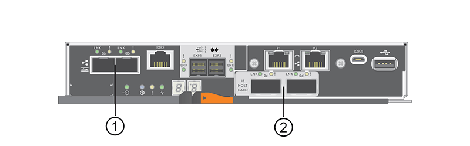

= Requisitos para alterar o protocolo de porta de host E5700
:allow-uri-read: 
:icons: font
:imagesdir: ../media/

[role="lead"]
Antes de converter o protocolo da porta do host no E5700, revise os requisitos.

== Portas de host que você pode alterar

NOTE: Apenas as portas da base ótica de um controlador E5700 podem ser convertidas.

A figura a seguir mostra o E5700 com suas portas de host de placa base SFP *(1)* e as duas portas HIC IB opcionais *(2)*.

== Requisitos

* Tem de programar uma janela de manutenção de tempo de inatividade para este procedimento.
* Você deve parar as operações de e/S do host quando executar a conversão e não poderá acessar dados no storage array até que você tenha concluído a conversão com êxito.
* Você deve usar o gerenciamento fora da banda. (Você não pode usar o gerenciamento na banda para concluir este procedimento.)
* Você obteve o hardware necessário para a conversão. O seu representante de vendas da NetApp pode ajudá-lo a determinar o hardware de que necessita e ajudá-lo a encomendar as peças corretas.
* Se você estiver tentando alterar as portas de host de placa base de seu storage array e ele atualmente usa transcetores SFP de protocolo duplo (também chamados _unificados_) que você comprou da NetApp, você não precisa alterar seus transcetores SFP.
* Certifique-se de que os transcetores SFP de protocolo duplo suportam FC (a 4 Gbps ou 16 Gbps) e iSCSI (a 10 Gbps), mas não suportam iSCSI de 1 Gbps. link:hpp-change-host-protocol-task.html["Passo 1: Determine se você tem SFPs de protocolo duplo"]Consulte para determinar que tipo de transcetores SFP estão instalados.

== Considerações para alterar o protocolo do host

As considerações para alterar o protocolo do host dependem dos protocolos de início e término das portas do host da placa base e das portas HIC.

Se você usar um recurso de espelhamento ou o recurso Data Assurance (DA), você deve entender o que acontece com esses recursos quando você altera o protocolo de porta do host.

NOTE: As considerações a seguir se aplicam somente se você estiver convertendo um storage array que já esteja em uso. Essas considerações não se aplicam se você estiver convertendo um novo storage array que ainda não tenha hosts e volumes definidos.

=== Conversão de FC para iSCSI

* O espelhamento assíncrono requer o storage array local e o storage array remoto para usar o mesmo protocolo.
+
** Se você estiver usando atualmente o espelhamento assíncrono através da placa de base, desative as relações de espelhamento assíncrono usando essas portas antes de aplicar o pacote de recursos.
** Consulte a ajuda on-line do Gerenciador de sistemas do SANtricity para excluir todos os grupos de consistência de espelhos e remover todos os pares espelhados dos storages locais e remotos. Além disso, siga as instruções na ajuda on-line para desativar o espelhamento assíncrono.
+

NOTE: Se a sua configuração contiver hosts de inicialização SAN conetados às portas de placa base FC, verifique a https://mysupport.netapp.com/NOW/products/interoperability["Matriz de interoperabilidade do NetApp"^] ferramenta para garantir que a configuração seja compatível com iSCSI. Se não estiver, não poderá converter o protocolo de anfitrião para iSCSI.

* O recurso de espelhamento síncrono não é suportado para iSCSI.
+
** Se você estiver usando relacionamentos de espelhamento síncrono por meio das portas da placa base, será necessário desativar essas relações de espelhamento síncrono.
** Consulte a ajuda on-line do Gerenciador de sistemas do SANtricity para remover todos os pares espelhados síncronos, que remove as relações de espelhamento no storage array local e no storage array remoto. Além disso, siga as instruções na ajuda on-line para desativar o espelhamento síncrono.
+

CAUTION: Se não desativar as relações de espelhamento síncrono antes de converter para iSCSI, o sistema perderá o acesso aos dados e poderá ocorrer perda de dados.

=== Conversão de iSCSI para FC

* O espelhamento assíncrono requer o storage array local e o storage array remoto para usar o mesmo protocolo. Se estiver atualmente a utilizar o espelhamento assíncrono com as portas de base, tem de desativar o espelhamento assíncrono antes de alterar o protocolo.
* Consulte a ajuda on-line do Gerenciador de sistemas do SANtricity para excluir todos os grupos de consistência de espelhos e remover todos os pares espelhados dos storages locais e remotos. Além disso, siga as instruções na ajuda on-line para desativar o espelhamento assíncrono.

=== Conversão de IB-iSER para/do IB-SRP

* Você não precisa fazer alterações no hardware ao converter de/para iSER para SRP.
* O recurso Data Assurance (DA) não é suportado para SRP.
* O recurso DA não é suportado pelo IB-SRP. Se você estiver usando esse recurso no IB-HIC e quiser converter essas portas do iSER para SRP, você deve desativar permanentemente DA em todos os volumes. Consulte a ajuda on-line do Gerenciador de sistemas do SANtricity para alterar as configurações de um volume para desativar permanentemente a configuração de garantia de dados.
+

NOTE: Depois de ter sido desativado, A DA não pode ser reativada no volume.

* Confirme o seguinte:
+
** O Gerenciador de sistema do SANtricity é acessível através de um navegador da Web.
** O sistema de storage está executando o SANtricity os (firmware da controladora) versão 08.40.11.00 ou posterior.

=== As operações de espelhamento precisam do mesmo protocolo de host

As operações de espelhamento não são afetadas se as portas do host que estão sendo usadas para espelhamento manterem o mesmo protocolo depois de aplicar o pacote de recursos. Mesmo assim, antes de aplicar o pacote de recursos, você deve confirmar que todos os grupos de consistência de espelho estão sincronizados. Depois de aplicar o pacote de recursos, você deve testar a comunicação entre o storage de armazenamento local e o storage de armazenamento remoto. Consulte a ajuda on-line do Gerenciador de sistemas do SANtricity se você tiver dúvidas sobre como fazer isso.

NOTE: O espelhamento assíncrono e síncrono não é compatível com NVMe sobre Fabrics. Para desativar o espelhamento assíncrono e síncrono, você pode usar os `disable storageArray feature=asyncMirror` comandos ou `disable storageArray feature=syncMirror` através da interface de linha de comando. Consulte os http://docs.netapp.com/ess-11/topic/com.netapp.doc.ssm-cli-115/GUID-0F156C94-C2A7-4458-A922-56439A098C09.html["Desativar o recurso de storage array"^] comandos de espelhamento na Ajuda Online de Referência de comando CLI para obter mais informações sobre como desativar o espelhamento.
