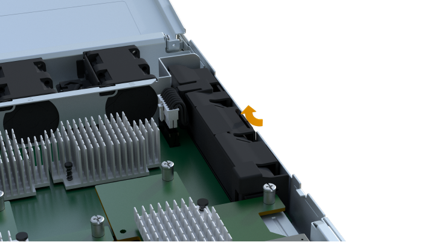

= Substitua a bateria EF300 ou EF600
:allow-uri-read: 
:experimental: 
:icons: font
:imagesdir: ../media/

[role="lead"]
Pode substituir uma bateria num sistema de armazenamento EF300 ou EF600.

.Sobre esta tarefa
Cada recipiente do controlador inclui uma bateria que preserva os dados armazenados em cache se a energia CA falhar. Se o Guru de recuperação no Gestor do sistema SANtricity comunicar um estado de falha da bateria ou um estado de substituição da bateria necessário, tem de substituir a bateria afetada.

.Antes de começar
* Verifique se nenhum volume está em uso ou se você tem um driver multipath instalado em todos os hosts que usam esses volumes.
* Reveja o link:batteries-overview-requirements-concept.html["Requisitos para a substituição da bateria EF300 ou EF600"].
* Certifique-se de que tem o seguinte:
+
** A bateria de substituição.
** Uma pulseira antiestática ou outras precauções antiestáticas.
** Uma área de trabalho plana e estática livre.
** Etiquetas para identificar cada cabo que está ligado ao recipiente do controlador.
** Uma estação de gerenciamento com um navegador que pode acessar o Gerenciador de sistema do SANtricity para o controlador. (Para abrir a interface do System Manager, aponte o navegador para o nome de domínio ou endereço IP do controlador.)

== Passo 1: Coloque o controlador offline

Faça backup dos dados e coloque o controlador afetado offline.

.Passos
. A partir do Gestor do sistema SANtricity, reveja os detalhes no Guru de recuperação para confirmar que existe um problema com uma bateria e para garantir que não é necessário resolver primeiro outros itens.
. Na área Detalhes do Recovery Guru, determine qual bateria deve ser substituída.
. Faça backup do banco de dados de configuração do storage usando o Gerenciador de sistema do SANtricity.
+
Se ocorrer um problema ao remover um controlador, pode utilizar o ficheiro guardado para restaurar a configuração. O sistema salvará o estado atual do banco de dados de configuração RAID, que inclui todos os dados para grupos de volume e pools de discos na controladora.

+
** Do System Manager:
+
... Selecione menu:suporte[Centro de suporte > Diagnóstico].
... Selecione *Collect Configuration Data*.
... Clique em *Collect*.
+
O arquivo é salvo na pasta Downloads do seu navegador com o nome *configurationData-<arrayName>-<dateTime>.7z*.

. Se o controlador ainda não estiver offline, coloque-o offline agora usando o Gerenciador de sistema do SANtricity.
+
.. Selecione *hardware*.
.. Se o gráfico mostrar as unidades, selecione *Mostrar parte traseira da prateleira* para mostrar os controladores.
.. Selecione o controlador que pretende colocar offline.
.. No menu de contexto, selecione *colocar offline* e confirme que deseja executar a operação.
+

NOTE: Se você estiver acessando o Gerenciador de sistema do SANtricity usando o controlador que você está tentando ficar offline, uma mensagem Gerenciador de sistema do SANtricity indisponível será exibida. Selecione *conetar-se a uma conexão de rede alternativa* para acessar automaticamente o Gerenciador de sistema do SANtricity usando o outro controlador.

. Aguarde até que o Gerenciador de sistema do SANtricity atualize o status do controlador para offline.
+

NOTE: Não inicie quaisquer outras operações até que o estado tenha sido atualizado.

. Selecione *Reverifique* no Recovery Guru e confirme que o campo OK para remover na área Detalhes exibe Sim, indicando que é seguro remover este componente.

== Etapa 2: Remova o recipiente do controlador

Substitua a bateria com falha por uma nova.

.Passos
. Coloque uma pulseira antiestática ou tome outras precauções antiestáticas.
. Identifique cada cabo que esteja conetado ao recipiente do controlador.
. Desligue todos os cabos do recipiente do controlador.
+

CAUTION: Para evitar um desempenho degradado, não torça, dobre, aperte ou pise nos cabos.

. Confirme se o LED Cache ative na parte de trás do controlador está desligado.
. Aperte as alças em ambos os lados do controlador e puxe para trás até que ele se solte da prateleira.
+
image::../media/remove_controller_5.png[remova o controlador 5]

. Utilizando as duas mãos e as pegas, deslize o recipiente do controlador para fora da prateleira. Quando a parte frontal do controlador estiver livre do compartimento, use duas mãos para puxá-lo completamente.
+

CAUTION: Utilize sempre duas mãos para suportar o peso de um recipiente do controlador.

+
image::../media/remove_controller_6.png[remova o controlador 6]

. Coloque o recipiente do controlador numa superfície plana e sem estática.

== Passo 3: Remova a bateria com falha

Retire a bateria com falha do controlador.

.Passos
. Retire a tampa do recipiente do controlador desapertando o parafuso de aperto manual único e levantando a tampa aberta.
. Confirme se o LED verde no interior do controlador está desligado.
+
Se este LED verde estiver ligado, o controlador ainda está a utilizar a bateria. Deve aguardar que este LED se apague antes de remover quaisquer componentes.

. Localize o separador "Press" (premir) na parte lateral do controlador.
. Desengate a bateria premindo a patilha e apertando a caixa da bateria.
+

. Apertar cuidadosamente a cablagem da bateria do alojamento da ficha. Puxe para cima, desligando a bateria da placa.
+
image::../media/batt_2.png[batt 2]

. Levante a bateria para fora do controlador e coloque-a numa superfície plana e sem estática.
+
image::../media/batt_4.png[batt 4]

. Siga os procedimentos adequados para a sua localização para reciclar ou eliminar a bateria avariada.
+

CAUTION: Para cumprir com os regulamentos da Associação Internacional de Transporte aéreo (IATA), nunca envie uma bateria de lítio por via aérea, a menos que seja instalada dentro da prateleira do controlador.

== Passo 4: Instale a bateria nova

Depois de remover a bateria com falha do recipiente do controlador, siga este passo para instalar a nova bateria.

.Passos
. Desembale a nova bateria e coloque-a numa superfície plana e sem estática.
+

NOTE: Para cumprir com os regulamentos IATA com segurança, as baterias de substituição são enviadas com um estado de carga (SoC) de 30% ou menos. Quando voltar a aplicar energia, tenha em mente que o armazenamento em cache de gravação não é retomado até que a bateria de substituição esteja totalmente carregada e tenha concluído o ciclo de aprendizagem inicial.

. Insira a bateria no controlador alinhando a caixa da bateria com as travas metálicas na lateral do controlador.
+
image::../media/batt_5.png[batt 5]

+
A bateria encaixa no lugar.

. Volte a ligar o conetor da bateria à placa.

== Etapa 5: Reinstale o recipiente do controlador

Reinstale o controlador na gaveta do controlador.

.Passos
. Baixe a tampa do recipiente do controlador e fixe o parafuso de aperto manual.
. Enquanto aperta as alças do controlador, deslize suavemente o recipiente do controlador até a prateleira do controlador.
+

NOTE: O controlador clica audivelmente quando instalado corretamente na prateleira.

+
image::../media/remove_controller_7.png[remova o controlador 7]

== Passo 6: Substituição completa da bateria

Coloque o controlador on-line, colete dados de suporte e retome as operações.

.Passos
. Coloque o controlador online.
+
.. No System Manager, navegue até a página hardware.
.. Selecione *Mostrar parte posterior do controlador*.
.. Selecione o controlador com a bateria substituída.
.. Selecione *Place on-line* na lista suspensa.

. À medida que o controlador arranca, verifique os LEDs do controlador.
+
Quando a comunicação com o outro controlador é restabelecida:

+
** O LED âmbar de atenção permanece aceso.
** Os LEDs do Host Link podem estar ligados, piscando ou desligados, dependendo da interface do host.

. Quando o controlador estiver novamente online, confirme se o seu estado é ideal e verifique os LEDs de atenção do compartimento do controlador.
+
Se o estado não for o ideal ou se algum dos LEDs de atenção estiver aceso, confirme se todos os cabos estão corretamente encaixados e o recipiente do controlador está instalado corretamente. Se necessário, remova e reinstale o recipiente do controlador.

+

NOTE: Se não conseguir resolver o problema, contacte o suporte técnico.

. Clique em menu:suporte[Centro de atualização] para garantir que a versão mais recente do SANtricity os esteja instalada.
+
Conforme necessário, instale a versão mais recente.

. Verifique se todos os volumes foram devolvidos ao proprietário preferido.
+
.. Selecione menu:armazenamento[volumes]. Na página *todos os volumes*, verifique se os volumes são distribuídos aos seus proprietários preferidos. Selecione menu:mais[alterar propriedade] para ver os proprietários de volume.
.. Se todos os volumes forem propriedade do proprietário preferido, avance para o passo 6.
.. Se nenhum dos volumes for retornado, você deverá retornar manualmente os volumes. Vá para menu:mais[redistribuir volumes].
.. Se apenas alguns dos volumes forem devolvidos aos seus proprietários preferidos após a distribuição automática ou a distribuição manual, você deverá verificar o Recovery Guru para problemas de conetividade do host.
.. Se não houver Recovery Guru presente ou se seguir as etapas do Recovery Guru, os volumes ainda não serão devolvidos aos seus proprietários preferenciais, entre em Contato com o suporte.

. Colete dados de suporte para sua matriz de armazenamento usando o Gerenciador de sistema do SANtricity.
+
.. Selecione menu:suporte[Centro de suporte > Diagnóstico].
.. Selecione *coletar dados de suporte*.
.. Clique em *Collect*.
+
O arquivo é salvo na pasta Downloads do seu navegador com o nome *support-data.7z*.

.O que se segue?
A substituição da bateria está concluída. Pode retomar as operações normais.
