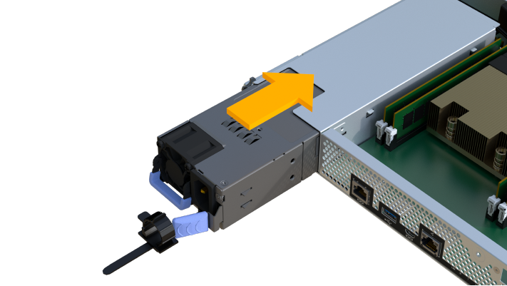

= Substitua o controlador - EF300 e EF600
:allow-uri-read: 
:experimental: 
:icons: font
:imagesdir: ../media/

[role="lead"]
É possível substituir um único controlador no compartimento de controladoras EF300, EF600, EF300C ou EF600C.

.Sobre esta tarefa
Ao substituir um recipiente do controlador com falha, você deve remover a bateria, a fonte de alimentação, os DIMMs, os ventiladores e a placa de interface do host (HIC) do recipiente do controlador original e instalá-los no recipiente do controlador de substituição.

.Antes de começar
* Revisão link:controllers-overview-supertask-concept.html["Requisitos para a substituição do controlador EF300 ou EF600"].
* Determine se você tem um recipiente de controlador com falha de duas maneiras:
+
** O Guru de recuperação no Gerenciador de sistema do SANtricity direciona você para substituir o recipiente do controlador.
** O LED âmbar de atenção no recipiente do controlador está aceso, indicando que o controlador tem uma avaria.
+
[]
====

NOTE: O LED de atenção âmbar do controlador será desligado sempre que existirem as seguintes condições de substituição:

*** Falha na fonte de alimentação Alt
*** Falha no caminho da unidade Alt
*** A gaveta está aberta/em falta
*** A ventoinha falhou/está em falta
*** Fonte de alimentação em falta

====

* Certifique-se de que tem o seguinte:
+
** Um recipiente do controlador de substituição com o mesmo número de peça que o recipiente do controlador que está a substituir.
** Uma pulseira antiestática, ou você tomou outras precauções antiestáticas.
** Uma área de trabalho plana e estática livre.
** Uma chave de fendas Phillips nº 1
** Etiquetas para identificar cada cabo que está ligado ao recipiente do controlador.
** Uma estação de gerenciamento com um navegador que pode acessar o Gerenciador de sistema do SANtricity para o controlador. (Para abrir a interface do System Manager, aponte o navegador para o nome de domínio ou endereço IP do controlador.)

== Passo 1: Prepare-se para substituir o controlador

Prepare-se para substituir um recipiente do controlador com falha, verificando se o recipiente do controlador de substituição tem o número de peça correto da FRU, fazendo backup da configuração e coletando dados de suporte.

.Passos
. Desembale o novo recipiente do controlador e coloque-o numa superfície plana e livre de estática.
+
Guarde os materiais de embalagem a utilizar ao enviar o recipiente do controlador avariado.

. Localize o endereço MAC e as etiquetas de número de peça FRU na parte traseira do recipiente do controlador.
. No Gerenciador do sistema do SANtricity, localize o número de peça de substituição do recipiente do controlador que você está substituindo.
+
Quando um controlador tem uma falha e precisa ser substituído, o número de peça de substituição é exibido na área Detalhes do Recovery Guru. Se você precisar encontrar esse número manualmente, siga estas etapas:

+
.. Selecione *hardware*.
.. Localize o compartimento do controlador, que está marcado com o ícone do controlador image:../media/sam1130_ss_hardware_controller_icon_maint-ef600.gif[""].
.. Clique no ícone do controlador.
.. Selecione o controlador e clique em *seguinte*.
.. No separador *base*, anote o *número de peça de substituição* para o controlador.

. Confirme se o número de peça de substituição para o controlador com falha é o mesmo que o número de peça FRU para o controlador de substituição.
+

CAUTION: *Possível perda de acesso a dados* -- se os números de duas partes não forem os mesmos, não tente este procedimento. Além disso, se o recipiente do controlador com falha incluir uma placa de interface do host (HIC), você deve instalar esse HIC no novo recipiente do controlador. A presença de controladores ou HICs incompatíveis faz com que o novo controlador fique bloqueado quando o coloca online.

. Faça backup do banco de dados de configuração do storage usando o Gerenciador de sistema do SANtricity.
+
Se ocorrer um problema ao remover um controlador, pode utilizar o ficheiro guardado para restaurar a configuração. O sistema salvará o estado atual do banco de dados de configuração RAID, que inclui todos os dados para grupos de volume e pools de discos na controladora.

+
** Do System Manager:
+
... Selecione menu:suporte[Centro de suporte > Diagnóstico].
... Selecione *Collect Configuration Data*.
... Clique em *Collect*.
+
O arquivo é salvo na pasta Downloads do seu navegador com o nome *configurationData-<arrayName>-<dateTime>.7z*.

. Se o controlador ainda não estiver offline, coloque-o offline agora usando o Gerenciador de sistema do SANtricity.
+
.. Selecione *hardware*.
.. Se o gráfico mostrar as unidades, selecione *Mostrar parte traseira da prateleira* para mostrar os controladores.
.. Selecione o controlador que pretende colocar offline.
.. No menu de contexto, selecione *colocar offline* e confirme que deseja executar a operação.

+

NOTE: Se você estiver acessando o Gerenciador de sistema do SANtricity usando o controlador que você está tentando ficar offline, uma mensagem Gerenciador de sistema do SANtricity indisponível será exibida. Selecione *conetar-se a uma conexão de rede alternativa* para acessar automaticamente o Gerenciador de sistema do SANtricity usando o outro controlador.

. Aguarde até que o Gerenciador de sistema do SANtricity atualize o status do controlador para offline.
+

CAUTION: Não inicie quaisquer outras operações até que o estado tenha sido atualizado.

. Selecione *Reverifique* no Recovery Guru e confirme se o campo *OK para remover* na área Detalhes exibe *Sim*, indicando que é seguro remover este componente.

== Passo 2: Remover controlador com falha

Remova um recipiente do controlador para substituir o recipiente com falha por um novo.

Este é um procedimento de várias etapas que requer que você remova os seguintes componentes: Bateria, placa de interface do host, fonte de alimentação, DIMMs e ventiladores.

=== Etapa 2a: Remova o recipiente do controlador

Remova o recipiente do controlador com falha para que você possa substituí-lo por um novo.

.Passos
. Coloque uma pulseira antiestática ou tome outras precauções antiestáticas.
. Identifique cada cabo que esteja conetado ao recipiente do controlador.
. Desligue todos os cabos do recipiente do controlador.
+

CAUTION: Para evitar um desempenho degradado, não torça, dobre, aperte ou pise nos cabos.

. Se o recipiente do controlador tiver um HIC que usa transcetores SFP, remova os SFPs.
+
Como você deve remover o HIC do recipiente do controlador com falha, você deve remover quaisquer SFPs das portas HIC. Ao reconetar os cabos, você pode mover esses SFPs para o novo recipiente do controlador.

. Aperte as alças em ambos os lados do controlador e puxe para trás até que ele se solte da prateleira.
+
image::../media/remove_controller_5.png[Aperte as alças para remover o controlador]

. Utilizando as duas mãos e as pegas, deslize o recipiente do controlador para fora da prateleira. Quando a parte frontal do controlador estiver livre do compartimento, use duas mãos para puxá-lo completamente.
+

CAUTION: Utilize sempre duas mãos para suportar o peso de um recipiente do controlador.

+
image::../media/remove_controller_6.png[Use duas mãos para suportar o peso do controlador enquanto você remove]

. Coloque o recipiente do controlador numa superfície plana e sem estática.

=== Passo 2b: Remova a bateria

Remova a bateria do recipiente do controlador com falha para que possa instalá-la no novo recipiente do controlador.

.Passos
. Retire a tampa do recipiente do controlador desapertando o parafuso de aperto manual único e levantando a tampa aberta.
. Localize o separador "Press" (premir) na parte lateral do controlador.
. Desengate a bateria premindo a patilha e apertando a caixa da bateria.
+
image::../media/batt_3.png["Prima a patilha para desbloquear a bateria]

. Apertar cuidadosamente a cablagem da bateria do alojamento da ficha. Puxe para cima, desligando a bateria da placa.image:../media/batt_2.png["Retire a cablagem da bateria do alojamento do conetor"]
. Levante a bateria para fora do controlador e coloque-a numa superfície plana e sem estática.image:../media/batt_4.png["Levante a bateria para fora do controlador"]

=== Passo 2c: Remova o HIC

Se o recipiente do controlador incluir um HIC, tem de remover o HIC do recipiente do controlador original. Caso contrário, você pode pular esta etapa.

.Passos
. Utilizando uma chave de fendas Phillips, retire os dois parafusos que fixam a placa frontal HIC ao recipiente do controlador.
+
image::../media/hic_2.png[Remova a placa frontal do HIC]

+

NOTE: A imagem acima é um exemplo, a aparência do seu HIC pode diferir.

. Retire a placa frontal do HIC.
. Utilizando os dedos ou uma chave de fendas Phillips, desaperte o parafuso de aperto manual único que fixa o HIC à placa do controlador.
+
image::../media/hic_3.png[Solte os parafusos de aperto manual do HIC]

+

NOTE: O HIC vem com três localizações de parafuso na parte superior, mas é fixado com apenas um.

. Solte cuidadosamente o HIC da placa controladora levantando-o para cima e para fora do controlador.
+

CAUTION: Tenha cuidado para não arranhar ou bater os componentes na parte inferior do HIC ou na parte superior da placa controladora.

+
image::../media/hic_4.png[Remova o HIC da placa controladora]

. Coloque o HIC sobre uma superfície plana e livre de estática.

=== Passo 2D: Remova a fonte de alimentação

Remova a fonte de alimentação para que possa instalá-la no novo controlador.

.Passos
. Desligue os cabos de alimentação:
+
.. Abra o retentor do cabo de alimentação e, em seguida, desconete o cabo de alimentação da fonte de alimentação.
.. Desconete o cabo de alimentação da fonte de alimentação.

. Localize a patilha à direita da fonte de alimentação e prima-a em direção à unidade de fonte de alimentação.
+
image::../media/psup_2.png[Prima o separador junto à fonte de alimentação]

. Localize a alça na parte frontal da fonte de alimentação.
. Utilize a pega para deslizar a fonte de alimentação para fora do sistema.
+
image::../media/psup_3.png[Deslize a fonte de alimentação para fora]

+

CAUTION: Ao remover uma fonte de alimentação, utilize sempre duas mãos para suportar o seu peso.

=== Etapa 2e: Remova DIMMs

Remova os DIMMs para que você possa instalá-los no novo controlador.

.Passos
. Localize os DIMMs no controlador.
. Observe a orientação do DIMM no soquete para que você possa inserir o DIMM de substituição na orientação adequada.
+

NOTE: Um entalhe na parte inferior do DIMM ajuda a alinhar o DIMM durante a instalação.

. Empurre lentamente as duas abas do ejetor DIMM em ambos os lados do DIMM para ejetar o DIMM de seu slot e, em seguida, deslize-o para fora do slot.
+

NOTE: Segure cuidadosamente o DIMM pelas bordas para evitar a pressão nos componentes da placa de circuito DIMM.

+
image::../media/dimm_2.png[Pressione as abas do ejetor no slot DIMM]

+
image::../media/dimim_3.png[Remova a DIMM]

=== Passo 2f: Remova os ventiladores

Remova os ventiladores para que você possa instalá-los no novo controlador.

.Passos
. Levante cuidadosamente a ventoinha do controlador.
+
image::../media/fan_2.png[Retire a ventoinha]

. Repita até que todos os ventiladores sejam removidos.

== Passo 3: Instale o novo controlador

Instale um novo recipiente do controlador para substituir o que falhou.

Este é um procedimento de várias etapas que requer a instalação dos seguintes componentes do controlador original: Bateria, placa de interface do host, fonte de alimentação, DIMMs e ventiladores.

=== Passo 3a: Instale a bateria

Instale a bateria no recipiente do controlador de substituição.

.Passos
. Certifique-se de que tem:
+
** A bateria do recipiente do controlador original, ou uma nova bateria que você pediu.
** O recipiente do controlador de substituição.

. Insira a bateria no controlador alinhando a caixa da bateria com as travas metálicas na lateral do controlador.
+
image::../media/batt_5.png[Instale a bateria]

+
A bateria encaixa no lugar.

. Volte a ligar o conetor da bateria à placa.

=== Passo 3b: Instale o HIC

Se tiver removido um HIC do recipiente do controlador original, tem de instalar esse HIC no novo recipiente do controlador. Caso contrário, você pode pular esta etapa.

.Passos
. Usando uma chave de fenda Phillips nº 1, remova os dois parafusos que prendem a placa frontal vazia ao recipiente do controlador de substituição e remova a placa frontal.
. Alinhe o parafuso de aperto manual único no HIC com o orifício correspondente no controlador e alinhe o conetor na parte inferior do HIC com o conetor de interface HIC na placa do controlador.
+
Tenha cuidado para não arranhar ou bater os componentes na parte inferior do HIC ou na parte superior da placa controladora.

+
image::../media/hic_7.png[Instale o HIC]

+

NOTE: A imagem acima é um exemplo; a aparência do seu HIC pode diferir.

. Baixe cuidadosamente o HIC para o devido lugar e assente o conetor HIC pressionando suavemente o HIC.
+

CAUTION: * Possíveis danos ao equipamento * - tenha muito cuidado para não apertar o conetor de fita dourada para os LEDs do controlador entre o HIC e o parafuso de aperto manual.

. Aperte manualmente o parafuso manual HIC.
+
Não use uma chave de fenda, ou você pode apertar demais o parafuso.

+
image::../media/hic_3.png[Aperte manualmente os parafusos de aperto manual HIC ao controlador]

+

NOTE: A imagem acima é um exemplo; a aparência do seu HIC pode diferir.

. Usando uma chave de fenda Phillips nº 1, prenda a placa frontal HIC que você removeu do recipiente do controlador original ao novo recipiente do controlador com os dois parafusos.

=== Passo 3c: Instale a fonte de alimentação

Instale a fonte de alimentação no recipiente do controlador de substituição.

.Passos
. Utilizando ambas as mãos, apoie e alinhe as extremidades da fonte de alimentação com a abertura no chassis do sistema e, em seguida, empurre cuidadosamente a fonte de alimentação para o chassis utilizando a pega do excêntrico.
+
As fontes de alimentação são chaveadas e só podem ser instaladas de uma forma.

+

CAUTION: Não utilize força excessiva ao deslizar a fonte de alimentação para o sistema; pode danificar o conetor.

+

=== Passo 3D: Instale DIMMs

Instale os DIMMs no novo recipiente do controlador.

.Passos
. Segure o DIMM pelos cantos e alinhe-o com o slot.
+
O entalhe entre os pinos no DIMM deve estar alinhado com a guia no soquete.

. Insira o DIMM diretamente no slot.
+
image::../media/dimm_4.png[Instale o DIMM no slot do controlador]

+
O DIMM encaixa firmemente no slot, mas deve entrar facilmente. Caso contrário, realinhar o DIMM com o slot e reinseri-lo.

+

NOTE: Inspecione visualmente o DIMM para verificar se ele está alinhado uniformemente e totalmente inserido no slot.

. Empurre com cuidado, mas firmemente, na borda superior do DIMM até que as travas se encaixem no lugar sobre os entalhes nas extremidades do DIMM.
+

NOTE: DIMMs se encaixam firmemente. Talvez seja necessário pressionar suavemente um lado de cada vez e fixar com cada aba individualmente.

+
image::../media/dimm_5.png[Pressione as travas para cima no slot DIMM para fixar]

=== Passo 3e: Instale os ventiladores

Instale as ventoinhas no recipiente do controlador de substituição.

.Passos
. Deslize a ventoinha até ao controlador de substituição.
+
image::../media/fan_3.png[Instale o ventilador no controlador]

+
image::../media/fan_3_a.png[Instale o ventilador no controlador]

. Repita até que todas as ventoinhas estejam instaladas.

=== Passo 3f: Instale o novo recipiente do controlador

Por último, instale o novo recipiente do controlador na gaveta do controlador.

.Passos
. Baixe a tampa do recipiente do controlador e fixe o parafuso de aperto manual.
. Enquanto aperta as alças do controlador, deslize suavemente o recipiente do controlador até a prateleira do controlador.
+

NOTE: O controlador clica audivelmente quando instalado corretamente na prateleira.

+
image::../media/remove_controller_7.png[Instale o controlador na gaveta]

. Instale os SFPs do controlador original nas portas do host no novo controlador, se eles foram instalados no controlador original e reconete todos os cabos.
+
Se você estiver usando mais de um protocolo de host, certifique-se de instalar os SFPs nas portas de host corretas.

. Se o controlador original usou DHCP para o endereço IP, localize o endereço MAC na etiqueta na parte de trás do controlador de substituição. Peça ao administrador da rede para associar o DNS/rede e o endereço IP do controlador removido com o endereço MAC do controlador de substituição.
+

NOTE: Se o controlador original não usou DHCP para o endereço IP, o novo controlador adota o endereço IP do controlador removido.

== Passo 4: Substituição completa do controlador

Coloque o controlador on-line, colete dados de suporte e retome as operações.

.Passos
. Coloque o controlador online.
+
.. No System Manager, navegue até a página hardware.
.. Selecione *Mostrar parte posterior do controlador*.
.. Selecione o controlador substituído.
.. Selecione *Place on-line* na lista suspensa.

. À medida que o controlador arranca, verifique os LEDs do controlador.
+
Quando a comunicação com o outro controlador é restabelecida:

+
** O LED âmbar de atenção permanece aceso.
** Os LEDs do Host Link podem estar ligados, piscando ou desligados, dependendo da interface do host.

. Quando a controladora estiver novamente on-line, verifique se uma incompatibilidade de NVSRAM é relatada no Recovery Guru.
+
.. Se uma incompatibilidade de NVSRAM for relatada, atualize a NVSRAM usando o seguinte comando SMcli:
+
[listing]
----
SMcli <controller A IP> <controller B IP> -u admin -p <password> -k -c "download storageArray NVSRAM file=\"C:\Users\testuser\Downloads\NVSRAM .dlp file>\" forceDownload=TRUE;"
----
+
O `-k` parâmetro é necessário se o array não for https seguro.

+

NOTE: Se o comando SMcli não puder ser concluído, contacte https://www.netapp.com/company/contact-us/support/["Suporte técnico da NetApp"^] ou inicie sessão no https://mysupport.netapp.com["Site de suporte da NetApp"^] para criar um caso.

. Confirme se o status do sistema é ideal e verifique os LEDs de atenção do compartimento do controlador.
+
Se o estado não for o ideal ou se algum dos LEDs de atenção estiver aceso, confirme se todos os cabos estão corretamente encaixados e o recipiente do controlador está instalado corretamente. Se necessário, remova e reinstale o recipiente do controlador.

+

NOTE: Se não conseguir resolver o problema, contacte o suporte técnico.

. Clique em menu:hardware[Support > Upgrade Center] (hardware [suporte > Centro de atualização]) para garantir que as versões de firmware e NVSRAM do sistema estão nos níveis desejados.
+
Conforme necessário, instale a versão mais recente.

. Verifique se todos os volumes foram devolvidos ao proprietário preferido.
+
.. Selecione menu:armazenamento[volumes]. Na página *todos os volumes*, verifique se os volumes são distribuídos aos seus proprietários preferidos. Selecione menu:mais[alterar propriedade] para ver os proprietários de volume.
.. Se todos os volumes forem propriedade do proprietário preferido, avance para o passo 6.
.. Se nenhum dos volumes for retornado, você deverá retornar manualmente os volumes. Vá para menu:mais[redistribuir volumes].
.. Se apenas alguns dos volumes forem devolvidos aos seus proprietários preferidos após a distribuição automática ou a distribuição manual, você deverá verificar o Recovery Guru para problemas de conetividade do host.
.. Se não houver Recovery Guru presente ou se seguir as etapas do Recovery Guru, os volumes ainda não serão devolvidos aos seus proprietários preferenciais, entre em Contato com o suporte.

. Colete dados de suporte para sua matriz de armazenamento usando o Gerenciador de sistema do SANtricity.
+
.. Selecione menu:suporte[Centro de suporte > Diagnóstico].
.. Selecione *coletar dados de suporte*.
.. Clique em *Collect*.
+
O arquivo é salvo na pasta Downloads do seu navegador com o nome *support-data.7z*.

.O que se segue?
A substituição do controlador está concluída. Pode retomar as operações normais.
