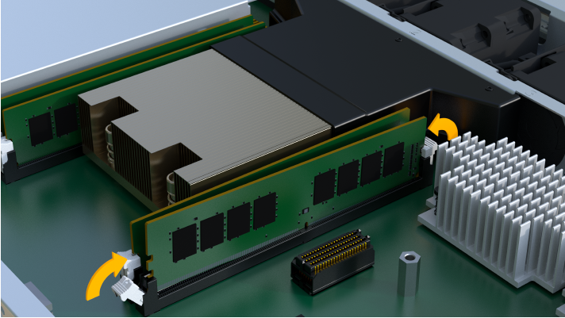

= Substitua DIMMs em EF300 ou EF600
:allow-uri-read: 
:experimental: 
:icons: font
:imagesdir: ../media/

[role="lead"]
Você pode substituir um DIMM em uma matriz EF300 ou EF600.

.Sobre esta tarefa
Para substituir um DIMM, você deve verificar o tamanho do cache do controlador, colocar o controlador off-line, remover o controlador, remover os DIMMs e instalar os novos DIMMs no controlador. Em seguida, você pode colocar seu controlador novamente on-line e verificar se o storage array está funcionando corretamente.

.Antes de começar
* Revisão link:dimms-overview-supertask-concept.html["Requisitos para substituir um DIMM EF300 ou EF600"].
* Certifique-se de que não há volumes em uso ou de que você tenha um driver multipath instalado em todos os hosts que usam esses volumes.
* Certifique-se de que tem o seguinte:
+
** Um DIMM de substituição.
** Uma pulseira antiestática, ou você tomou outras precauções antiestáticas.
** Uma área de trabalho plana e estática livre.
** Etiquetas para identificar cada cabo que está ligado ao recipiente do controlador.
** Uma estação de gerenciamento com um navegador que pode acessar o Gerenciador de sistema do SANtricity para o controlador. (Para abrir a interface do System Manager, aponte o navegador para o nome de domínio ou endereço IP do controlador.)

== Etapa 1: Determine se você precisa substituir um DIMM

Verifique o tamanho do cache do controlador antes de substituir os DIMMS.

.Passos
. Acesse o perfil Storage Array para o controlador. No Gerenciador de sistema do SANtricity, vá para menu:suporte[Centro de suporte]. Na página recursos de suporte, selecione *Perfil da matriz de armazenamento*.
. Role para baixo ou use o campo pesquisar para localizar as informações *Data Cache Module*.
. Se um dos itens a seguir estiver presente, observe a localização do DIMM e continue com os procedimentos restantes nesta seção para substituir os DIMMs no controlador:
+
** Um DIMM com falha ou um DIMM informando *módulo de cache de dados* como não ótimo.
** Um DIMM com uma capacidade de *Data Cache Module* incompatível.

== Passo 2: Coloque o controlador offline

Coloque o controlador offline para que possa remover e substituir os DIMMs com segurança.

.Passos
. No Gerenciador de sistema do SANtricity, revise os detalhes no Guru de recuperação para confirmar que há um problema com uma memória incorreta e garantir que nenhum outro item deve ser resolvido primeiro.
. Na área Detalhes do Recovery Guru, determine qual DIMM substituir.
. Faça backup do banco de dados de configuração do storage usando o Gerenciador de sistema do SANtricity.
+
Se ocorrer um problema ao remover um controlador, pode utilizar o ficheiro guardado para restaurar a configuração. O sistema salvará o estado atual do banco de dados de configuração RAID, que inclui todos os dados para grupos de volume e pools de discos na controladora.

+
** Do System Manager:
+
... Selecione menu:suporte[Centro de suporte > Diagnóstico].
... Selecione *Collect Configuration Data*.
... Clique em *Collect*.
+
O arquivo é salvo na pasta Downloads do seu navegador com o nome *configurationData-<arrayName>-<dateTime>.7z*.

. Se o controlador ainda não estiver offline, coloque-o offline agora usando o Gerenciador de sistema do SANtricity.
+
.. Selecione *hardware*.
.. Se o gráfico mostrar as unidades, selecione *Mostrar parte traseira da prateleira* para mostrar os controladores.
.. Selecione o controlador que pretende colocar offline.
.. No menu de contexto, selecione *colocar offline* e confirme que deseja executar a operação.
+

NOTE: Se você estiver acessando o Gerenciador de sistema do SANtricity usando o controlador que você está tentando ficar offline, uma mensagem Gerenciador de sistema do SANtricity indisponível será exibida. Selecione *conetar-se a uma conexão de rede alternativa* para acessar automaticamente o Gerenciador de sistema do SANtricity usando o outro controlador.

. Aguarde até que o Gerenciador de sistema do SANtricity atualize o status do controlador para offline.
+

NOTE: Não inicie quaisquer outras operações até que o estado tenha sido atualizado.

. Selecione *Reverifique* no Recovery Guru e confirme que o campo OK para remover na área Detalhes exibe Sim, indicando que é seguro remover este componente.

== Etapa 3: Remova o recipiente do controlador

Você remove o recipiente do controlador com falha para que você possa substituir seus DIMMs por novos.

.Passos
. Coloque uma pulseira antiestática ou tome outras precauções antiestáticas.
. Identifique cada cabo que esteja conetado ao recipiente do controlador.
. Desligue todos os cabos do recipiente do controlador.
+

CAUTION: Para evitar um desempenho degradado, não torça, dobre, aperte ou pise nos cabos.

. Aperte as alças em ambos os lados do controlador e puxe para trás até que ele se solte da prateleira.
+
image::../media/remove_controller_5.png[Aperte as alças para remover o controlador]

. Confirme se o LED Cache ative na parte de trás do controlador está desligado.
. Utilizando as duas mãos e as pegas, deslize o recipiente do controlador para fora da prateleira. Quando a parte frontal do controlador estiver livre do compartimento, use duas mãos para puxá-lo completamente.
+

CAUTION: Utilize sempre duas mãos para suportar o peso de um recipiente do controlador.

+
image::../media/remove_controller_6.png[Use duas mãos para suportar o peso do controlador enquanto você remove]

. Coloque o recipiente do controlador numa superfície plana e sem estática.

== Etapa 4: Remova DIMMs

Se houver uma incompatibilidade de memória presente, substitua os DIMMs no controlador.

.Passos
. Retire a tampa do recipiente do controlador desapertando o parafuso de aperto manual único e levantando a tampa aberta.
. Confirme se o LED verde no interior do controlador está desligado.
+
Se este LED verde estiver ligado, o controlador ainda está a utilizar a bateria. Deve aguardar que este LED se apague antes de remover quaisquer componentes.

. Localize os DIMMs no controlador.
. Observe a orientação do DIMM no soquete para que você possa inserir o DIMM de substituição na orientação adequada.
+

NOTE: Um entalhe na parte inferior do DIMM ajuda a alinhar o DIMM durante a instalação.

. Empurre lentamente as duas abas do ejetor DIMM em ambos os lados do DIMM para ejetar o DIMM de seu slot e, em seguida, deslize-o para fora do slot.
+
image::../media/dimm_2.png[Pressione as abas do ejetor no slot DIMM]

+
image::../media/dimim_3.png[Remova a DIMM]

+

CAUTION: Segure cuidadosamente o DIMM pelas bordas para evitar a pressão nos componentes da placa de circuito DIMM.

+
O número e a colocação dos DIMMs do sistema dependem do modelo do sistema.

== Passo 5: Instale novos DIMMs

Instale um novo DIMM para substituir o antigo.

.Passos
. Segure o DIMM pelos cantos e alinhe-o com o slot.
+
O entalhe entre os pinos no DIMM deve estar alinhado com a guia no soquete.

. Insira o DIMM diretamente no slot.
+
O DIMM encaixa firmemente no slot, mas deve entrar facilmente. Caso contrário, realinhar o DIMM com o slot e reinseri-lo.

+

NOTE: Inspecione visualmente o DIMM para verificar se ele está alinhado uniformemente e totalmente inserido no slot.

. Empurre com cuidado, mas firmemente, na borda superior do DIMM até que as travas se encaixem no lugar sobre os entalhes nas extremidades do DIMM.
+

NOTE: DIMMs se encaixam firmemente. Talvez seja necessário pressionar suavemente um lado de cada vez e fixar com cada aba individualmente.

+

== Etapa 6: Reinstale o recipiente do controlador

Depois de instalar os novos DIMMs, reinstale o recipiente do controlador na gaveta do controlador.

.Passos
. Baixe a tampa do recipiente do controlador e fixe o parafuso de aperto manual.
. Enquanto aperta as alças do controlador, deslize suavemente o recipiente do controlador até a prateleira do controlador.
+

NOTE: O controlador clica audivelmente quando instalado corretamente na prateleira.

+
image::../media/remove_controller_7.png[Instale o DIMM no slot do controlador]

. Volte a ligar todos os cabos.

== Etapa 7: Substituição completa de DIMMs

Coloque o controlador on-line, colete dados de suporte e retome as operações.

.Passos
. Coloque o controlador online.
+
.. No System Manager, navegue até a página hardware.
.. Selecione *Mostrar parte posterior do controlador*.
.. Selecione o controlador com os DIMMs substituídos.
.. Selecione *Place on-line* na lista suspensa.

. À medida que o controlador arranca, verifique os LEDs do controlador.
+
Quando a comunicação com o outro controlador é restabelecida:

+
** O LED âmbar de atenção permanece aceso.
** Os LEDs do Host Link podem estar ligados, piscando ou desligados, dependendo da interface do host.

. Quando o controlador estiver novamente online, confirme se o seu estado é ideal e verifique os LEDs de atenção do compartimento do controlador.
+
Se o estado não for o ideal ou se algum dos LEDs de atenção estiver aceso, confirme se todos os cabos estão corretamente encaixados e o recipiente do controlador está instalado corretamente. Se necessário, remova e reinstale o recipiente do controlador.

+

NOTE: Se não conseguir resolver o problema, contacte o suporte técnico.

. Clique em menu:hardware[suporte > Centro de Atualização] para garantir que a versão mais recente do SANtricity os esteja instalada.
+
Conforme necessário, instale a versão mais recente.

. Verifique se todos os volumes foram devolvidos ao proprietário preferido.
+
.. Selecione menu:armazenamento[volumes]. Na página *todos os volumes*, verifique se os volumes são distribuídos aos seus proprietários preferidos. Selecione menu:mais[alterar propriedade] para ver os proprietários de volume.
.. Se todos os volumes forem propriedade do proprietário preferido, avance para o passo 6.
.. Se nenhum dos volumes for retornado, você deverá retornar manualmente os volumes. Vá para menu:mais[redistribuir volumes].
.. Se não houver Recovery Guru presente ou se seguir as etapas Recovery Guru, os volumes ainda não serão retornados aos proprietários preferenciais, entre em Contato com o suporte.

. Colete dados de suporte para sua matriz de armazenamento usando o Gerenciador de sistema do SANtricity.
+
.. Selecione menu:suporte[Centro de suporte > Diagnóstico].
.. Selecione *coletar dados de suporte*.
.. Clique em *Collect*.
+
O arquivo é salvo na pasta Downloads do seu navegador com o nome *support-data.7z*.

.O que se segue?
A substituição do DIMM está concluída. Pode retomar as operações normais.
