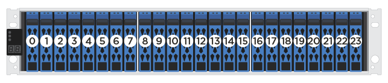

= Requisitos para substituir a unidade - EF300 ou EF600
:allow-uri-read: 
:icons: font
:imagesdir: ../media/

[role="lead"]
Antes de substituir uma unidade em um array EF300, EF600, EF300C ou EF600C, revise os requisitos e considerações.

CAUTION: Esteja ciente de que as unidades em seu storage array são frágeis; o manuseio inadequado de unidades é uma das principais causas de falha da unidade.

== Requisitos de substituição da unidade

Siga estas regras para evitar danificar as unidades do seu storage de armazenamento:

* Evitar descargas eletrostáticas (ESD):
+
** Mantenha a unidade no saco ESD até que esteja pronto para instalá-la.
** Abra o saco ESD à mão ou corte a parte superior com uma tesoura. Não insira uma ferramenta de metal ou faca no saco ESD.
** Guarde o saco ESD e quaisquer materiais de embalagem caso tenha de devolver uma unidade mais tarde.
** Utilize sempre uma pulseira antiestática ligada à terra a uma superfície não pintada no chassis do compartimento de armazenamento. Se uma correia de pulso não estiver disponível, toque numa superfície não pintada no chassis do compartimento de armazenamento antes de manusear a unidade.

* Manuseie cuidadosamente as transmissões:
+
** Utilize sempre as duas mãos ao remover, instalar ou transportar uma unidade.
** Nunca force uma unidade para dentro de uma prateleira e utilize uma pressão suave e firme para engatar completamente o trinco da unidade.
** Coloque as unidades em superfícies almofadadas e nunca empilhe as unidades umas sobre as outras.
** Não bata as transmissões contra outras superfícies.
** Antes de remover uma unidade de uma gaveta, solte a alça e aguarde 60 segundos para que a unidade gire para baixo.
** Utilize sempre embalagens aprovadas ao enviar unidades.

* Evite campos magnéticos. Mantenha as unidades afastadas de dispositivos magnéticos.
+
Os campos magnéticos podem destruir todos os dados na unidade e causar danos irreparáveis aos circuitos da unidade.

== Impulsione o número impressionante de unidades no compartimento de controladora de 24 unidades

As gavetas padrão de 24 unidades exigem escalonamento de unidades. A figura a seguir mostra como as unidades são numeradas em cada gaveta (o painel frontal da gaveta foi removido).

Ao inserir menos de 24 unidades em um controlador EF300 ou EF600, você deve alternar entre as duas metades do controlador. Começando pela extrema esquerda e depois movendo-se para a extrema direita, coloque as unidades em uma de cada vez.

A figura a seguir mostra como escalonar as unidades entre as duas metades.

image::../media/ef600_drives_staggering.png[Impulsione impressionantes em uma gaveta de 24 unidades]
