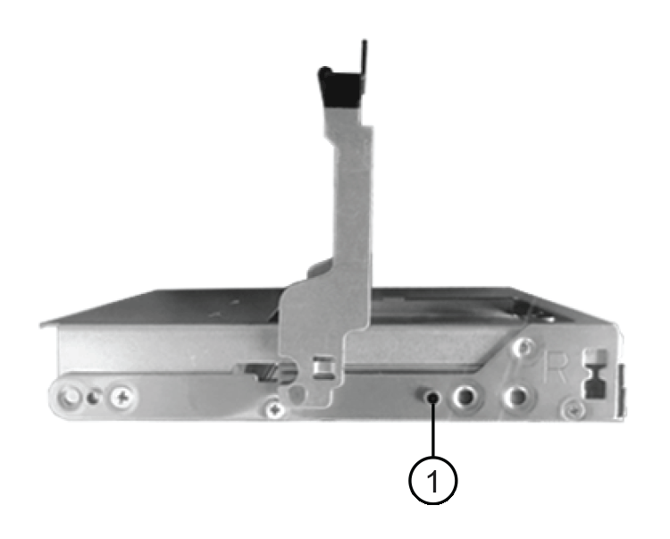

= Substitua a unidade em um array EF300
:allow-uri-read: 
:icons: font
:imagesdir: ../media/

[role="lead"]
Você pode substituir uma unidade em uma matriz EF300 ou EF300C.

O EF300 e o EF300C dão suporte à expansão SAS com compartimentos de 24 unidades e 60 unidades. O procedimento a seguir depende se você tem um compartimento de 24 unidades ou um compartimento de 60 unidades:

* <<Substituir a unidade em um EF300 (compartimento de 24 unidades)>>
* <<Substituir a unidade em um EF300 (compartimento de 60 unidades)>>

== Substituir a unidade em um EF300 (compartimento de 24 unidades)

Siga este procedimento para substituir uma unidade em um compartimento de 24 unidades.

.Sobre esta tarefa
O Guru de recuperação no Gerenciador de sistema do SANtricity monitora as unidades no storage array e pode notificá-lo de uma falha iminente de unidade ou de uma falha real de unidade. Quando uma unidade tiver falhado, o LED âmbar de atenção está aceso. Você pode trocar a quente uma unidade com falha enquanto a matriz de armazenamento está recebendo e/S

.Antes de começar
* Revise os requisitos de manuseio de unidades link:drives-overview-supertask-concept.html["Requisitos para substituição de EF300 ou EF600 unidades"]na .
* Certifique-se de que tem o seguinte:
+
** Uma unidade de substituição compatível com o NetApp para o compartimento de controladora ou compartimento de unidade.
** Uma pulseira antiestática, ou você tomou outras precauções antiestáticas.
** Uma superfície de trabalho plana e livre de estática.
** Uma estação de gerenciamento com um navegador que pode acessar o Gerenciador de sistema do SANtricity para o controlador. (Para abrir a interface do System Manager, aponte o navegador para o nome de domínio ou endereço IP do controlador.)

=== Passo 1: Prepare-se para substituir a unidade (24 unidades)

Prepare-se para substituir uma unidade verificando o Guru de recuperação no Gerenciador de sistema do SANtricity e completando quaisquer etapas de pré-requisito. Em seguida, você pode localizar o componente com falha.

.Passos
. Se o Guru de recuperação no Gerenciador de sistema do SANtricity o notificou de uma _falha iminente da unidade_, mas a unidade ainda não falhou, siga as instruções no Guru de recuperação para falhar a unidade.
. Se necessário, utilize o Gestor do sistema SANtricity para confirmar que tem uma unidade de substituição adequada.
+
.. Selecione *hardware*.
.. Selecione a unidade com falha no gráfico da gaveta.
.. Clique na unidade para exibir seu menu de contexto e selecione *Exibir configurações*.
.. Confirme se a unidade de substituição tem uma capacidade igual ou superior à unidade que está a substituir e que tem os recursos esperados.
+
Por exemplo, não tente substituir uma unidade de disco rígido (HDD) por uma unidade de estado sólido (SSD). Da mesma forma, se você estiver substituindo uma unidade com capacidade segura, verifique se a unidade de substituição também é segura.

. Se necessário, use o Gerenciador de sistema SANtricity para localizar a unidade dentro de sua matriz de armazenamento: No menu de contexto da unidade, selecione *Ativar luz localizador*.
+
O LED de atenção da unidade (âmbar) pisca para que possa identificar qual unidade substituir.

+

NOTE: Se você estiver substituindo uma unidade em uma prateleira que tenha um painel frontal, remova-a para ver os LEDs da unidade.

=== Etapa 2: Remover a unidade com falha (24 unidades)

Remova uma unidade com falha para substituí-la por uma nova.

.Passos
. Desembale a unidade de substituição e coloque-a numa superfície plana e sem estática perto da prateleira.
+
Salve todos os materiais de embalagem.

. Pressione o botão de liberação na unidade com falha.
+
image::../media/drw_drive_latch_maint-e5700.gif[Trinco da unidade]

+
** Para unidades em E5724 compartimentos de controladora ou DE224C compartimentos de unidades, o botão de liberação fica na parte superior da unidade. A alavanca do came nas molas de acionamento abre parcialmente e a unidade solta-se do plano médio.

. Abra a alavanca do came e deslize a unidade ligeiramente para fora.
. Aguarde 60 segundos.
. Utilizando ambas as mãos, retire a unidade da prateleira.
. Coloque a unidade numa superfície antiestática e amortecida, longe de campos magnéticos.
. Aguarde 60 segundos para que o software reconheça que a unidade foi removida.
+

NOTE: Se remover acidentalmente uma unidade ativa, aguarde pelo menos 60 segundos e, em seguida, reinstale-a. Para o procedimento de recuperação, consulte o software de gerenciamento de armazenamento.

=== Passo 3: Instale a nova unidade (24 unidades)

Você instala uma nova unidade para substituir a que falhou. Instale a unidade de substituição o mais rapidamente possível depois de remover a unidade com falha. Caso contrário, existe o risco de o equipamento sobreaquecer.

.Passos
. Abra o manípulo do excêntrico.
. Com as duas mãos, insira a unidade de substituição no compartimento aberto, empurrando firmemente até que a unidade pare.
. Feche lentamente a alavanca do came até que a unidade fique totalmente assente no plano médio e a pega encaixe no devido lugar.
+
O LED verde na unidade acende-se quando a unidade é inserida corretamente.

+

NOTE: Dependendo da sua configuração, o controlador pode reconstruir automaticamente os dados para a nova unidade. Se o compartimento usar unidades hot spare, talvez o controlador precise executar uma reconstrução completa no hot spare antes de poder copiar os dados para a unidade substituída. Este processo de reconstrução aumenta o tempo necessário para concluir este procedimento.

=== Passo 4: Substituição completa da unidade (24 unidades)

Confirme se a nova unidade está a funcionar corretamente.

.Passos
. Verifique o LED de alimentação e o LED de atenção na unidade que você substituiu.
+
Quando você insere uma unidade pela primeira vez, seu LED de atenção pode estar ligado. No entanto, o LED deve apagar-se dentro de um minuto.

+
** O LED de alimentação está ligado ou intermitente e o LED de atenção está apagado: Indica que a nova unidade está a funcionar corretamente.
** O LED de alimentação está desligado: Indica que a unidade pode não estar instalada corretamente. Retire a unidade, aguarde 60 segundos e, em seguida, volte a instalá-la.
** O LED de atenção está aceso: Indica que a nova unidade pode estar com defeito. Substitua-a por outra unidade nova.

. Se o Guru de recuperação no Gerenciador de sistema do SANtricity ainda exibir um problema, selecione *Reverificar* para garantir que o problema foi resolvido.
. Se o Recovery Guru indicar que a reconstrução da unidade não foi iniciada automaticamente, inicie a reconstrução manualmente, da seguinte forma:
+

NOTE: Execute esta operação somente quando instruído a fazê-lo pelo suporte técnico ou pelo Recovery Guru.

+
.. Selecione *hardware*.
.. Clique na unidade que você substituiu.
.. No menu de contexto da unidade, selecione *Reconstruct*.
.. Confirme se pretende efetuar esta operação.
+
Quando a reconstrução da unidade for concluída, o grupo de volume está no estado ideal.

. Conforme necessário, volte a instalar a moldura.
. Devolva a peça com falha ao NetApp, conforme descrito nas instruções de RMA fornecidas com o kit.

.O que se segue?
A substituição da unidade está concluída. Pode retomar as operações normais.

== Substituir a unidade em um EF300 (compartimento de 60 unidades)

Siga este procedimento para substituir uma unidade em um compartimento de 60 unidades.

.Sobre esta tarefa
O Guru de recuperação no Gerenciador de sistema do SANtricity monitora as unidades no storage array e pode notificá-lo de uma falha iminente de unidade ou de uma falha real de unidade. Quando uma unidade tiver falhado, o LED âmbar de atenção está aceso. Você pode trocar a quente uma unidade com falha enquanto o storage array está recebendo operações de e/S.

.Antes de começar
* Revise os requisitos de manuseio de unidades link:drives-overview-supertask-concept.html["Requisitos para substituição de EF300 ou EF600 unidades"]na .
* Certifique-se de que tem o seguinte:
+
** Uma unidade de substituição compatível com o NetApp para o compartimento de controladora ou compartimento de unidade.
** Uma pulseira antiestática, ou você tomou outras precauções antiestáticas.
** Uma estação de gerenciamento com um navegador que pode acessar o Gerenciador de sistema do SANtricity para o controlador. (Para abrir a interface do System Manager, aponte o navegador para o nome de domínio ou endereço IP do controlador.)

=== Passo 1: Prepare-se para substituir a unidade (60 unidades)

Prepare-se para substituir uma unidade verificando o Guru de recuperação no Gerenciador de sistema do SANtricity e completando quaisquer etapas de pré-requisito. Em seguida, você pode localizar o componente com falha.

.Passos
. Se o Guru de recuperação no Gerenciador de sistema do SANtricity o notificou de uma _falha iminente da unidade_, mas a unidade ainda não falhou, siga as instruções no Guru de recuperação para falhar a unidade.
. Se necessário, utilize o Gestor do sistema SANtricity para confirmar que tem uma unidade de substituição adequada.
+
.. Selecione *hardware*.
.. Selecione a unidade com falha no gráfico da gaveta.
.. Clique na unidade para exibir seu menu de contexto e selecione *Exibir configurações*.
.. Confirme se a unidade de substituição tem uma capacidade igual ou superior à unidade que está a substituir e que tem os recursos esperados.
+
Por exemplo, não tente substituir uma unidade de disco rígido (HDD) por um disco de estado sólido (SSD). Da mesma forma, se você estiver substituindo uma unidade com capacidade segura, verifique se a unidade de substituição também é segura.

. Se necessário, use o Gerenciador de sistema do SANtricity para localizar a unidade dentro do storage de armazenamento.
+
.. Se a prateleira tiver uma moldura, retire-a para que possa ver os LEDs.
.. No menu de contexto da unidade, selecione *Ativar luz de localização*.
+
O LED de atenção (âmbar) da gaveta da unidade pisca para que você possa abrir a gaveta da unidade correta para identificar qual unidade substituir.

+
image::../media/2860_dwg_attn_led_on_drawer_maint-e5700.gif["LED de atenção]

+
*(1)* _atenção LED_

.. Desengate a gaveta da unidade puxando ambas as alavancas.
.. Utilizando as alavancas estendidas, puxe cuidadosamente a gaveta da unidade para fora até parar.
.. Olhe para a parte superior da gaveta da unidade para encontrar o LED de atenção na frente de cada unidade.
+
image::../media/2860_dwg_amber_on_drive_maint-e5700.gif[LED de atenção na gaveta da unidade]

+
*(1)* _luz LED atenção acesa para a unidade no lado superior direito_

+
Os LEDs de atenção da gaveta da unidade estão no lado esquerdo na frente de cada unidade, com um ícone de atenção na alça da unidade logo atrás do LED.

+
image::../media/28_dwg_e2860_de460c_attention_led_drive_maint-e5700.gif[LED de atenção na pega da unidade]

+
*(1)* _ícone de atenção_

+
*(2)* _atenção LED_

=== Etapa 2: Remover a unidade com falha (60 unidades)

Remova uma unidade com falha para substituí-la por uma nova.

.Passos
. Desembale a unidade de substituição e coloque-a numa superfície plana e sem estática perto da prateleira.
+
Salve todos os materiais de embalagem para a próxima vez que você precisar enviar uma unidade de volta.

. Solte as alavancas da gaveta da unidade a partir do centro da gaveta da unidade apropriada, puxando ambas em direção aos lados da gaveta.
. Puxe cuidadosamente as alavancas estendidas da gaveta da unidade para retirar a gaveta da unidade até a extensão completa sem removê-la do compartimento.
. Puxe cuidadosamente a trava de liberação laranja que está na frente da unidade que você deseja remover.
+
A pega do came nas molas da unidade abre parcialmente e a unidade é libertada da gaveta.

+
image::../media/trafford_drive_rel_button_maint-e5700.gif[Trinco de libertação laranja]

+
*(1)* _trava de liberação laranja_

. Abra o manípulo do excêntrico e levante ligeiramente a unidade.
. Aguarde 60 segundos.
. Utilize a pega do excêntrico para levantar a unidade da prateleira.
+
image::../media/92_dwg_de6600_install_or_remove_drive_maint-e5700.gif[Utilize a pega do excêntrico para levantar a unidade da prateleira]

. Coloque a unidade numa superfície antiestática e amortecida, longe de campos magnéticos.
. Aguarde 60 segundos para que o software reconheça que a unidade foi removida.
+

NOTE: Se remover acidentalmente uma unidade ativa, aguarde pelo menos 60 segundos e, em seguida, reinstale-a. Para o procedimento de recuperação, consulte o software de gerenciamento de armazenamento.

=== Passo 3: Instale a nova unidade (60 unidades)

Instale uma nova unidade para substituir a que falhou.

CAUTION: *Possível perda de acesso a dados* -- ao empurrar a gaveta da unidade de volta para o gabinete, nunca bata a gaveta fechada. Empurre a gaveta lentamente para dentro para evitar estressar a gaveta e causar danos à matriz de armazenamento.

.Passos
. Levante a alavanca do came na nova unidade para a vertical.
. Alinhe os dois botões levantados em cada lado do suporte da unidade com a folga correspondente no canal da unidade na gaveta da unidade.
+

+
*(1)* _botão levantado no lado direito do transportador da unidade_

. Baixe a unidade em linha reta para baixo e, em seguida, rode a pega do came para baixo até que a unidade encaixe no devido lugar sob o trinco de desbloqueio laranja.
. Empurre cuidadosamente a gaveta da unidade de volta para dentro do compartimento. Empurre a gaveta lentamente para dentro para evitar estressar a gaveta e causar danos à matriz de armazenamento.
. Feche a gaveta da unidade empurrando ambas as alavancas em direção ao centro.
+
O LED de atividade verde da unidade substituída na parte frontal da gaveta da unidade acende-se quando a unidade é inserida corretamente.

+
Dependendo da sua configuração, o controlador pode reconstruir automaticamente os dados para a nova unidade. Se o compartimento usar unidades hot spare, talvez o controlador precise executar uma reconstrução completa no hot spare antes de poder copiar os dados para a unidade substituída. Este processo de reconstrução aumenta o tempo necessário para concluir este procedimento.

=== Passo 4: Substituição completa da unidade (60 unidades)

Confirme se a nova unidade está a funcionar corretamente.

.Passos
. Verifique o LED de alimentação e o LED de atenção na unidade que você substituiu. (Quando você insere uma unidade pela primeira vez, seu LED de atenção pode estar ligado. No entanto, o LED deve apagar-se dentro de um minuto.)
+
** O LED de alimentação está ligado ou intermitente e o LED de atenção está apagado: Indica que a nova unidade está a funcionar corretamente.
** O LED de alimentação está desligado: Indica que a unidade pode não estar instalada corretamente. Retire a unidade, aguarde 60 segundos e, em seguida, volte a instalá-la.
** O LED de atenção está aceso: Indica que a nova unidade pode estar com defeito. Substitua-a por outra unidade nova.

. Se o Guru de recuperação no Gerenciador de sistema do SANtricity ainda exibir um problema, selecione *Reverificar* para garantir que o problema foi resolvido.
. Se o Recovery Guru indicar que a reconstrução da unidade não foi iniciada automaticamente, inicie a reconstrução manualmente, da seguinte forma:
+

NOTE: Execute esta operação somente quando instruído a fazê-lo pelo suporte técnico ou pelo Recovery Guru.

+
.. Selecione *hardware*.
.. Clique na unidade que você substituiu.
.. No menu de contexto da unidade, selecione *Reconstruct*.
.. Confirme se pretende efetuar esta operação.
+
Quando a reconstrução da unidade for concluída, o grupo de volume está no estado ideal.

. Conforme necessário, volte a instalar a moldura.
. Devolva a peça com falha ao NetApp, conforme descrito nas instruções de RMA fornecidas com o kit.

.O que se segue?
A substituição da unidade está concluída. Pode retomar as operações normais.
